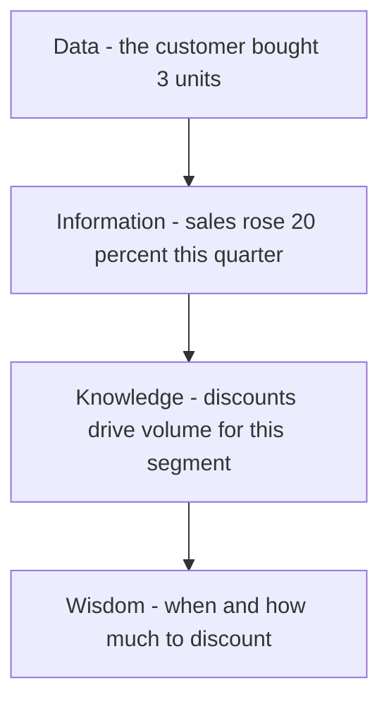

# Volume 02 - Business Knowledge

| Field | Value |
|---|---|
| Document ID | WORLD-VOL02-052 |
| Title | Business Knowledge |
| Version | 1.0 |
| Status | Approved |
| Classification | Internal |
| Founder | Mahesh Choudhary |

## Purpose

This document defines business knowledge from first principles, situates it within the DIKW progression, and explains how organizations capture, structure, and apply what they know. It builds directly on the chapters covering business, master, and transactional data.

## Scope

This chapter covers the definition, types, and lifecycle of business knowledge as a general reference, along with the DIKW model that connects data to wisdom. It does not prescribe a specific knowledge-management platform.

## Definition

Business knowledge is applied understanding: the patterns, rules, relationships, and expertise that let an organization interpret information and act effectively. Where data records facts and information adds context, knowledge answers how and why, enabling reliable action. Knowledge is what remains useful after the specifics of any single transaction have passed.

## The DIKW Progression

Business knowledge is best understood as a stage in the DIKW pyramid, which describes the refinement of raw data into judgment.

Data is the raw fact. Information is data placed in context. Knowledge is the generalizable pattern extracted from many pieces of information. Wisdom is the seasoned judgment that applies knowledge to novel situations. Each layer compounds the value of the last.

## Types of Business Knowledge

| Type | Description | Example |
|---|---|---|
| Explicit | Documented and easily shared | Process manuals, product specs |
| Tacit | Held in people's experience | An expert's sense of a good deal |
| Procedural | Know-how for performing tasks | Steps to onboard a client |
| Declarative | Know-what facts and definitions | Definition of a qualified lead |
| Institutional | Shared organizational memory | Why a policy was adopted |

A central challenge of knowledge management is converting tacit knowledge, which lives in people, into explicit knowledge that the organization can retain, share, and reuse.

## Why Business Knowledge Matters

Knowledge is the difference between an organization that repeats mistakes and one that learns. It shortens onboarding, standardizes quality, preserves expertise when employees leave, and enables consistent decisions at scale. Codified knowledge is also what allows automation to act correctly, because rules and patterns can be encoded and applied uniformly.

## The Knowledge Lifecycle

Business knowledge is created or discovered, captured and codified, organized and stored, shared and transferred, applied in decisions, and periodically reviewed and retired as it becomes obsolete. Governance keeps knowledge current, trusted, and findable.

## Concrete Example

A sales team observes across thousands of transactions (data) that deals close faster when a demo happens within three days of first contact (information). Distilling this into a rule, "schedule the demo within 72 hours of a qualified lead" (knowledge), the team encodes it in its playbook. An experienced manager then knows when to bend the rule for a strategic account (wisdom). The same underlying transactions have been refined all the way up the DIKW pyramid.

## Relevance to WORLD

The AI Business Partner exists to move an organization up the DIKW pyramid, turning raw data and information into codified knowledge and, ultimately, sound judgment. WORLD captures explicit rules and surfaces patterns hidden in transactional history, converting scattered tacit expertise into reusable knowledge that guides every decision it supports.

## Related Documents

- [Business Data](/docs/blueprint/volume-02-business-foundation/section-g-data-and-knowledge/49-business-data.md)
- [Business Documents](/docs/blueprint/volume-02-business-foundation/section-g-data-and-knowledge/53-business-documents.md)
- [Policies](/docs/blueprint/volume-02-business-foundation/section-g-data-and-knowledge/54-policies.md)

## References

- [Volume 01 - Vision and Philosophy](/docs/blueprint/volume-01-vision-and-philosophy/README.md)
- [Document Standards](/docs/governance/document-standards.md)

## Change Log

| Version | Date | Author | Description |
|---|---|---|---|
| 1.0 | 2026-07-12 | Lead Software Engineer | Initial approved version. |
