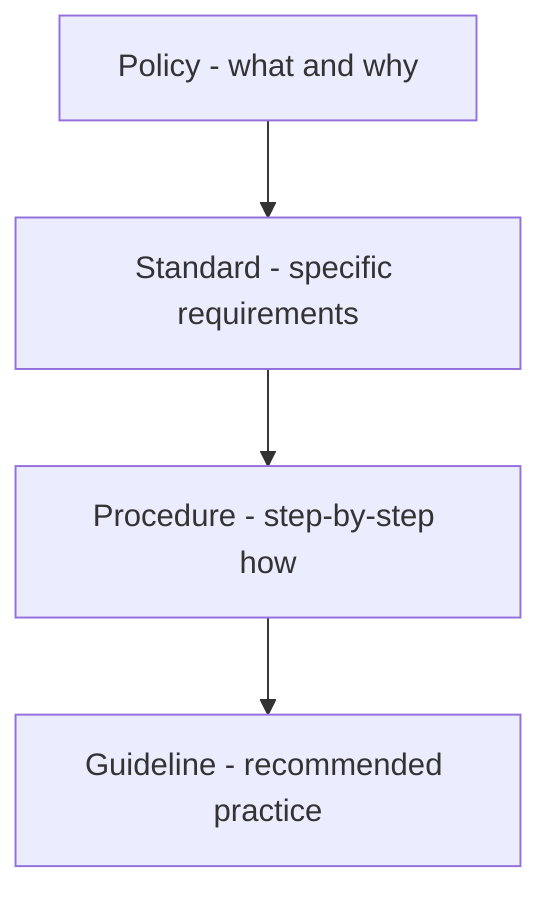

# Volume 02 - Policies

| Field | Value |
|---|---|
| Document ID | WORLD-VOL02-054 |
| Title | Policies |
| Version | 1.0 |
| Status | Approved |
| Classification | Internal |
| Founder | Mahesh Choudhary |

## Purpose

This document defines business policies from first principles, distinguishes them from related governance instruments, and explains how they translate intent into consistent action. It links the knowledge and document chapters to the compliance chapter that follows.

## Scope

This chapter covers the definition, hierarchy, structure, and lifecycle of policies as a general reference. It does not enumerate any organization's specific policies.

## Definition

A policy is a formal statement of intent that establishes the principles and rules governing how an organization behaves and makes decisions. A policy expresses what the organization requires or prohibits and why, providing a stable frame within which people and systems act. Policies convert values and objectives into enforceable expectations.

## Why Policies Matter

Policies create consistency, reduce risk, and encode institutional knowledge into repeatable rules. They ensure that decisions do not depend on the individual making them, that legal and ethical obligations are met, and that the organization can demonstrate deliberate control over its conduct. Well-designed policies balance protection with the freedom to operate efficiently.

## The Governance Hierarchy

Policies sit at the top of the governance hierarchy. A policy states intent; a standard specifies mandatory, measurable requirements that satisfy it; a procedure describes the exact steps to follow; and a guideline offers recommended, non-mandatory practice. Confusing these levels is a common source of unenforceable or overly rigid rules.

## Types of Policy

| Type | Governs | Example |
|---|---|---|
| Operational | Day-to-day conduct of work | Procurement approval limits |
| Human resources | Workforce and conduct | Code of conduct, leave policy |
| Financial | Money and controls | Expense and delegation policy |
| Information and security | Data and systems | Access control, data retention |
| Compliance and legal | Regulatory obligations | Anti-bribery, privacy policy |

## Anatomy of a Policy

A well-formed policy states its purpose, its scope (who and what it applies to), the policy statements themselves, defined roles and responsibilities, the consequences of non-compliance, and references to related standards and procedures. Clear ownership and an effective date are essential for enforceability.

## Policy Lifecycle

Policies are proposed, drafted, reviewed by stakeholders, approved by an authorized owner, published and communicated, enforced, and periodically reviewed for continued relevance before being revised or retired. Version control preserves the history of why rules changed.

## Concrete Example

An organization adopts a data retention policy stating that customer records must be kept for seven years and then securely destroyed (the policy: what and why). A supporting standard specifies the encryption and storage requirements (the standard). A procedure details the quarterly steps for identifying and purging expired records (the procedure). Together they turn an abstract intent into a repeatable, auditable practice.

## Relevance to WORLD

The AI Business Partner treats policies as executable constraints, applying an organization's rules automatically to every decision and action it takes. By encoding policies as machine-readable logic, WORLD guarantees that automated conduct stays within approved limits and can explain which policy governed any given outcome.

## Related Documents

- [Business Knowledge](/docs/blueprint/volume-02-business-foundation/section-g-data-and-knowledge/52-business-knowledge.md)
- [Business Documents](/docs/blueprint/volume-02-business-foundation/section-g-data-and-knowledge/53-business-documents.md)
- [Compliance](/docs/blueprint/volume-02-business-foundation/section-g-data-and-knowledge/55-compliance.md)

## References

- [Volume 01 - Vision and Philosophy](/docs/blueprint/volume-01-vision-and-philosophy/README.md)
- [Document Standards](/docs/governance/document-standards.md)

## Change Log

| Version | Date | Author | Description |
|---|---|---|---|
| 1.0 | 2026-07-12 | Lead Software Engineer | Initial approved version. |
