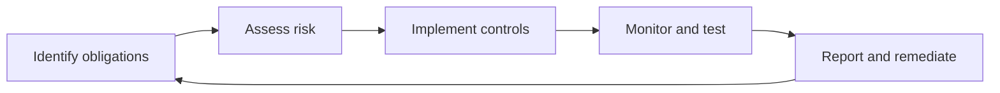

# Volume 02 - Compliance

| Field | Value |
|---|---|
| Document ID | WORLD-VOL02-055 |
| Title | Compliance |
| Version | 1.0 |
| Status | Approved |
| Classification | Internal |
| Founder | Mahesh Choudhary |

## Purpose

This document defines compliance from first principles, explains why it is essential to sustainable business, and describes how organizations achieve and demonstrate it. It closes Section G by connecting policies, documents, and data to the obligation to operate within the rules.

## Scope

This chapter covers the definition, sources, components, and lifecycle of compliance as a general reference. It does not provide legal advice or enumerate the specific regulations that apply to any particular organization.

## Definition

Compliance is the state and ongoing practice of conforming to the laws, regulations, standards, contractual commitments, and internal policies that apply to an organization. It is both an outcome (being in conformance) and a discipline (the processes that keep the organization there). Compliance turns external and internal obligations into verifiable, everyday conduct.

## Why Compliance Matters

Non-compliance carries legal penalties, financial loss, and reputational damage, and can threaten an organization's license to operate. Beyond avoiding harm, strong compliance builds trust with customers, regulators, and partners, and provides the documented evidence needed to demonstrate good conduct. Compliance is where policy meets accountability.

## Sources of Compliance Obligation

| Source | Origin | Examples |
|---|---|---|
| Legal | Statutes and laws | Corporate and tax law |
| Regulatory | Sector regulators | Financial, health, privacy rules |
| Contractual | Agreements with parties | Service-level and data terms |
| Standards | Industry frameworks | Security and quality standards |
| Internal | Own policies | Code of conduct, controls |

Obligations flow inward from external law and outward from internal policy, and a mature program reconciles both into a single set of controls.

## The Compliance Cycle

Compliance is continuous, not a one-time event. The organization identifies applicable obligations, assesses the risk of failing them, implements controls, monitors and tests those controls, and reports and remediates gaps, then repeats the cycle as obligations and risks evolve.

## Core Components of a Compliance Program

An effective program includes clear governance and accountability, a register of obligations, risk assessment, documented controls, training and awareness, monitoring and audit, incident and breach handling, and record-keeping that produces an audit trail. Evidence is central: compliance must not only exist but be demonstrable.

## Compliance versus Governance and Risk

Governance sets direction through policy, risk management weighs and prioritizes threats, and compliance ensures conformance to the resulting rules and obligations. The three disciplines are complementary and are often managed together as an integrated GRC (governance, risk, and compliance) practice.

## Concrete Example

A company handling personal data identifies a privacy obligation to obtain consent and honor deletion requests. It assesses the risk of mishandling data, implements controls such as consent capture and a deletion workflow, monitors these controls through periodic testing, and logs every request and action. When a regulator inquires, the company produces the audit trail proving that each deletion request was fulfilled within the required period.

## Relevance to WORLD

The AI Business Partner embeds compliance into every action by enforcing applicable obligations as controls and by recording an auditable trail of what it did and why. Because WORLD reasons over governed data and encoded policies, it can continuously monitor for compliance gaps and demonstrate conformance on demand.

## Related Documents

- [Policies](/docs/blueprint/volume-02-business-foundation/section-g-data-and-knowledge/54-policies.md)
- [Business Documents](/docs/blueprint/volume-02-business-foundation/section-g-data-and-knowledge/53-business-documents.md)
- [Business Data](/docs/blueprint/volume-02-business-foundation/section-g-data-and-knowledge/49-business-data.md)

## References

- [Volume 01 - Vision and Philosophy](/docs/blueprint/volume-01-vision-and-philosophy/README.md)
- [Document Standards](/docs/governance/document-standards.md)

## Change Log

| Version | Date | Author | Description |
|---|---|---|---|
| 1.0 | 2026-07-12 | Lead Software Engineer | Initial approved version. |
