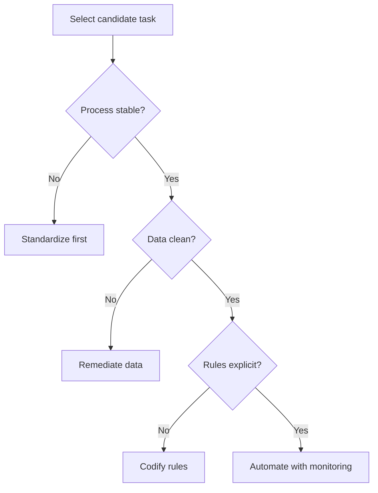

# Volume 02 - Automation Readiness

| Field | Value |
|---|---|
| Document ID | WORLD-VOL02-057 |
| Title | Automation Readiness |
| Version | 1.0 |
| Status | Approved |
| Classification | Internal |
| Founder | Mahesh Choudhary |

## Purpose

This document defines automation readiness from first principles: the degree to which a business is prepared to hand routine, rule-based work to machines reliably and safely. It provides a leveled model for assessing readiness and a vocabulary for identifying what must be true before automation delivers durable value.

## Scope

The scope covers the meaning of automation, its preconditions, the dimensions of readiness, and a five-level maturity scale. It is general business knowledge and does not prescribe a specific automation program. It relates the concept to how an AI Business Partner evaluates a customer's suitability for automation.

## What Automation Readiness Is

Automation is the execution of work by systems without step-by-step human action. Readiness is the precondition set that makes automation trustworthy: stable processes, clean data, clear rules, and defined ownership. At first principles, a task can be automated only when it is **observable** (its inputs and outputs are captured), **repeatable** (it follows consistent logic), and **governable** (someone owns its correctness). Automating an unstable or opaque process merely accelerates errors.

## Why It Matters

Automation compounds: every routine task removed frees human attention for judgment work, and freed attention is the scarcest resource in any organization. But premature automation is costly because it embeds today's flaws into tomorrow's speed. Readiness discipline ensures that what is automated is worth automating and safe to automate.

## Dimensions of Readiness

| Dimension | Question It Answers |
|---|---|
| Process Stability | Is the process consistent and documented? |
| Data Quality | Are inputs accurate, complete, and accessible? |
| Rule Clarity | Can decisions be expressed as explicit logic? |
| System Connectivity | Can tools exchange data via interfaces? |
| Governance | Is there ownership, monitoring, and rollback? |

## Maturity Levels

| Level | Name | Criteria |
|---|---|---|
| 1 | Manual | Work performed by hand; no documented processes |
| 2 | Assisted | Digital tools used, but steps triggered manually |
| 3 | Rule-Based | Defined rules automate discrete, stable tasks |
| 4 | Orchestrated | End-to-end flows automated across systems |
| 5 | Self-Optimizing | Automation monitors and improves itself with oversight |

## Readiness Assessment Flow

## Concrete Example

A services firm wants to automate invoice approval. It is at Level 2: invoices arrive as email attachments and a manager approves them manually. To reach Level 3, the firm standardizes an approval rule (approve under a threshold if the purchase order matches), digitizes invoice data, and connects the finance system. Once approvals run automatically with an exception queue for mismatches, the firm has crossed into rule-based automation and can measure error and cycle-time reductions.

## Relevance to WORLD

An AI Business Partner scores each of a customer's workflows against the readiness dimensions and recommends only automations whose preconditions are met, staging the rest with remediation steps. This prevents the platform from automating fragile processes and instead sequences automation so that each step is observable, repeatable, and governable.

## Related Documents

- [Digital Transformation](/docs/blueprint/volume-02-business-foundation/section-h-future-ready-business/56-digital-transformation.md)
- [AI Readiness](/docs/blueprint/volume-02-business-foundation/section-h-future-ready-business/58-ai-readiness.md)
- [Business Maturity Model](/docs/blueprint/volume-02-business-foundation/section-h-future-ready-business/62-business-maturity-model.md)

## References

- [Volume 01 - Vision and Philosophy](/docs/blueprint/volume-01-vision-and-philosophy/README.md)
- [Document Standards](/docs/governance/document-standards.md)

## Change Log

| Version | Date | Author | Notes |
|---|---|---|---|
| 1.0 | 2026-07-12 | Lead Software Engineer | Initial approved version. |
