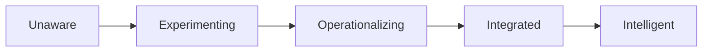

# Volume 02 - AI Readiness

| Field | Value |
|---|---|
| Document ID | WORLD-VOL02-058 |
| Title | AI Readiness |
| Version | 1.0 |
| Status | Approved |
| Classification | Internal |
| Founder | Mahesh Choudhary |

## Purpose

This document defines AI readiness from first principles: the degree to which a business can adopt, trust, and benefit from artificial intelligence. It distinguishes AI readiness from automation readiness, sets out its dimensions, and provides a leveled maturity model for assessment.

## Scope

The scope covers the meaning of AI readiness, its preconditions, dimensions, and a five-level maturity scale. It is general business knowledge and does not prescribe a specific AI program. It relates the concept to how an AI Business Partner assesses whether a customer can responsibly delegate judgment to intelligent systems.

## What AI Readiness Is

Where automation executes fixed rules, AI produces predictions, classifications, and recommendations from patterns in data. AI readiness is therefore a higher bar than automation readiness: it requires not only stable processes but also **learnable signal** (data rich enough to model), **decision framing** (a clear objective the model serves), and **trust mechanisms** (ways to validate, explain, and correct outputs). At first principles, AI is only valuable where a decision is repeated often, benefits from pattern recognition, and can tolerate probabilistic answers with human oversight.

## Why It Matters

AI shifts a business from encoding known rules to discovering unknown patterns, unlocking decisions that were previously too complex or too numerous for people to make well. But AI amplifies data flaws and can fail silently. Readiness ensures adoption is grounded in reliable data, appropriate use cases, and governance that keeps humans accountable for outcomes.

## Dimensions of AI Readiness

| Dimension | Question It Answers |
|---|---|
| Data Foundation | Is there sufficient, representative, accessible data? |
| Use-Case Fit | Is the decision repeated and pattern-rich? |
| Talent and Literacy | Can people interpret and challenge AI outputs? |
| Infrastructure | Can models be deployed, served, and monitored? |
| Governance and Ethics | Are bias, privacy, and accountability managed? |

## Maturity Levels

| Level | Name | Criteria |
|---|---|---|
| 1 | Unaware | No AI use; data scattered and untrusted |
| 2 | Experimenting | Isolated pilots; no production integration |
| 3 | Operationalizing | AI supports select decisions with oversight |
| 4 | Integrated | AI embedded across core workflows with monitoring |
| 5 | Intelligent | AI continuously learns and drives strategy with governance |

## Readiness Progression

## Concrete Example

A retailer wants AI to forecast demand. It has three years of clean sales history (data foundation), a repeated weekly decision (use-case fit), and analysts who can sanity-check forecasts (literacy). It reaches Level 3 by deploying a forecasting model whose output planners can override, with accuracy tracked against actuals. Only after the model proves reliable and monitored does the retailer let it drive automatic replenishment, moving toward Level 4.

## Relevance to WORLD

An AI Business Partner evaluates a customer's data foundation, use-case fit, and governance before proposing where intelligence should be applied, and it embeds trust mechanisms such as explanations and human-in-the-loop review. This lets the platform expand a customer's use of AI in step with their genuine readiness rather than their enthusiasm.

## Related Documents

- [Automation Readiness](/docs/blueprint/volume-02-business-foundation/section-h-future-ready-business/57-automation-readiness.md)
- [Digital Transformation](/docs/blueprint/volume-02-business-foundation/section-h-future-ready-business/56-digital-transformation.md)
- [Business Maturity Model](/docs/blueprint/volume-02-business-foundation/section-h-future-ready-business/62-business-maturity-model.md)

## References

- [Volume 01 - Vision and Philosophy](/docs/blueprint/volume-01-vision-and-philosophy/README.md)
- [Document Standards](/docs/governance/document-standards.md)

## Change Log

| Version | Date | Author | Notes |
|---|---|---|---|
| 1.0 | 2026-07-12 | Lead Software Engineer | Initial approved version. |
