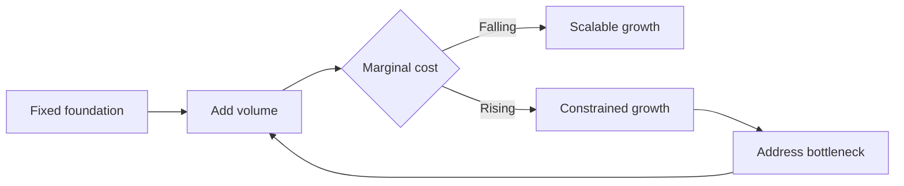

# Volume 02 - Scalability Model

| Field | Value |
|---|---|
| Document ID | WORLD-VOL02-059 |
| Title | Scalability Model |
| Version | 1.0 |
| Status | Approved |
| Classification | Internal |
| Founder | Mahesh Choudhary |

## Purpose

This document defines scalability from first principles: the ability of a business to grow output and value without a proportional growth in cost, effort, or fragility. It provides a model of the dimensions of scalability and the constraints that limit growth.

## Scope

The scope covers the meaning of scalability, the difference between growth and scale, the dimensions along which businesses scale, and the constraints that bound them. It is general business knowledge and does not prescribe a specific growth plan. It relates the concept to how an AI Business Partner reasons about a customer's capacity to grow.

## What Scalability Is

Scalability is a property of a system: how its outputs respond as inputs increase. A scalable business adds revenue or customers while its marginal cost per unit falls or holds steady. At first principles, scale comes from **leverage** - assets that serve many customers at once (software, brand, network effects, standardized processes) rather than assets consumed one customer at a time (bespoke labor). Growth is getting bigger; scale is getting bigger efficiently.

## Why It Matters

Unscalable growth eventually collapses under its own weight: costs rise as fast as revenue, quality slips, and coordination breaks down. Understanding scalability lets a business grow deliberately, investing in the leverage points that make each additional unit cheaper and each additional customer easier to serve.

## Dimensions of Scalability

| Dimension | Description | Leverage Source |
|---|---|---|
| Operational | Serving more volume per unit of effort | Automation, standardization |
| Financial | Funding growth without proportional cash strain | Margin, capital efficiency |
| Technical | Systems handling more load reliably | Elastic infrastructure |
| Organizational | Growing headcount without chaos | Clear roles, processes |
| Market | Reaching more customers efficiently | Channels, network effects |

## The Scaling Curve

## Constraints and Bottlenecks

Every system scales only as far as its tightest constraint. Common bottlenecks include manual processes that require linear headcount, single points of dependency, data that cannot be shared, and cash that cannot fund lead times. Scaling is therefore a discipline of finding and relieving the current binding constraint, then finding the next.

## Concrete Example

A training company delivers courses through in-person instructors. Doubling revenue means doubling instructors, rooms, and travel - operational cost scales linearly, so it grows but does not scale. By recording courses into an on-demand platform, the company creates a leverage asset: one recording serves thousands of learners at near-zero marginal cost. The binding constraint shifts from instructor hours to marketing reach, which is far more scalable.

## Relevance to WORLD

An AI Business Partner models a customer's scaling curve, identifies the current binding constraint, and recommends the leverage investments that lower marginal cost. By continuously re-evaluating which constraint binds next, the platform helps a business grow without accumulating the fragility that unmanaged growth creates.

## Related Documents

- [Enterprise Readiness](/docs/blueprint/volume-02-business-foundation/section-h-future-ready-business/60-enterprise-readiness.md)
- [Global Expansion Readiness](/docs/blueprint/volume-02-business-foundation/section-h-future-ready-business/61-global-expansion-readiness.md)
- [Business Maturity Model](/docs/blueprint/volume-02-business-foundation/section-h-future-ready-business/62-business-maturity-model.md)

## References

- [Volume 01 - Vision and Philosophy](/docs/blueprint/volume-01-vision-and-philosophy/README.md)
- [Document Standards](/docs/governance/document-standards.md)

## Change Log

| Version | Date | Author | Notes |
|---|---|---|---|
| 1.0 | 2026-07-12 | Lead Software Engineer | Initial approved version. |
