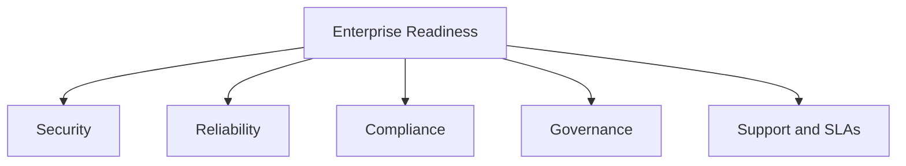

# Volume 02 - Enterprise Readiness

| Field | Value |
|---|---|
| Document ID | WORLD-VOL02-060 |
| Title | Enterprise Readiness |
| Version | 1.0 |
| Status | Approved |
| Classification | Internal |
| Founder | Mahesh Choudhary |

## Purpose

This document defines enterprise readiness from first principles: the degree to which a business or product meets the reliability, security, and governance expectations of large organizations. It sets out the dimensions of readiness and a leveled maturity model.

## Scope

The scope covers the meaning of enterprise readiness, why it differs from serving small customers, its dimensions, and a five-level maturity scale. It is general business knowledge and does not prescribe a specific compliance program. It relates the concept to how an AI Business Partner assesses readiness to serve or become an enterprise.

## What Enterprise Readiness Is

Enterprise readiness is the set of capabilities that make an organization trustworthy to operate at large scale and to be relied upon by demanding customers. At first principles, large organizations delegate critical work to suppliers and internal functions, so they require **predictability** (consistent, documented behavior), **security** (protection of data and access), **compliance** (adherence to laws and standards), and **supportability** (the ability to resolve problems within committed timeframes). Readiness is the evidence that these guarantees can be kept under stress.

## Why It Matters

Small customers tolerate informality; enterprises cannot. A single security lapse or unmet service commitment can create disproportionate loss. Enterprise readiness matters because it is the threshold that separates businesses able to win and retain large, durable relationships from those confined to smaller, higher-churn segments.

## Dimensions of Enterprise Readiness

| Dimension | Focus |
|---|---|
| Security | Access control, encryption, threat management |
| Reliability | Uptime, resilience, disaster recovery |
| Compliance | Regulatory and standards adherence, audit trails |
| Governance | Roles, policies, accountability, risk management |
| Support and SLAs | Response commitments, escalation, documentation |
| Integration | Interoperability with existing enterprise systems |

## Maturity Levels

| Level | Name | Criteria |
|---|---|---|
| 1 | Ad Hoc | Informal practices; no documented controls |
| 2 | Defined | Core policies exist but are inconsistently applied |
| 3 | Managed | Controls applied consistently and measured |
| 4 | Assured | Independently audited; SLAs met reliably |
| 5 | Optimized | Continuous improvement; readiness is a competitive asset |

## Readiness Domains

## Concrete Example

A software vendor selling to small teams wins interest from a large bank. The bank's procurement requires single sign-on, encryption at rest, an audited security certification, a 99.9 percent uptime commitment, and documented incident response. The vendor is at Level 2: it has informal practices but no evidence. To reach Level 4, it formalizes controls, obtains an independent audit, and publishes SLAs, turning readiness into proof the bank can trust.

## Relevance to WORLD

An AI Business Partner assesses a customer against the enterprise-readiness dimensions and highlights the gaps that block larger relationships, sequencing remediation from the highest-risk controls first. By tracking evidence such as audits and SLA performance, the platform helps a business convert readiness from an aspiration into demonstrable proof.

## Related Documents

- [Scalability Model](/docs/blueprint/volume-02-business-foundation/section-h-future-ready-business/59-scalability-model.md)
- [Global Expansion Readiness](/docs/blueprint/volume-02-business-foundation/section-h-future-ready-business/61-global-expansion-readiness.md)
- [Business Maturity Model](/docs/blueprint/volume-02-business-foundation/section-h-future-ready-business/62-business-maturity-model.md)

## References

- [Volume 01 - Vision and Philosophy](/docs/blueprint/volume-01-vision-and-philosophy/README.md)
- [Document Standards](/docs/governance/document-standards.md)

## Change Log

| Version | Date | Author | Notes |
|---|---|---|---|
| 1.0 | 2026-07-12 | Lead Software Engineer | Initial approved version. |
