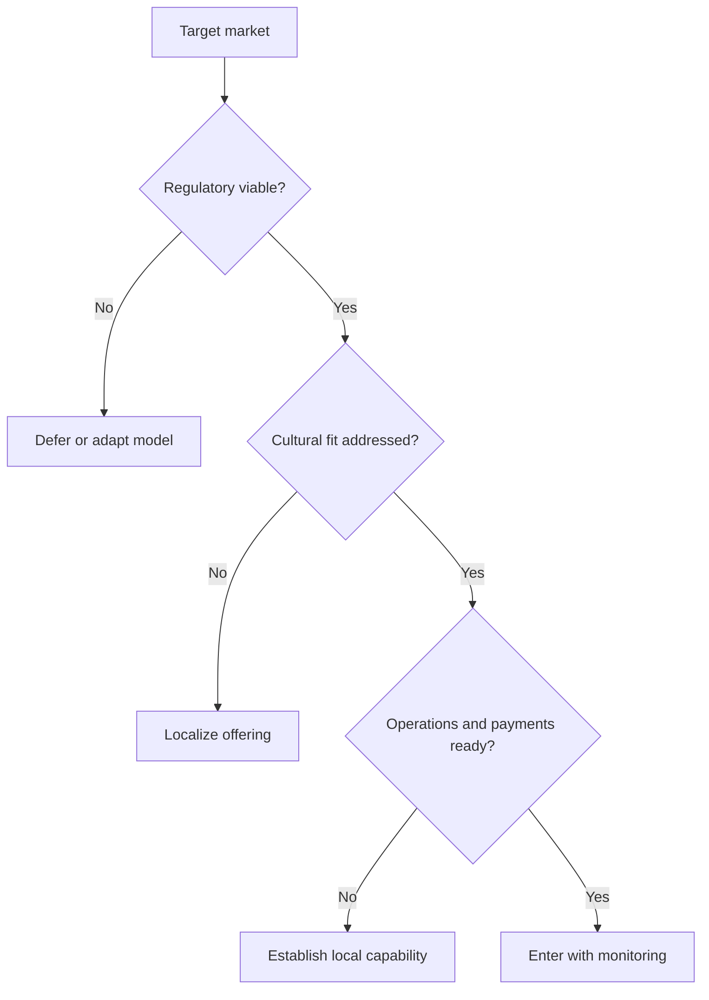

# Volume 02 - Global Expansion Readiness

| Field | Value |
|---|---|
| Document ID | WORLD-VOL02-061 |
| Title | Global Expansion Readiness |
| Version | 1.0 |
| Status | Approved |
| Classification | Internal |
| Founder | Mahesh Choudhary |

## Purpose

This document defines global expansion readiness from first principles: the degree to which a business is prepared to enter and operate in markets beyond its home country. It sets out the dimensions of readiness and a leveled maturity model for assessing preparedness.

## Scope

The scope covers the meaning of global expansion readiness, its drivers and risks, dimensions, and a five-level maturity scale. It is general business knowledge and does not prescribe a specific market-entry plan. It relates the concept to how an AI Business Partner evaluates a customer's readiness to expand internationally.

## What Global Expansion Readiness Is

Global expansion readiness is the capability to replicate value creation in a new geography while adapting to its local realities. At first principles, a business succeeds abroad only when its offering remains valuable after crossing four boundaries: **regulatory** (laws, taxes, data rules), **cultural** (language, norms, expectations), **operational** (supply, payments, support in local time zones), and **economic** (pricing power, currency, purchasing behavior). Readiness is the evidence that the business can honor its value promise across all four.

## Why It Matters

Expansion multiplies both opportunity and complexity. A model that thrives at home can fail abroad because of a single unmanaged boundary - an incompatible regulation, a mistranslated message, or a payment method customers do not use. Readiness matters because it converts expansion from a gamble into a staged, evidence-based decision.

## Dimensions of Readiness

| Dimension | Question It Answers |
|---|---|
| Regulatory and Legal | Can the business comply locally and protect data? |
| Cultural and Linguistic | Is the offering adapted to local language and norms? |
| Operational | Can it deliver, support, and be paid locally? |
| Financial | Can it manage currency, pricing, and tax? |
| Market Fit | Is there validated demand in the target market? |

## Maturity Levels

| Level | Name | Criteria |
|---|---|---|
| 1 | Domestic | Operates in home market only; no international capability |
| 2 | Exploring | Researching markets; no local presence |
| 3 | Entering | First market entered with localized offering |
| 4 | Multi-Market | Operating reliably across several geographies |
| 5 | Global | Coordinated global operations with local adaptation |

## Expansion Decision Flow

## Concrete Example

A subscription business wants to expand from its home market into a neighboring country. It is at Level 2. Research reveals the target country mandates local data storage, prefers a payment method the business does not support, and speaks a different primary language. To reach Level 3, the business localizes its interface, adds the local payment method, hosts data in-region for compliance, and validates demand with a small launch before committing further investment.

## Relevance to WORLD

An AI Business Partner assesses a customer's readiness across the regulatory, cultural, operational, and financial boundaries and flags the gaps that would undermine a specific target market. By staging entry behind validated demand and compliance evidence, the platform helps a business expand deliberately rather than reactively.

## Related Documents

- [Scalability Model](/docs/blueprint/volume-02-business-foundation/section-h-future-ready-business/59-scalability-model.md)
- [Enterprise Readiness](/docs/blueprint/volume-02-business-foundation/section-h-future-ready-business/60-enterprise-readiness.md)
- [Business Maturity Model](/docs/blueprint/volume-02-business-foundation/section-h-future-ready-business/62-business-maturity-model.md)

## References

- [Volume 01 - Vision and Philosophy](/docs/blueprint/volume-01-vision-and-philosophy/README.md)
- [Document Standards](/docs/governance/document-standards.md)

## Change Log

| Version | Date | Author | Notes |
|---|---|---|---|
| 1.0 | 2026-07-12 | Lead Software Engineer | Initial approved version. |
