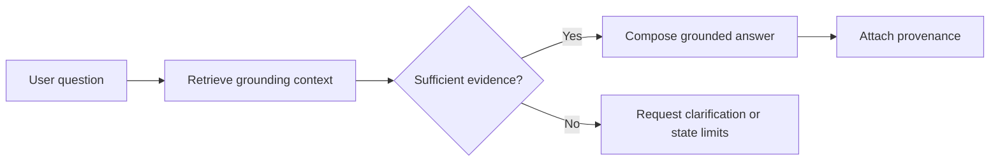
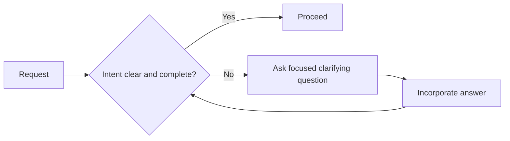
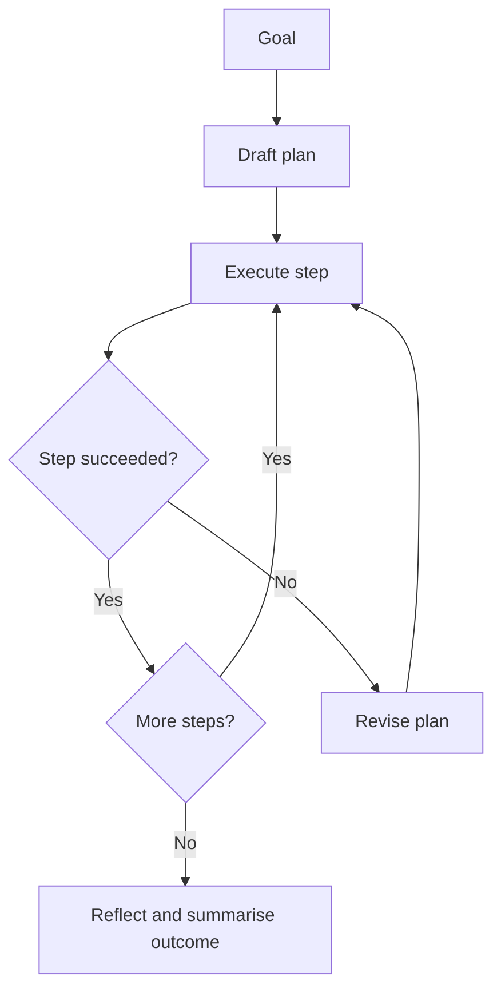
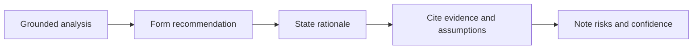
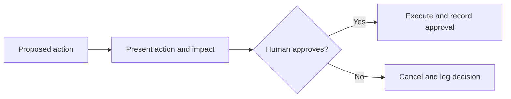
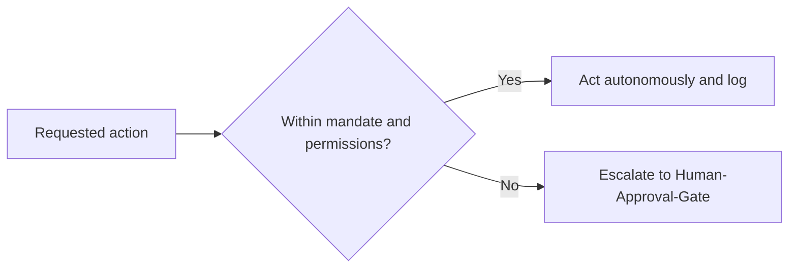

# Volume 03 - AI Design Patterns

| Field | Value |
|---|---|
| Document ID | WORLD-VOL03-A3 |
| Title | AI Design Patterns |
| Version | 1.0 |
| Status | Approved |
| Classification | Internal |
| Founder | Mahesh Choudhary |

## Purpose

This appendix catalogues recurring functional design patterns for the AI Business Partner. Each pattern captures a proven way to structure AI behaviour so that outputs are grounded, safe, explainable, and aligned with user authority. The patterns are intended as reusable building blocks that designers and engineers can apply and combine when specifying AI behaviours across the intelligence layer.

## Scope

The patterns describe functional behaviour, not implementation technology. Each entry states the pattern's intent, the situations in which it applies, its structure, and its consequences. Small diagrams are provided where they clarify flow. Patterns may be composed; for example, Ground-then-Answer commonly precedes Recommend-with-Rationale, and Human-Approval-Gate frequently terminates Plan-Execute-Reflect.

## Pattern Catalogue

### 1. Ground-then-Answer

**Intent.** Ensure every substantive answer is anchored in verifiable business data before it is produced.

**When to use.** Any time the AI Business Partner answers a business question that depends on the user's actual state, records, or documents.

**Structure.**

**Consequences.** Reduces hallucination and increases trust. Adds a retrieval step that may increase latency and requires reliable knowledge sources. When evidence is insufficient, the pattern degrades gracefully to clarification rather than fabrication.

### 2. Clarify-before-Act

**Intent.** Resolve ambiguity in intent, scope, or inputs before performing consequential work.

**When to use.** When a request is underspecified, when multiple interpretations are plausible, or when an action carries meaningful cost or risk.

**Structure.**

**Consequences.** Prevents wasted or incorrect work and respects user authority. Overuse can frustrate users, so clarification should be reserved for genuine ambiguity and batched into a single, focused request where possible.

### 3. Plan-Execute-Reflect

**Intent.** Accomplish multi-step goals reliably by planning first, executing steps, and reflecting on results.

**When to use.** For agentic workflows that require several actions, dependencies, or intermediate checks.

**Structure.**

**Consequences.** Improves reliability and transparency for complex tasks and produces a natural audit trail. Introduces overhead unsuited to trivial requests, and plans must remain revisable when reality diverges from expectation.

### 4. Recommend-with-Rationale

**Intent.** Deliver recommendations that are always accompanied by the reasoning and evidence behind them.

**When to use.** Whenever the AI Business Partner proposes a course of action or a decision option.

**Structure.**

**Consequences.** Supports explainability and lets users critically assess advice. Requires discipline to surface assumptions and confidence honestly; a recommendation without rationale is non-compliant with this pattern.

### 5. Human-Approval-Gate

**Intent.** Require explicit human approval before executing an action that is sensitive, irreversible, or beyond the AI mandate.

**When to use.** For actions affecting money, contracts, external communications, data deletion, or anything exceeding the configured mandate.

**Structure.**

**Consequences.** Enforces user authority and separation of duties and creates accountability. Adds a synchronous human dependency; approval requests must be clear and complete so the approver can decide quickly and correctly.

### 6. Bounded-Autonomy

**Intent.** Allow the AI Business Partner to act independently only within an explicitly defined mandate and permission set.

**When to use.** For routine, low-risk actions where speed is valuable and the scope is well understood.

**Structure.**

**Consequences.** Balances efficiency with control and applies least privilege. Mandate boundaries must be maintained accurately; an overly broad mandate weakens safety, while an overly narrow one erodes usefulness.

### 7. Explain-on-Demand

**Intent.** Provide layered explanations so users can request deeper reasoning without cluttering the primary response.

**When to use.** When answers must stay concise yet remain fully auditable and defensible on request.

**Structure.** Deliver a concise headline answer, then offer an expandable rationale, evidence, and provenance that the user can open when needed.

**Consequences.** Improves readability while preserving explainability and traceability. Requires the underlying reasoning and provenance to be retained even when not initially shown.

## Cross-References

- [Reasoning Framework](/docs/blueprint/volume-03-ai-business-partner/chapters/reasoning-framework.md)
- [Decision Support](/docs/blueprint/volume-03-ai-business-partner/chapters/decision-support.md)
- [Safety and Guardrails](/docs/blueprint/volume-03-ai-business-partner/chapters/safety-and-guardrails.md)

## References

- [Volume 01 - Vision and Philosophy](/docs/blueprint/volume-01-vision-and-philosophy/README.md)
- [Document Standards](/docs/governance/document-standards.md)

## Change Log

| Version | Date | Author | Notes |
|---|---|---|---|
| 1.0 | 2026-07-12 | Lead Software Engineer | Initial approved version. |
