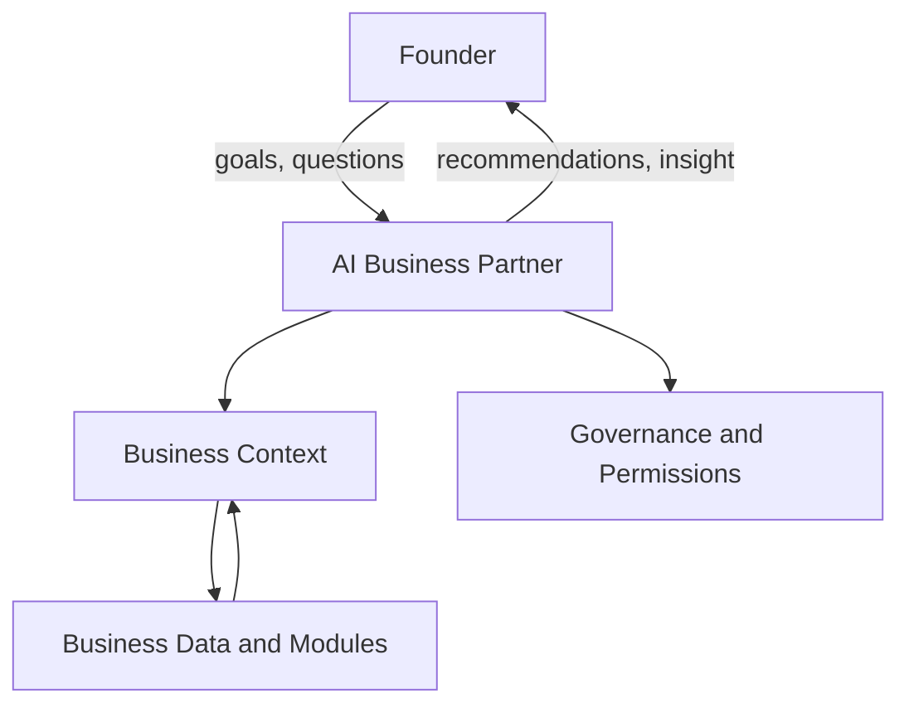

# Volume 03 - What is an AI Business Partner

| Field | Value |
|---|---|
| Document ID | WORLD-VOL03-001 |
| Title | What is an AI Business Partner |
| Version | 1.0 |
| Status | Approved |
| Classification | Internal |
| Founder | Mahesh Choudhary |

## Purpose
This chapter defines, from first principles, what an AI Business Partner is within Project WORLD. It establishes the foundational concept on which every subsequent chapter of Volume 03 depends, distinguishing the AI Business Partner from adjacent categories such as chatbots, assistants, and analytics tools. The definition set here is authoritative for the entire intelligence layer.

## Scope
Conceptual definition only. This chapter describes what the AI Business Partner *is* and *is not*. Its purpose, objectives, capabilities, limitations, and collaboration model are specified in the chapters that follow. Implementation technology is out of scope and belongs to Part C of the Master Blueprint.

## Definition from First Principles
A business partner, in the human sense, is a trusted party who shares responsibility for the health of a business: understanding its context, contributing judgement, and helping the owner make and execute better decisions over time. WORLD's product, as established in [Volume 01 - Product Definition](/docs/blueprint/volume-01-vision-and-philosophy/05-product-definition.md), is an AI Business Partner: the intelligence that turns WORLD from a system of record into a system of judgement.

An **AI Business Partner** is a persistent, context-aware artificial intelligence that understands a specific business, reasons about its goals and risks, recommends actions, and collaborates with the founder to run and grow the business responsibly. It is not a single feature; it is the coordinating intelligence layer that spans every module of the operating system.

Three properties are essential to the definition:

- **Persistence** - it retains memory of the business across time, not merely within a single conversation.
- **Context-awareness** - it understands the business's structure, goals, metrics, and history, drawn from Volume 02 concepts.
- **Partnership** - it works *with* the founder, sharing reasoning transparently rather than issuing opaque outputs.

## What It Is and What It Is Not

| Dimension | AI Business Partner | Chatbot / Generic Assistant |
|---|---|---|
| Memory | Persistent business memory across time | Session-only or none |
| Context | Deep model of the specific business | Generic world knowledge |
| Output | Reasoned recommendations with rationale | Answers or text generation |
| Relationship | Ongoing, accountable collaboration | Transactional query response |
| Scope | Cross-functional business support | Narrow task or topic |
| Governance | Operates within permissions and audit | Typically ungoverned |

## Position in the WORLD Architecture
The AI Business Partner sits above the business data and modules, consuming business context and returning judgement. The following diagram shows its conceptual position.

## Enterprise Example
Consider a founder running a 40-person services company. At month end, revenue has grown but cash is tight. A generic assistant, asked "why is cash low?", would offer generic explanations. The AI Business Partner instead recalls the business's payment terms, reads its receivables and cost structure (Volume 02 concepts), identifies that two large clients moved to 60-day terms, quantifies the impact on cash flow, and recommends a targeted collections action and a revised terms policy - presenting its reasoning so the founder can accept, adjust, or reject it. That combination of memory, context, reasoning, and accountable recommendation is what makes it a partner rather than a tool.

## Cross-References
- [Purpose of the AI Business Partner](/docs/blueprint/volume-03-ai-business-partner/section-a-ai-foundation/02-purpose-of-the-ai-business-partner.md)
- [Human-in-the-Loop Philosophy](/docs/blueprint/volume-03-ai-business-partner/section-a-ai-foundation/08-human-in-the-loop-philosophy.md)
- [Volume 01 - Product Definition](/docs/blueprint/volume-01-vision-and-philosophy/05-product-definition.md)
- [Volume 02 - Business Operating Model](/docs/blueprint/volume-02-business-foundation/section-a-business-fundamentals/05-business-operating-model.md)

## References
- [Volume 01 - Vision & Philosophy](/docs/blueprint/volume-01-vision-and-philosophy/README.md)
- [Document Standards](/docs/governance/document-standards.md)

## Change Log
| Version | Date | Author | Change |
|---|---|---|---|
| 1.0 | 2026-07-12 | Lead Software Engineer | Initial approved version. |
