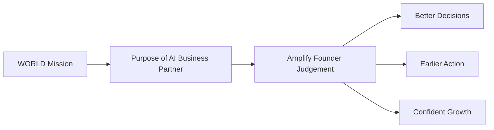

# Volume 03 - Purpose of the AI Business Partner

| Field | Value |
|---|---|
| Document ID | WORLD-VOL03-002 |
| Title | Purpose of the AI Business Partner |
| Version | 1.0 |
| Status | Approved |
| Classification | Internal |
| Founder | Mahesh Choudhary |

## Purpose
This chapter establishes *why* the AI Business Partner exists. It connects the intelligence layer to the problem WORLD was created to solve and to the founder-centric mission defined in Volume 01, so that every downstream capability can be evaluated against a clear reason for being.

## Scope
The purpose and intended outcomes of the AI Business Partner. This chapter does not enumerate objectives (see [Core Objectives](/docs/blueprint/volume-03-ai-business-partner/section-a-ai-foundation/04-core-objectives.md)) or capabilities; it explains the underlying intent those objectives serve.

## The Problem It Exists to Solve
Founders and small leadership teams carry disproportionate cognitive load. They must understand finance, operations, sales, and people simultaneously, usually without the specialist support that large enterprises take for granted. As established in [Volume 01 - Problem Statement](/docs/blueprint/volume-01-vision-and-philosophy/02-problem-statement.md), decisions are made under time pressure, with incomplete information, and without a partner who holds the full picture.

The purpose of the AI Business Partner is to close this gap: to give every founder access to a knowledgeable, always-available partner that understands their business and helps them think and decide better.

## Statement of Purpose
> The AI Business Partner exists to amplify the judgement of the founder - understanding the business deeply, surfacing what matters, reasoning through options transparently, and helping execute decisions responsibly - so that the founder can run and grow the business with the confidence of a much larger team.

## Why It Matters

| Without an AI Business Partner | With an AI Business Partner |
|---|---|
| Insight is scattered across tools and people | Insight is unified and contextual |
| Decisions rely on memory and intuition alone | Decisions are supported by reasoning and evidence |
| Problems are noticed late | Risks and opportunities are surfaced early |
| Expertise is expensive and part-time | Cross-functional guidance is always available |
| The founder is the single point of context | Context is shared, durable, and auditable |

## Purpose Chain
The purpose flows directly from WORLD's mission down to the founder's outcome.

## Enterprise Example
A founder of a regional retail chain is deciding whether to open a fifth store. The purpose of the AI Business Partner is not to make the decision, but to make the founder's decision better: it assembles the relevant context - current unit economics, cash runway, and demand signals - frames the trade-offs, models a conservative and an optimistic scenario, and highlights the single risk most likely to invalidate the plan. The founder decides faster and with greater confidence, which is precisely the outcome the AI Business Partner exists to produce.

## Cross-References
- [What is an AI Business Partner](/docs/blueprint/volume-03-ai-business-partner/section-a-ai-foundation/01-what-is-an-ai-business-partner.md)
- [Core Objectives](/docs/blueprint/volume-03-ai-business-partner/section-a-ai-foundation/04-core-objectives.md)
- [Volume 01 - Purpose, Mission & Vision](/docs/blueprint/volume-01-vision-and-philosophy/04-purpose-mission-vision.md)
- [Volume 01 - Problem Statement](/docs/blueprint/volume-01-vision-and-philosophy/02-problem-statement.md)

## References
- [Volume 01 - Vision & Philosophy](/docs/blueprint/volume-01-vision-and-philosophy/README.md)
- [Document Standards](/docs/governance/document-standards.md)

## Change Log
| Version | Date | Author | Change |
|---|---|---|---|
| 1.0 | 2026-07-12 | Lead Software Engineer | Initial approved version. |
