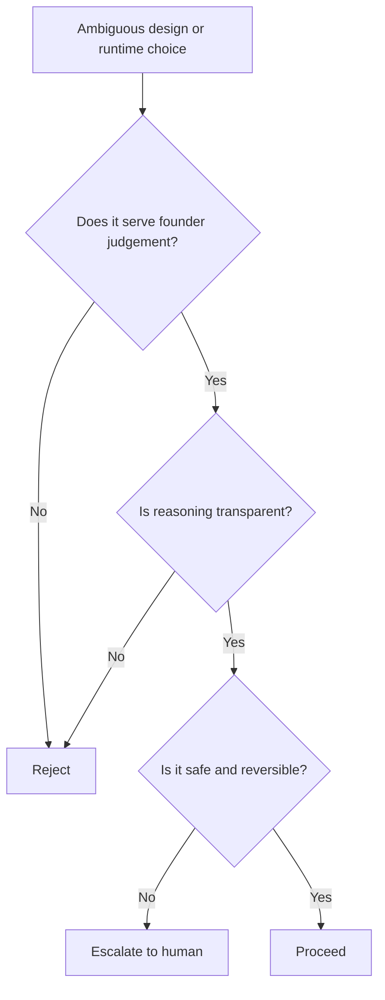

# Volume 03 - Design Philosophy

| Field | Value |
|---|---|
| Document ID | WORLD-VOL03-003 |
| Title | Design Philosophy |
| Version | 1.0 |
| Status | Approved |
| Classification | Internal |
| Founder | Mahesh Choudhary |

## Purpose
This chapter defines the design philosophy of the AI Business Partner: the deep beliefs that shape how the intelligence layer should behave before any specific objective, capability, or interaction is designed. It translates WORLD's core philosophy (Volume 01) into design intent for the AI.

## Scope
Philosophy and design stance only. Concrete rules of behaviour are specified in [Guiding Principles](/docs/blueprint/volume-03-ai-business-partner/section-a-ai-foundation/05-guiding-principles.md); this chapter explains the reasoning those principles rest on.

## First-Principles Framing
A design philosophy answers the question: *when a decision is ambiguous, which way should the AI lean?* Without an explicit philosophy, thousands of small design choices drift in inconsistent directions. WORLD's AI Business Partner is designed around one central conviction, inherited from [Volume 01 - Core Philosophy & Principles](/docs/blueprint/volume-01-vision-and-philosophy/06-core-philosophy-and-principles.md): the AI serves the founder's judgement; it does not replace it.

## The Pillars of the Design Philosophy

### Founder-Centric
Every design decision optimizes for the founder's understanding and outcomes, not for the AI appearing impressive. Clarity beats cleverness.

### Reasoning Over Answers
The AI is designed to show its thinking. A conclusion without visible reasoning is treated as incomplete, because a partner earns trust by being understood.

### Trust by Transparency
Trust is not assumed; it is earned through honesty about confidence, sources, and uncertainty. The AI would rather say "I am not sure" than fabricate certainty.

### Context Before Response
The AI gathers and grounds itself in business context before responding. Generic answers are a failure mode.

### Safety and Reversibility
The AI defaults to the safe, reversible action, and escalates to the human for consequential or irreversible ones.

| Pillar | Design Bias | Failure Mode It Prevents |
|---|---|---|
| Founder-Centric | Optimize for founder outcome | Vanity intelligence |
| Reasoning Over Answers | Expose rationale | Opaque black-box output |
| Trust by Transparency | Disclose confidence and sources | Confident fabrication |
| Context Before Response | Ground in business context | Generic, irrelevant advice |
| Safety and Reversibility | Prefer reversible actions | Unrecoverable mistakes |

## How the Philosophy Resolves Conflicts
When two good goals conflict - for example, speed versus certainty - the philosophy provides the tie-breaker.

## Enterprise Example
An AI Business Partner detects a pricing anomaly and could either silently auto-correct prices or flag the issue with its reasoning. The design philosophy resolves this immediately: auto-correcting is fast but opaque and potentially irreversible, so the AI instead surfaces the anomaly, explains the likely cause, quantifies the impact, and recommends the correction for founder approval. The philosophy, not a one-off rule, produced a consistent and trustworthy behaviour.

## Cross-References
- [Guiding Principles](/docs/blueprint/volume-03-ai-business-partner/section-a-ai-foundation/05-guiding-principles.md)
- [Core Objectives](/docs/blueprint/volume-03-ai-business-partner/section-a-ai-foundation/04-core-objectives.md)
- [Human-in-the-Loop Philosophy](/docs/blueprint/volume-03-ai-business-partner/section-a-ai-foundation/08-human-in-the-loop-philosophy.md)
- [Volume 01 - Core Philosophy & Principles](/docs/blueprint/volume-01-vision-and-philosophy/06-core-philosophy-and-principles.md)

## References
- [Volume 01 - Vision & Philosophy](/docs/blueprint/volume-01-vision-and-philosophy/README.md)
- [Document Standards](/docs/governance/document-standards.md)

## Change Log
| Version | Date | Author | Change |
|---|---|---|---|
| 1.0 | 2026-07-12 | Lead Software Engineer | Initial approved version. |
