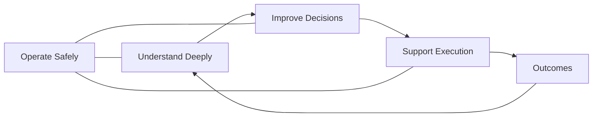

# Volume 03 - Core Objectives

| Field | Value |
|---|---|
| Document ID | WORLD-VOL03-004 |
| Title | Core Objectives |
| Version | 1.0 |
| Status | Approved |
| Classification | Internal |
| Founder | Mahesh Choudhary |

## Purpose
This chapter translates the purpose and philosophy of the AI Business Partner into a concrete set of core objectives - the measurable outcomes the intelligence layer is designed to achieve. These objectives are the standard against which every AI capability and behaviour is judged.

## Scope
The defining objectives of the AI Business Partner and how they are measured at a conceptual level. Detailed metrics and KPI models are covered in Volume 02 Section D and in later Volume 03 cognition chapters; this chapter defines the objectives themselves.

## From Purpose to Objectives
An objective is a purpose made specific and observable. Where [Purpose](/docs/blueprint/volume-03-ai-business-partner/section-a-ai-foundation/02-purpose-of-the-ai-business-partner.md) states *why* the AI exists, objectives state *what good performance looks like*. WORLD defines five core objectives.

## The Five Core Objectives

### 1. Understand the Business Deeply
Maintain an accurate, current model of the business - its goals, structure, metrics, and history - so that every response is grounded in context.

### 2. Improve Decision Quality
Help the founder make better decisions by framing options, surfacing trade-offs, and quantifying impact with transparent reasoning.

### 3. Surface What Matters Early
Detect risks and opportunities proactively so the founder acts ahead of events rather than reacting to them.

### 4. Support Reliable Execution
Help turn decisions into action - plans, follow-ups, and monitoring - and keep the founder informed of progress.

### 5. Operate Safely and Accountably
Work within permissions, disclose confidence and limitations, and keep a clear record of reasoning and actions.

| # | Objective | Primary Outcome | Illustrative Measure |
|---|---|---|---|
| 1 | Understand deeply | Contextual relevance | Share of responses grounded in business context |
| 2 | Improve decisions | Decision quality | Founder-rated usefulness of recommendations |
| 3 | Surface early | Proactivity | Lead time between detection and impact |
| 4 | Support execution | Follow-through | Share of decisions tracked to completion |
| 5 | Operate safely | Trust and control | Adherence to permission and escalation rules |

## How the Objectives Relate
The objectives form a reinforcing loop: understanding enables better decisions, which drive execution, which generates outcomes that deepen understanding - all under a constant safety constraint.

## Enterprise Example
A founder asks the AI Business Partner to help hit a quarterly margin target. Objective 1 ensures the AI already understands the current cost structure and margin trend. Objective 3 leads it to flag that one supplier's price increase threatens the target. Objective 2 produces a ranked set of corrective options with quantified impact. Objective 4 turns the chosen option into a tracked plan with checkpoints. Objective 5 ensures no supplier contract is changed without the founder's explicit approval. All five objectives operate together on a single, real business goal.

## Cross-References
- [Purpose of the AI Business Partner](/docs/blueprint/volume-03-ai-business-partner/section-a-ai-foundation/02-purpose-of-the-ai-business-partner.md)
- [Guiding Principles](/docs/blueprint/volume-03-ai-business-partner/section-a-ai-foundation/05-guiding-principles.md)
- [AI Capabilities](/docs/blueprint/volume-03-ai-business-partner/section-a-ai-foundation/06-ai-capabilities.md)
- [Volume 02 - KPIs](/docs/blueprint/volume-02-business-foundation/section-d-business-intelligence/26-kpis.md)

## References
- [Volume 01 - Vision & Philosophy](/docs/blueprint/volume-01-vision-and-philosophy/README.md)
- [Document Standards](/docs/governance/document-standards.md)

## Change Log
| Version | Date | Author | Change |
|---|---|---|---|
| 1.0 | 2026-07-12 | Lead Software Engineer | Initial approved version. |
