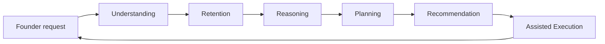

# Volume 03 - AI Capabilities

| Field | Value |
|---|---|
| Document ID | WORLD-VOL03-006 |
| Title | AI Capabilities |
| Version | 1.0 |
| Status | Approved |
| Classification | Internal |
| Founder | Mahesh Choudhary |

## Purpose
This chapter defines, from first principles, the categories of capability the AI Business Partner is expected to possess. It provides a stable taxonomy so that every future reasoning engine, planning engine, and advisor can be located within a shared map of what the AI can do.

## Scope
Capability categories and their intent. This chapter does not specify the algorithms or technology that deliver each capability, nor the boundaries where capabilities stop - those boundaries are defined in [AI Limitations](/docs/blueprint/volume-03-ai-business-partner/section-a-ai-foundation/07-ai-limitations.md).

## What a Capability Is
A capability is a durable class of things the AI can do to serve its objectives. Capabilities are defined at the functional level - what value they produce - rather than by implementation, so that the specification remains stable as underlying technology evolves.

## Capability Taxonomy
The AI Business Partner's capabilities fall into six categories, layered from perception through to action.

| Layer | Capability | What It Enables |
|---|---|---|
| Perception | Understanding | Interpret questions, documents, and business context |
| Memory | Retention | Recall business history and prior decisions over time |
| Cognition | Reasoning | Analyse causes, weigh options, form judgements |
| Cognition | Planning | Break goals into ordered, feasible steps |
| Advisory | Recommendation | Propose ranked actions with rationale and impact |
| Action | Assisted Execution | Draft, monitor, and follow up within permissions |

### Understanding
Interpreting natural-language questions, business documents, and structured data to determine what the founder actually needs.

### Retention
Maintaining persistent memory of the business so context accumulates rather than resets.

### Reasoning
Analysing situations, performing root-cause analysis, and weighing options against goals and constraints.

### Planning
Decomposing a goal into a sequenced, feasible set of steps with dependencies and checkpoints.

### Recommendation
Producing ranked, justified recommendations with expected impact and confidence.

### Assisted Execution
Helping act on decisions - drafting communications, initiating workflows, and monitoring progress - always within granted permissions.

## How Capabilities Combine
Capabilities are not used in isolation; a single request typically flows through several layers.

## Enterprise Example
A founder types: "Sales dipped last month - what should I do?" *Understanding* interprets the intent as diagnosis plus action. *Retention* recalls the sales trend and recent pipeline changes. *Reasoning* isolates that a key salesperson's territory underperformed. *Planning* structures a two-week recovery plan. *Recommendation* ranks three interventions by expected impact and confidence. *Assisted Execution* drafts the coaching message and sets a follow-up check - subject to the founder's approval. The single sentence exercised all six capability categories in sequence.

## Cross-References
- [Core Objectives](/docs/blueprint/volume-03-ai-business-partner/section-a-ai-foundation/04-core-objectives.md)
- [AI Limitations](/docs/blueprint/volume-03-ai-business-partner/section-a-ai-foundation/07-ai-limitations.md)
- [Human-in-the-Loop Philosophy](/docs/blueprint/volume-03-ai-business-partner/section-a-ai-foundation/08-human-in-the-loop-philosophy.md)
- [Volume 02 - Automation Readiness](/docs/blueprint/volume-02-business-foundation/section-h-future-ready-business/57-automation-readiness.md)

## References
- [Volume 01 - Vision & Philosophy](/docs/blueprint/volume-01-vision-and-philosophy/README.md)
- [Document Standards](/docs/governance/document-standards.md)

## Change Log
| Version | Date | Author | Change |
|---|---|---|---|
| 1.0 | 2026-07-12 | Lead Software Engineer | Initial approved version. |
