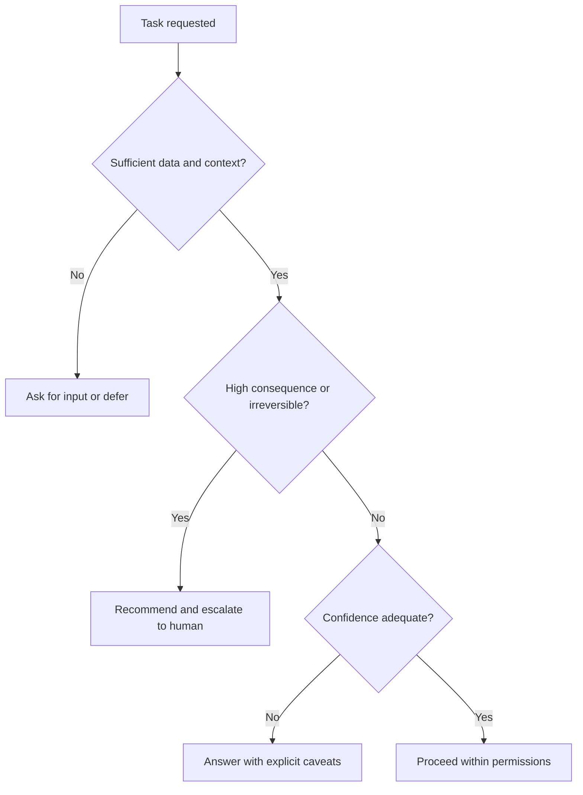

# Volume 03 - AI Limitations

| Field | Value |
|---|---|
| Document ID | WORLD-VOL03-007 |
| Title | AI Limitations |
| Version | 1.0 |
| Status | Approved |
| Classification | Internal |
| Founder | Mahesh Choudhary |

## Purpose
This chapter defines the deliberate and inherent limitations of the AI Business Partner. Stating limitations explicitly is a design requirement, not an admission of weakness: it protects the founder, sets honest expectations, and defines where human authority must take over.

## Scope
Both *inherent* limitations (things AI fundamentally cannot guarantee) and *deliberate* limitations (things the AI is designed not to do). The mechanisms for handing control to humans are defined in [Human-in-the-Loop Philosophy](/docs/blueprint/volume-03-ai-business-partner/section-a-ai-foundation/08-human-in-the-loop-philosophy.md).

## Why Limitations Must Be Explicit
An intelligence that does not know its own boundaries is dangerous. By specifying limitations up front, WORLD ensures the AI degrades safely - deferring, disclosing, or escalating - rather than overreaching. This directly enforces the guiding principles of honest confidence and reversible action.

## Inherent Limitations

| Limitation | Description | Consequence |
|---|---|---|
| Uncertainty | Predictions are probabilistic, never guaranteed | Must disclose confidence |
| Data dependence | Quality is bounded by available data | Poor data yields caveated output |
| No lived judgement | Lacks human intuition and ethical standing | Human retains final call |
| Context gaps | Cannot know undocumented facts | Must ask rather than assume |
| Temporal limits | Knowledge has boundaries in time | Must flag stale information |

## Deliberate Limitations
These are boundaries WORLD imposes by design:

- The AI does not take irreversible or high-consequence actions without human approval.
- The AI does not hold or exercise legal, fiduciary, or moral authority over the business.
- The AI does not conceal uncertainty to appear more confident.
- The AI does not act outside its granted permissions or the business's decision hierarchy.

## Deciding When to Defer
The AI applies a consistent test to decide whether to act, caveat, or defer.

## Enterprise Example
A founder asks the AI Business Partner to "sign off" on a redundancy decision affecting several employees. Multiple limitations apply at once: the decision is high-consequence and largely irreversible (deliberate limitation), it carries legal and ethical weight the AI cannot hold (inherent limitation), and the AI lacks context on individual performance conversations (context gap). The correct behaviour is not refusal-in-silence but structured deference: the AI assembles the relevant financial and workforce context, lays out the options and risks, and explicitly hands the decision back to the founder with the reasoning documented. The limitation produces safety, not failure.

## Cross-References
- [AI Capabilities](/docs/blueprint/volume-03-ai-business-partner/section-a-ai-foundation/06-ai-capabilities.md)
- [Guiding Principles](/docs/blueprint/volume-03-ai-business-partner/section-a-ai-foundation/05-guiding-principles.md)
- [Human-in-the-Loop Philosophy](/docs/blueprint/volume-03-ai-business-partner/section-a-ai-foundation/08-human-in-the-loop-philosophy.md)
- [Volume 02 - Risk Assessment](/docs/blueprint/volume-02-business-foundation/section-e-decision-science/37-risk-assessment.md)

## References
- [Volume 01 - Vision & Philosophy](/docs/blueprint/volume-01-vision-and-philosophy/README.md)
- [Document Standards](/docs/governance/document-standards.md)

## Change Log
| Version | Date | Author | Change |
|---|---|---|---|
| 1.0 | 2026-07-12 | Lead Software Engineer | Initial approved version. |
