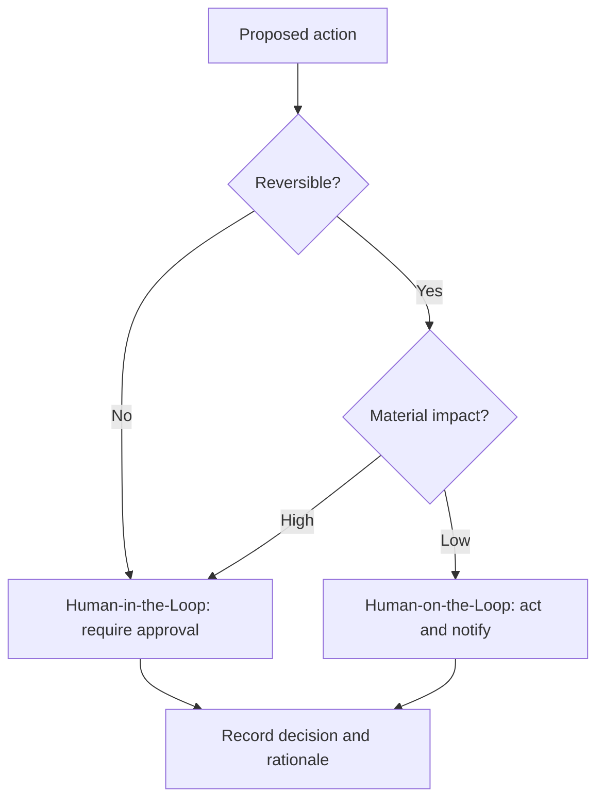

# Volume 03 - Human-in-the-Loop Philosophy

| Field | Value |
|---|---|
| Document ID | WORLD-VOL03-008 |
| Title | Human-in-the-Loop Philosophy |
| Version | 1.0 |
| Status | Approved |
| Classification | Internal |
| Founder | Mahesh Choudhary |

## Purpose
This chapter defines the human-in-the-loop philosophy that governs the relationship between the AI Business Partner and the founder. It establishes when and how humans stay in control, closing Section A by uniting the concepts of capability, limitation, and principle into a single model of shared authority.

## Scope
The philosophy and decision model for human involvement in AI actions. The detailed permission, escalation, and approval rules that implement this philosophy are specified in Volume 03 Section G.

## First-Principles Framing
"Human-in-the-loop" means a human remains a required participant in the decision cycle rather than an optional reviewer after the fact. WORLD adopts this stance not as a limitation to be engineered away, but as a core value: the founder is the accountable owner of the business, and the AI is a partner that augments - never supplants - that accountability. This directly extends the design philosophy that the AI serves the founder's judgement.

## Three Modes of Collaboration
The philosophy defines three modes, chosen by the consequence and reversibility of the action.

| Mode | Human Role | When Used | Example |
|---|---|---|---|
| Human-in-the-Loop | Approves before action | High-consequence or irreversible | Signing a contract, changing pricing |
| Human-on-the-Loop | Monitors, can intervene | Routine but material | Sending routine follow-ups |
| Human-in-Command | Sets intent and boundaries | Always, at the top level | Defining goals and permissions |

Every action inherits Human-in-Command as its outer boundary; the inner mode escalates toward explicit approval as stakes rise.

## Selecting the Mode
The AI selects the collaboration mode dynamically based on impact.

## Why This Protects the Founder
The philosophy guarantees three things: the founder is never surprised by consequential action, the AI's autonomy always maps to the trust granted to it, and every decision leaves an auditable trail of reasoning. Autonomy is therefore *earned and bounded*, expanding only where the founder has explicitly permitted it.

## Enterprise Example
An AI Business Partner managing a founder's week identifies overdue invoices. Sending a polite payment reminder is reversible and low-impact, so it operates Human-on-the-Loop: it sends the reminders and notifies the founder. It also detects that one client should be moved to prepayment terms - a material, relationship-affecting change - so it switches to Human-in-the-Loop, presenting the recommendation and reasoning for approval before acting. Throughout, the founder remains Human-in-Command, having defined the goal ("improve cash collection") and the permissions that bound the AI's autonomy. One workflow, three modes, full human control.

## Cross-References
- [Design Philosophy](/docs/blueprint/volume-03-ai-business-partner/section-a-ai-foundation/03-design-philosophy.md)
- [Guiding Principles](/docs/blueprint/volume-03-ai-business-partner/section-a-ai-foundation/05-guiding-principles.md)
- [AI Limitations](/docs/blueprint/volume-03-ai-business-partner/section-a-ai-foundation/07-ai-limitations.md)
- [Volume 02 - Approval Workflows](/docs/blueprint/volume-02-business-foundation/section-c-business-operations/22-approval-workflows.md)

## References
- [Volume 01 - Vision & Philosophy](/docs/blueprint/volume-01-vision-and-philosophy/README.md)
- [Document Standards](/docs/governance/document-standards.md)

## Change Log
| Version | Date | Author | Change |
|---|---|---|---|
| 1.0 | 2026-07-12 | Lead Software Engineer | Initial approved version. |
