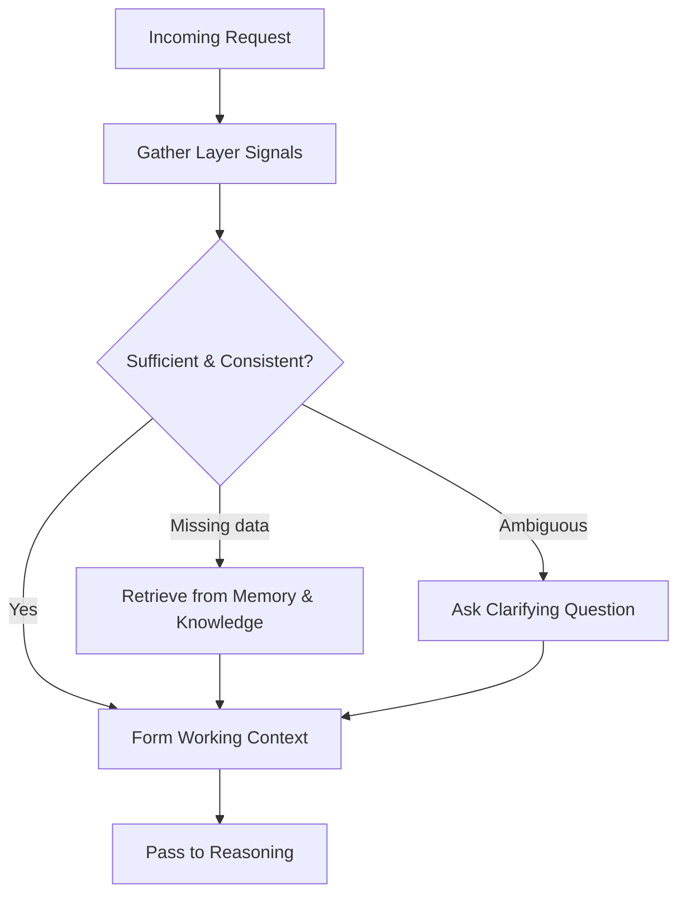

# Volume 03 - Context Understanding

| Field | Value |
|---|---|
| Document ID | WORLD-VOL03-017 |
| Title | Context Understanding |
| Version | 1.0 |
| Status | Approved |
| Classification | Internal |
| Founder | Mahesh Choudhary |

## Purpose
Define how the AI Business Partner perceives, assembles, and interprets the context surrounding any request so that its reasoning, planning, and recommendations are grounded in the founder's real situation rather than in generic assumptions. Context Understanding is the first cognitive act of the intelligence layer and the precondition for every downstream capability described in Section C.

## Scope
This chapter is a functional specification of the context model: what context is, why it matters, the layers that compose it, and how they are resolved into a single working interpretation. It does not specify storage technology, embedding techniques, or retrieval implementation, which belong to Part C of the Master Blueprint.

## What Context Is
Context is the complete set of facts, signals, and constraints that make a request meaningful. A question such as "Should we hire now?" has no correct answer in isolation; it becomes answerable only when the AI knows the company's cash position, current headcount, hiring plan, and stated goals. From first principles, an AI Business Partner cannot behave as a partner unless it reconstructs the situation a competent human colleague would already hold in mind before responding.

## Why It Matters
Aligned with [Volume 01 - Vision & Philosophy](/docs/blueprint/volume-01-vision-and-philosophy/README.md), WORLD exists to give founders a partner that understands their business. Context Understanding is what separates an assistant that answers words from a partner that answers situations. Poor context produces confident but wrong output; strong context produces relevant, safe, and trustworthy support.

## The Context Model
The AI assembles context in layers, from the most immediate to the most enduring. Each layer answers a distinct question.

| Layer | Question Answered | Example Signals | Volatility |
|---|---|---|---|
| Conversational | What is being discussed right now? | Current message, recent turns, referenced entities | Very high |
| Task | What outcome is intended? | Goal of the request, success criteria, constraints | High |
| Business | What is the state of the company? | KPIs, cash, pipeline, org structure, active goals | Medium |
| Relational | Who is asking and how do they work? | Role, authority, preferences, communication style | Low |
| Foundational | What is always true here? | Vision, values, policies, non-negotiables | Very low |

## How Context Is Resolved
Context is not simply collected; it is resolved into one coherent interpretation. The AI gathers signals from each layer, detects gaps and contradictions, and either fills them from memory and knowledge or asks a clarifying question. Ambiguity is treated as a first-class signal rather than ignored.

### Working Context
The resolved output is the working context: a compact, prioritised interpretation that other cognitive frameworks consume. It records not only what is known but the confidence in each element and the assumptions made, so that reasoning can remain honest about uncertainty.

## Enterprise Example
A founder types: "Can we afford the new office?" The conversational layer identifies the office decision. The task layer infers the intended outcome is an affordability judgement. The business layer supplies runway of eight months, monthly burn, and a hiring plan. The relational layer notes the founder prefers concise, numeric answers. The foundational layer recalls a stated value of preserving eighteen months of runway. The AI detects that the proposed lease would breach that policy and responds with a direct affordability verdict, the runway impact, and the specific assumption it made about deposit timing, inviting correction.

## Cross-References
- [Memory Model](/docs/blueprint/volume-03-ai-business-partner/section-c-ai-cognition/18-memory-model.md)
- [Knowledge Model](/docs/blueprint/volume-03-ai-business-partner/section-c-ai-cognition/19-knowledge-model.md)
- [Reasoning Framework](/docs/blueprint/volume-03-ai-business-partner/section-c-ai-cognition/20-reasoning-framework.md)
- [Volume 02 - Business Foundation](/docs/blueprint/volume-02-business-foundation/README.md)

## References
- [Volume 01 - Vision & Philosophy](/docs/blueprint/volume-01-vision-and-philosophy/README.md)
- [Document Standards](/docs/governance/document-standards.md)

## Change Log
| Version | Date | Author | Change |
|---|---|---|---|
| 1.0 | 2026-07-12 | Lead Software Engineer | Initial approved version. |
