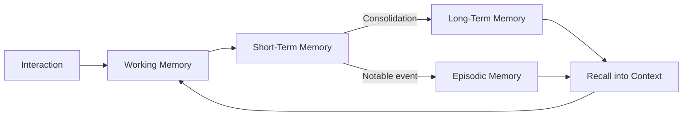

# Volume 03 - Memory Model

| Field | Value |
|---|---|
| Document ID | WORLD-VOL03-018 |
| Title | Memory Model |
| Version | 1.0 |
| Status | Approved |
| Classification | Internal |
| Founder | Mahesh Choudhary |

## Purpose
Define how the AI Business Partner retains, organises, and recalls information across time so that it behaves as a continuous partner with an accumulating understanding of the business, rather than a stateless tool that forgets every conversation.

## Scope
This chapter specifies the memory model functionally: the tiers of memory, what belongs in each, how information moves between them, and how memory is governed. Persistence technology, indexing, and retrieval mechanics are out of scope and defined in Part C.

## What Memory Is
Memory is the AI's retained experience of the business over time. Context Understanding assembles the present situation; memory is what allows that situation to be interpreted in light of everything that came before. Without memory, the AI cannot learn a founder's preferences, track commitments, or notice that a problem has recurred.

## Why It Matters
A partner is defined by continuity. Founders should never have to re-explain their business. Memory turns isolated interactions into a relationship and is the substrate on which the Learning Framework operates.

## Memory Tiers
Drawing on the established distinction between short-term and long-term memory, the model defines four tiers.

| Tier | Analogue | Holds | Retention |
|---|---|---|---|
| Working Memory | Human working memory | The active task and current reasoning state | Duration of the task |
| Short-Term Memory | Short-term recall | The current conversation and recent sessions | Days to weeks |
| Long-Term Memory | Long-term memory | Durable facts, decisions, preferences, history | Persistent |
| Episodic Memory | Autobiographical memory | Specific past events and their outcomes | Persistent |

## How Memory Works
### Consolidation
Not everything is worth keeping. After a task or session, a consolidation step decides what is durable enough to promote to long-term or episodic memory. Salience is judged by relevance to goals, decisions made, stated preferences, and recurrence.

### Recall
When a new request arrives, relevant memories are recalled and injected into the working context. Recall is selective and prioritised so that the most pertinent history surfaces without overwhelming reasoning.

### Forgetting and Correction
Memory is not a permanent record that cannot change. Stale facts are superseded, and founders can correct or delete what the AI holds. This keeps memory accurate and aligned with privacy expectations.

## Memory Governance
| Concern | Rule |
|---|---|
| Ownership | All memory belongs to the business, not the AI. |
| Correctability | Founders may inspect, edit, or delete stored memory. |
| Provenance | Each memory records its source and the time it was formed. |
| Confidence | Uncertain memories are marked and never presented as fact. |

## Enterprise Example
In March, a founder decides to pause international expansion until revenue reaches a defined threshold. This decision, its rationale, and the threshold are consolidated into long-term memory, and the meeting is recorded as an episodic memory. In August, when the founder asks about entering a new market, the AI recalls the paused decision, checks current revenue against the threshold, and notes that the condition is now met, prompting a review rather than starting from scratch.

## Cross-References
- [Context Understanding](/docs/blueprint/volume-03-ai-business-partner/section-c-ai-cognition/17-context-understanding.md)
- [Knowledge Model](/docs/blueprint/volume-03-ai-business-partner/section-c-ai-cognition/19-knowledge-model.md)
- [Learning Framework](/docs/blueprint/volume-03-ai-business-partner/section-c-ai-cognition/24-learning-framework.md)

## References
- [Volume 01 - Vision & Philosophy](/docs/blueprint/volume-01-vision-and-philosophy/README.md)
- [Document Standards](/docs/governance/document-standards.md)

## Change Log
| Version | Date | Author | Change |
|---|---|---|---|
| 1.0 | 2026-07-12 | Lead Software Engineer | Initial approved version. |
