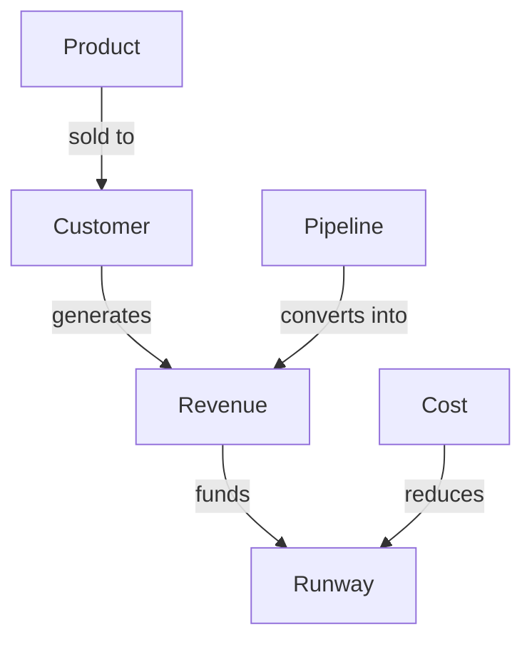

# Volume 03 - Knowledge Model

| Field | Value |
|---|---|
| Document ID | WORLD-VOL03-019 |
| Title | Knowledge Model |
| Version | 1.0 |
| Status | Approved |
| Classification | Internal |
| Founder | Mahesh Choudhary |

## Purpose
Define how the AI Business Partner represents, organises, and trusts knowledge so that its reasoning rests on structured, verifiable understanding of the business and its domain, not only on statistical language patterns.

## Scope
This chapter specifies the knowledge model functionally: the difference between memory and knowledge, the types of knowledge the AI holds, how they relate, and how trust in knowledge is established. Storage schemas, graph databases, and retrieval technology are out of scope.

## Knowledge Versus Memory
Memory is what the AI has experienced; knowledge is what the AI understands to be true. Memory is largely episodic and personal to a business; knowledge is structured, relational, and often shared across businesses. Memory recalls that a decision was made; knowledge explains the concepts and relationships that made the decision sensible.

## Why It Matters
An AI Business Partner must connect facts into meaning. Knowing that revenue fell is data; understanding that revenue depends on pipeline, conversion, and price is knowledge. The Knowledge Model is what lets the AI reason about cause, consequence, and structure rather than repeat surface facts.

## Types of Knowledge
| Type | Description | Example |
|---|---|---|
| Business Knowledge | Facts about this specific company | Products, customers, org chart, contracts |
| Domain Knowledge | General understanding of business disciplines | How cash flow, retention, or margin behave |
| Procedural Knowledge | How to perform tasks and processes | The steps to close a monthly forecast |
| Conceptual Knowledge | Definitions and relationships between ideas | Churn relates to lifetime value and pricing |

## Knowledge Structure
Knowledge is organised as entities and the relationships between them, forming a connected model of the business rather than a flat list of facts.

## How Knowledge Is Trusted
Not all knowledge is equally reliable. Each item carries provenance and a confidence level, and the AI distinguishes established fact from inference.

| Trust Level | Meaning | Use |
|---|---|---|
| Verified | Confirmed by an authoritative source | May be stated as fact |
| Derived | Inferred from verified data | Stated with the reasoning shown |
| Assumed | Reasonable but unconfirmed | Flagged as an assumption |
| Unknown | Missing knowledge | Triggers a question or research |

## Enterprise Example
A founder asks why margin is declining. Business knowledge supplies current product costs and prices. Domain knowledge encodes that margin equals price minus cost over price. The knowledge graph links a recent supplier change to a specific product's cost. The AI derives that the supplier change raised unit cost on the highest-volume product, marks that link as verified from the purchase records, and presents the causal chain rather than a generic explanation of margin.

## Cross-References
- [Memory Model](/docs/blueprint/volume-03-ai-business-partner/section-c-ai-cognition/18-memory-model.md)
- [Reasoning Framework](/docs/blueprint/volume-03-ai-business-partner/section-c-ai-cognition/20-reasoning-framework.md)
- [Context Understanding](/docs/blueprint/volume-03-ai-business-partner/section-c-ai-cognition/17-context-understanding.md)
- [Volume 02 - Business Foundation](/docs/blueprint/volume-02-business-foundation/README.md)

## References
- [Volume 01 - Vision & Philosophy](/docs/blueprint/volume-01-vision-and-philosophy/README.md)
- [Document Standards](/docs/governance/document-standards.md)

## Change Log
| Version | Date | Author | Change |
|---|---|---|---|
| 1.0 | 2026-07-12 | Lead Software Engineer | Initial approved version. |
