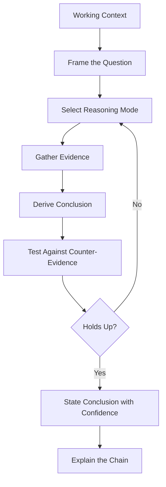

# Volume 03 - Reasoning Framework

| Field | Value |
|---|---|
| Document ID | WORLD-VOL03-020 |
| Title | Reasoning Framework |
| Version | 1.0 |
| Status | Approved |
| Classification | Internal |
| Founder | Mahesh Choudhary |

## Purpose
Define how the AI Business Partner moves from context and knowledge to sound conclusions. The Reasoning Framework specifies the disciplined thinking the AI applies so that its conclusions are correct, explainable, and honest about uncertainty.

## Scope
This chapter is a functional specification of reasoning modes, the reasoning pipeline, and the safeguards that keep reasoning trustworthy. Model architecture and inference technology are out of scope.

## What Reasoning Is
Reasoning is the process of deriving new, justified conclusions from what is known. Context Understanding assembles the situation and the Knowledge Model supplies structure; reasoning is the act of drawing a defensible conclusion and being able to show why it holds.

## Why It Matters
Founders act on the AI's conclusions. A conclusion that cannot be explained cannot be trusted, and a conclusion that hides its assumptions is dangerous. The framework exists to make the AI's thinking rigorous and transparent, consistent with WORLD's commitment to explainability.

## Modes of Reasoning
The AI selects among the three classical modes of inference according to the problem.

| Mode | From | To | Business Use |
|---|---|---|---|
| Deductive | General rules and facts | A certain conclusion | Applying a policy: runway below the floor means pause hiring |
| Inductive | Specific observations | A general pattern | Inferring seasonality from several years of sales |
| Abductive | An observation | The most likely explanation | Diagnosing why churn suddenly rose |

## The Reasoning Pipeline
Reasoning proceeds as an explicit pipeline so that each step can be inspected and challenged.

## Reasoning Safeguards
| Safeguard | Purpose |
|---|---|
| Assumption tracking | Every assumption is recorded and surfaced |
| Confidence scoring | Conclusions carry an explicit confidence level |
| Counter-evidence test | The AI actively seeks disconfirming evidence |
| Chain of reasoning | The path from evidence to conclusion is shown on request |
| Uncertainty honesty | When evidence is weak, the AI says so rather than guessing |

## Enterprise Example
Revenue dropped ten percent in a quarter. The AI frames the question as a diagnosis and selects abductive reasoning. It gathers evidence: pipeline was steady, but conversion fell and a competitor cut prices. It derives that price pressure is the most likely cause. It tests the alternative that a seasonal dip explains the fall, but induction over prior years shows no such seasonality, so that explanation is rejected. The AI concludes, with medium-high confidence, that competitor pricing is the primary driver, states its one key assumption about stable lead quality, and shows the chain so the founder can challenge it.

## Cross-References
- [Knowledge Model](/docs/blueprint/volume-03-ai-business-partner/section-c-ai-cognition/19-knowledge-model.md)
- [Planning Framework](/docs/blueprint/volume-03-ai-business-partner/section-c-ai-cognition/21-planning-framework.md)
- [Decision Support Framework](/docs/blueprint/volume-03-ai-business-partner/section-c-ai-cognition/22-decision-support-framework.md)
- [Reflection & Self-Evaluation](/docs/blueprint/volume-03-ai-business-partner/section-c-ai-cognition/25-reflection-and-self-evaluation.md)

## References
- [Volume 01 - Vision & Philosophy](/docs/blueprint/volume-01-vision-and-philosophy/README.md)
- [Document Standards](/docs/governance/document-standards.md)

## Change Log
| Version | Date | Author | Change |
|---|---|---|---|
| 1.0 | 2026-07-12 | Lead Software Engineer | Initial approved version. |
