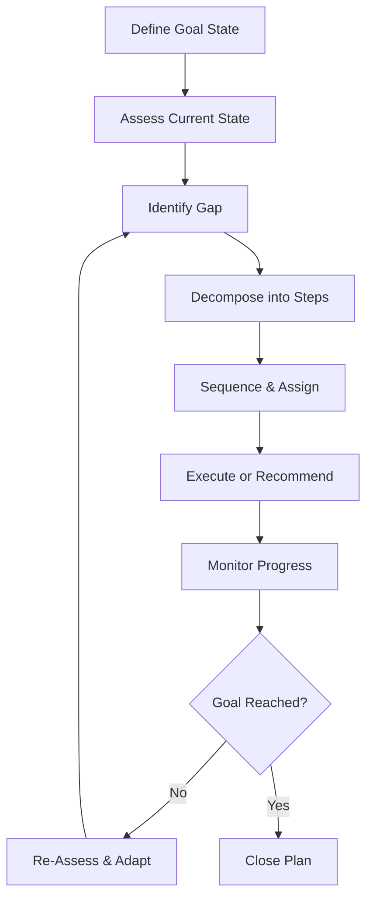

# Volume 03 - Planning Framework

| Field | Value |
|---|---|
| Document ID | WORLD-VOL03-021 |
| Title | Planning Framework |
| Version | 1.0 |
| Status | Approved |
| Classification | Internal |
| Founder | Mahesh Choudhary |

## Purpose
Define how the AI Business Partner turns a goal into an ordered, achievable course of action. The Planning Framework specifies how the AI decomposes objectives, sequences steps, anticipates obstacles, and adapts as reality changes.

## Scope
This chapter specifies planning functionally: what a plan is, the components of the planning model, and the planning loop. Task scheduling infrastructure and execution engines are out of scope.

## What Planning Is
Planning is the bridge between intent and action. Reasoning concludes what should be true; planning determines how to get there. From first principles, a plan is a structured path from a current state to a desired goal state, expressed as steps with dependencies, owners, and expected outcomes.

## Why It Matters
Founders are constrained by time and attention. A partner that only advises leaves the hardest work undone; a partner that plans converts advice into a sequence a team can execute. Planning is what makes the AI operationally useful rather than merely insightful.

## The Planning Model
Drawing on the established idea of means-ends analysis, planning reduces the gap between the current state and the goal state one step at a time.

| Component | Description |
|---|---|
| Goal State | The desired outcome and its success criteria |
| Current State | The relevant facts today, drawn from context and knowledge |
| Constraints | Time, budget, people, and policy limits |
| Steps | Discrete actions that reduce the gap to the goal |
| Dependencies | The order and prerequisites among steps |
| Milestones | Checkpoints that verify progress |

## The Planning Loop
Planning is iterative. A plan is a hypothesis about how to reach a goal and is revised as conditions change.

## Planning Principles
| Principle | Meaning |
|---|---|
| Goal-anchored | Every step traces to the goal and its success criteria |
| Constraint-aware | Plans respect real limits on time, money, and people |
| Risk-anticipating | Likely obstacles are surfaced with mitigations |
| Adaptive | Plans are revised when new information arrives |
| Transparent | The rationale for sequence and priority is explainable |

## Enterprise Example
A founder sets a goal to reach a defined monthly recurring revenue within two quarters. The AI states the goal state and its success metric, assesses the current pipeline and conversion rate as the current state, and identifies the gap. It decomposes the gap into steps: increase qualified leads, improve conversion, and reduce churn. It sequences these with dependencies, noting that a pricing change must precede the conversion push, and flags the risk that a hiring delay could stall lead generation. As the first month closes below target, the loop re-assesses and reallocates effort toward retention, presenting the revised plan with its reasoning.

## Cross-References
- [Reasoning Framework](/docs/blueprint/volume-03-ai-business-partner/section-c-ai-cognition/20-reasoning-framework.md)
- [Decision Support Framework](/docs/blueprint/volume-03-ai-business-partner/section-c-ai-cognition/22-decision-support-framework.md)
- [Learning Framework](/docs/blueprint/volume-03-ai-business-partner/section-c-ai-cognition/24-learning-framework.md)
- [Volume 02 - Business Foundation](/docs/blueprint/volume-02-business-foundation/README.md)

## References
- [Volume 01 - Vision & Philosophy](/docs/blueprint/volume-01-vision-and-philosophy/README.md)
- [Document Standards](/docs/governance/document-standards.md)

## Change Log
| Version | Date | Author | Change |
|---|---|---|---|
| 1.0 | 2026-07-12 | Lead Software Engineer | Initial approved version. |
