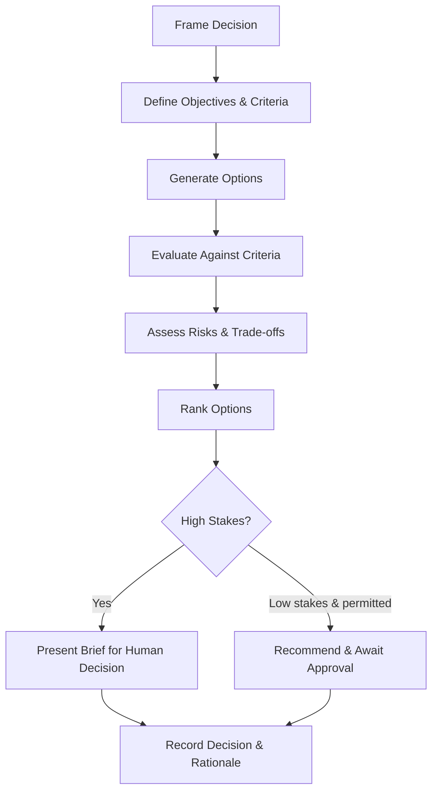

# Volume 03 - Decision Support Framework

| Field | Value |
|---|---|
| Document ID | WORLD-VOL03-022 |
| Title | Decision Support Framework |
| Version | 1.0 |
| Status | Approved |
| Classification | Internal |
| Founder | Mahesh Choudhary |

## Purpose
Define how the AI Business Partner helps founders make better decisions. The Decision Support Framework specifies how the AI structures a decision, evaluates options, and presents a defensible basis for choice while keeping the final decision with the human.

## Scope
This chapter specifies decision support functionally: what constitutes a decision, the anatomy of a decision, and the evaluation flow. It reinforces the human-in-the-loop philosophy: the AI supports decisions; it does not unilaterally make consequential ones.

## What Decision Support Is
Decision support is the disciplined framing and evaluation of a choice so that a founder can decide with clarity. Reasoning produces conclusions and planning produces paths; decision support is applied when there are competing options and a choice must be made under uncertainty and trade-offs.

## Why It Matters
Founders make high-stakes decisions with incomplete information and limited time. Poorly framed decisions are the root of avoidable failure. The framework ensures decisions are considered against the right criteria, options are compared fairly, and the reasoning is preserved for accountability.

## Anatomy of a Decision
| Element | Description |
|---|---|
| Decision Statement | The precise choice to be made |
| Objectives | What a good outcome must achieve |
| Options | The distinct, viable alternatives |
| Criteria | The weighted factors used to evaluate options |
| Evidence | Data and reasoning supporting each option |
| Risks | What could go wrong and how likely |
| Recommendation | The option best meeting the criteria, with rationale |

## The Decision Flow

## Weighted Evaluation
Options are scored against weighted criteria so comparison is explicit rather than intuitive.

| Criterion | Weight | Option A | Option B |
|---|---|---|---|
| Financial impact | High | Strong | Moderate |
| Time to result | Medium | Slow | Fast |
| Execution risk | High | Low | High |
| Strategic fit | Medium | Strong | Moderate |

## Enterprise Example
A founder must choose between raising a funding round or extending runway through cost cuts. The AI frames the decision, sets objectives of preserving control and sustaining growth, and defines weighted criteria. It evaluates each option: raising capital scores well on growth but poorly on control and dilution; cost cutting preserves control but risks slowing growth. It surfaces the key risk that market conditions may worsen the raise. Because the decision is high stakes, the AI produces a decision brief with a ranked recommendation and its rationale, and defers the choice to the founder, recording the decision and reasoning for later review.

## Cross-References
- [Reasoning Framework](/docs/blueprint/volume-03-ai-business-partner/section-c-ai-cognition/20-reasoning-framework.md)
- [Recommendation Framework](/docs/blueprint/volume-03-ai-business-partner/section-c-ai-cognition/23-recommendation-framework.md)
- [Planning Framework](/docs/blueprint/volume-03-ai-business-partner/section-c-ai-cognition/21-planning-framework.md)
- [Human-in-the-Loop Philosophy](/docs/blueprint/volume-03-ai-business-partner/section-a-ai-foundation/08-human-in-the-loop-philosophy.md)

## References
- [Volume 01 - Vision & Philosophy](/docs/blueprint/volume-01-vision-and-philosophy/README.md)
- [Document Standards](/docs/governance/document-standards.md)

## Change Log
| Version | Date | Author | Change |
|---|---|---|---|
| 1.0 | 2026-07-12 | Lead Software Engineer | Initial approved version. |
