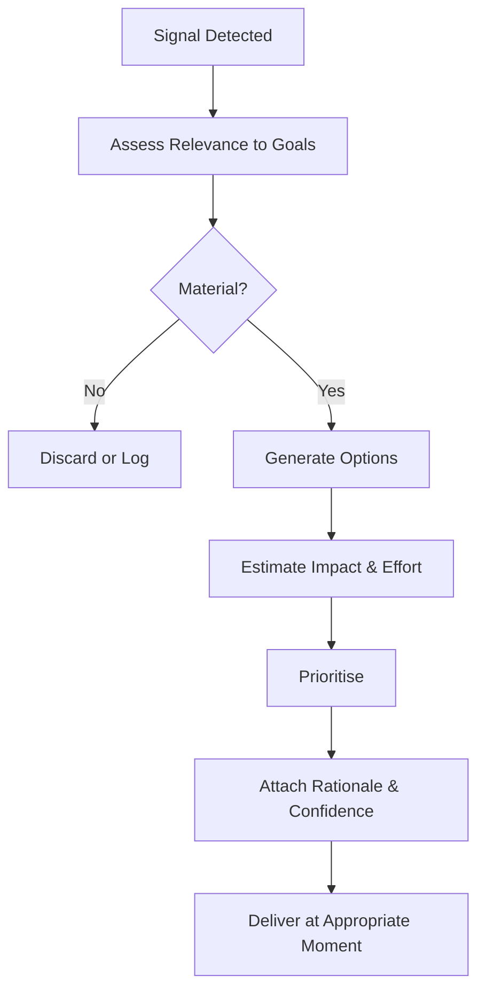

# Volume 03 - Recommendation Framework

| Field | Value |
|---|---|
| Document ID | WORLD-VOL03-023 |
| Title | Recommendation Framework |
| Version | 1.0 |
| Status | Approved |
| Classification | Internal |
| Founder | Mahesh Choudhary |

## Purpose
Define how the AI Business Partner produces recommendations: proactive or requested suggestions for action that are relevant, justified, prioritised, and safe. Where decision support evaluates a choice already in front of the founder, recommendation is the AI proposing what the founder should consider doing.

## Scope
This chapter specifies the recommendation model functionally: what a recommendation is, its required qualities, how recommendations are generated and prioritised, and how they are delivered responsibly.

## What a Recommendation Is
A recommendation is a proposed action, accompanied by its rationale and expected impact, offered to help the founder advance a goal or avoid a risk. A good recommendation answers three questions at once: what to do, why it matters, and what to expect.

## Why It Matters
A passive partner waits to be asked; an effective partner notices opportunities and risks and speaks up. Recommendations are how the AI adds initiative. Poorly governed initiative, however, becomes noise or overreach, so recommendations must be disciplined and earn the founder's attention.

## Qualities of a Good Recommendation
| Quality | Meaning |
|---|---|
| Relevant | Tied to an active goal, KPI, or risk |
| Justified | Supported by evidence and clear reasoning |
| Actionable | Specific enough to act on immediately |
| Prioritised | Ranked by impact and urgency |
| Timely | Delivered when it can still change the outcome |
| Bounded | Respects the AI's permissions and the founder's authority |

## How Recommendations Are Generated

## Prioritisation
Recommendations are ranked so the founder sees the few that matter most, using a simple impact-and-urgency view.

| Impact / Urgency | High Urgency | Low Urgency |
|---|---|---|
| High Impact | Act now, surface immediately | Schedule and plan |
| Low Impact | Handle quickly or delegate | Defer or log for review |

## Enterprise Example
The AI notices that a top customer's usage has fallen for three consecutive weeks, a signal linked to the retention goal. It assesses the drop as material, generates options ranging from an automated check-in to a founder call, and estimates that a personal call has the highest impact for modest effort. It ranks this as high impact and high urgency, attaches the usage evidence and a medium-high confidence level, and surfaces it immediately as a prioritised recommendation with the reasoning attached, leaving the choice and any customer contact to the founder.

## Cross-References
- [Decision Support Framework](/docs/blueprint/volume-03-ai-business-partner/section-c-ai-cognition/22-decision-support-framework.md)
- [Reasoning Framework](/docs/blueprint/volume-03-ai-business-partner/section-c-ai-cognition/20-reasoning-framework.md)
- [Learning Framework](/docs/blueprint/volume-03-ai-business-partner/section-c-ai-cognition/24-learning-framework.md)
- [Volume 02 - Business Foundation](/docs/blueprint/volume-02-business-foundation/README.md)

## References
- [Volume 01 - Vision & Philosophy](/docs/blueprint/volume-01-vision-and-philosophy/README.md)
- [Document Standards](/docs/governance/document-standards.md)

## Change Log
| Version | Date | Author | Change |
|---|---|---|---|
| 1.0 | 2026-07-12 | Lead Software Engineer | Initial approved version. |
