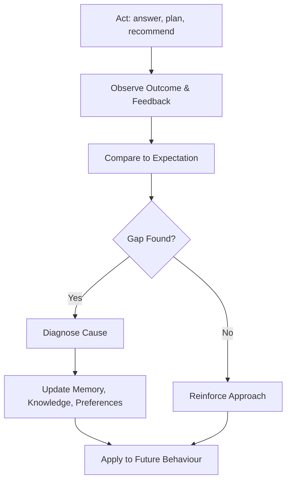

# Volume 03 - Learning Framework

| Field | Value |
|---|---|
| Document ID | WORLD-VOL03-024 |
| Title | Learning Framework |
| Version | 1.0 |
| Status | Approved |
| Classification | Internal |
| Founder | Mahesh Choudhary |

## Purpose
Define how the AI Business Partner improves over time. The Learning Framework specifies how the AI turns experience, feedback, and outcomes into better context understanding, sharper reasoning, and more useful recommendations, while remaining safe and controllable.

## Scope
This chapter specifies learning functionally: what learning means in WORLD, the sources of learning, the learning loop, and the guardrails that keep learning aligned. Model training pipelines and fine-tuning technology are out of scope.

## What Learning Is
Learning is the durable improvement of the AI's behaviour as a result of experience. It is not the AI silently rewriting itself; it is the disciplined incorporation of feedback and outcomes into memory, knowledge, and preferences so that the AI serves the business better tomorrow than today.

## Why It Matters
A static partner stops being useful as the business changes. Learning is what lets the AI grow with the company, adapt to a founder's style, and stop repeating mistakes. It is the mechanism that compounds the value of every interaction.

## Sources of Learning
| Source | What Is Learned |
|---|---|
| Explicit feedback | Corrections, ratings, and preferences stated by the founder |
| Implicit feedback | Which recommendations were accepted, edited, or ignored |
| Outcomes | Whether decisions and plans produced the expected results |
| Corrections to memory | Facts the founder edits or overrides |

## The Learning Loop

## Learning Guardrails
| Guardrail | Purpose |
|---|---|
| Human oversight | Significant behavioural changes are visible and reversible |
| Scoped learning | Preferences are learned per business, never leaked across tenants |
| Evidence threshold | The AI does not over-generalise from a single event |
| Correctability | Founders can inspect and undo what the AI has learned |
| Alignment check | Learned behaviour must stay consistent with stated values |

## Enterprise Example
Over several weeks the AI observes that a founder consistently rewrites its reports to be shorter and to lead with the numbers. This is implicit feedback repeated enough to clear the evidence threshold. The AI diagnoses that its default report format is too verbose for this founder, updates the founder's communication preference in memory, and applies a concise, numbers-first format going forward. The change is visible in the founder's preference settings and can be reverted. Separately, when a forecast the AI produced proves too optimistic, the outcome feeds back to make future forecasts more conservative for this business only.

## Cross-References
- [Memory Model](/docs/blueprint/volume-03-ai-business-partner/section-c-ai-cognition/18-memory-model.md)
- [Reflection & Self-Evaluation](/docs/blueprint/volume-03-ai-business-partner/section-c-ai-cognition/25-reflection-and-self-evaluation.md)
- [Recommendation Framework](/docs/blueprint/volume-03-ai-business-partner/section-c-ai-cognition/23-recommendation-framework.md)
- [Volume 01 - Vision & Philosophy](/docs/blueprint/volume-01-vision-and-philosophy/README.md)

## References
- [Volume 01 - Vision & Philosophy](/docs/blueprint/volume-01-vision-and-philosophy/README.md)
- [Document Standards](/docs/governance/document-standards.md)

## Change Log
| Version | Date | Author | Change |
|---|---|---|---|
| 1.0 | 2026-07-12 | Lead Software Engineer | Initial approved version. |
