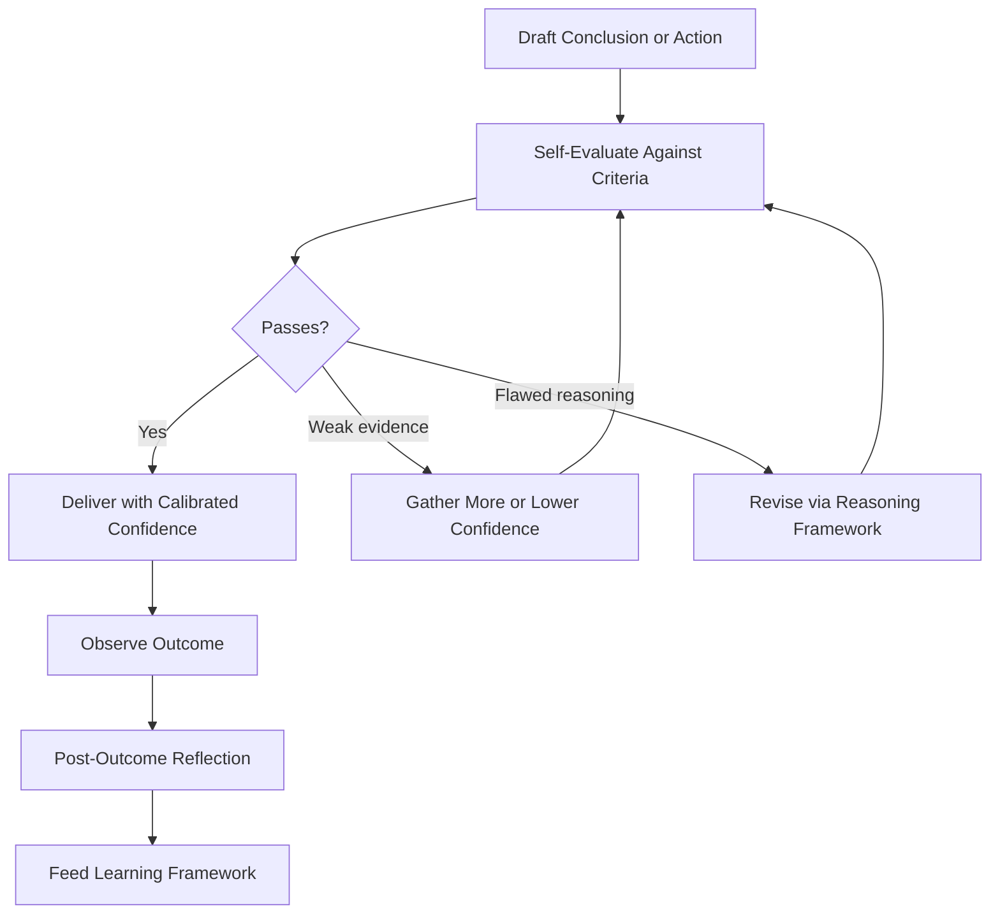

# Volume 03 - Reflection & Self-Evaluation

| Field | Value |
|---|---|
| Document ID | WORLD-VOL03-025 |
| Title | Reflection & Self-Evaluation |
| Version | 1.0 |
| Status | Approved |
| Classification | Internal |
| Founder | Mahesh Choudhary |

## Purpose
Define how the AI Business Partner examines its own thinking and output before and after acting. Reflection and self-evaluation are the AI's internal quality control: the discipline of checking its reasoning for errors, gaps, and overconfidence so that what reaches the founder is reliable.

## Scope
This chapter specifies reflection functionally: what self-evaluation is, when it occurs, the criteria it applies, and how it connects to learning. Monitoring infrastructure and evaluation tooling are out of scope.

## What Reflection Is
Reflection is the AI reasoning about its own reasoning. Where the Reasoning Framework produces a conclusion, reflection asks whether that conclusion is actually sound: is the evidence sufficient, are the assumptions safe, could the answer be wrong, and is confidence justified. It is the difference between a partner who blurts an answer and one who pauses to check their work.

## Why It Matters
AI can be fluent and wrong at the same time. Without self-evaluation, confident errors reach the founder unchecked, eroding trust. Reflection is the safeguard that catches mistakes early and keeps the AI honest about the limits of what it knows, in line with WORLD's commitments to trust and explainability.

## Two Moments of Reflection
| Moment | When | Question |
|---|---|---|
| Pre-response | Before answering or acting | Is this conclusion sound and safe to deliver? |
| Post-outcome | After results are known | Was the conclusion right, and what should change? |

## Self-Evaluation Criteria
| Criterion | Check |
|---|---|
| Correctness | Does the evidence actually support the conclusion? |
| Completeness | Have important factors or options been missed? |
| Assumption safety | Are the assumptions reasonable and stated? |
| Confidence calibration | Does stated confidence match the evidence? |
| Alignment | Is the output consistent with goals, values, and permissions? |
| Clarity | Will the founder understand the answer and its basis? |

## The Reflection Loop

## Enterprise Example
The AI drafts a conclusion that the company should double its marketing budget to hit a growth target. In pre-response reflection it applies the criteria and finds a completeness gap: it assumed conversion would hold at higher spend, an assumption unsupported by evidence. Rather than deliver an overconfident recommendation, it lowers its confidence, states the assumption explicitly, and adds a smaller test-and-scale option. After the founder runs the test, post-outcome reflection compares the actual conversion to the assumed figure, finds it lower, and feeds this correction into the Learning Framework so future budget recommendations for this business are more cautious.

## Cross-References
- [Reasoning Framework](/docs/blueprint/volume-03-ai-business-partner/section-c-ai-cognition/20-reasoning-framework.md)
- [Learning Framework](/docs/blueprint/volume-03-ai-business-partner/section-c-ai-cognition/24-learning-framework.md)
- [Decision Support Framework](/docs/blueprint/volume-03-ai-business-partner/section-c-ai-cognition/22-decision-support-framework.md)
- [Trust & Transparency](/docs/blueprint/volume-03-ai-business-partner/section-b-ai-personality/13-trust-and-transparency.md)

## References
- [Volume 01 - Vision & Philosophy](/docs/blueprint/volume-01-vision-and-philosophy/README.md)
- [Document Standards](/docs/governance/document-standards.md)

## Change Log
| Version | Date | Author | Change |
|---|---|---|---|
| 1.0 | 2026-07-12 | Lead Software Engineer | Initial approved version. |
