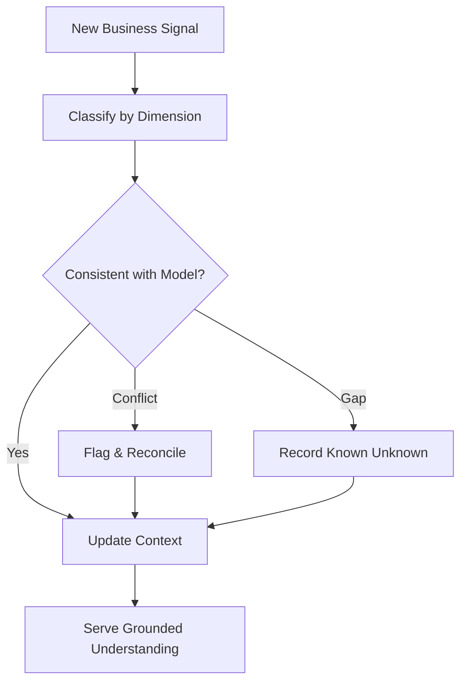

# Volume 03 - Business Context Engine

| Field | Value |
|---|---|
| Document ID | WORLD-VOL03-026 |
| Title | Business Context Engine |
| Version | 1.0 |
| Status | Approved |
| Classification | Internal |
| Founder | Mahesh Choudhary |

## Purpose
Define how the AI Business Partner assembles and maintains a living model of a specific business so that every act of understanding, reasoning, and recommendation is grounded in that company's real situation. The Business Context Engine is the foundation of Section D: goals, KPIs, risks, opportunities, causes, forecasts, and strategy are all understood relative to the context it holds.

## Scope
This chapter specifies the Business Context Engine functionally: what business context is, why it matters, the model it maintains, and how it stays current. It does not specify data pipelines, storage, or integration mechanics, which belong to the implementation volumes of the Master Blueprint.

## What the Business Context Engine Is
The Business Context Engine is the intelligence-layer component that converts raw business data into a structured, continuously updated understanding of a company. Where [Context Understanding](/docs/blueprint/volume-03-ai-business-partner/section-c-ai-cognition/17-context-understanding.md) resolves the context of a single request, the Business Context Engine maintains the enduring business layer that requests draw upon. From first principles, an AI cannot behave as a partner to a business it does not model; the engine is that model.

## Why It Matters
A founder does not want an assistant that must be re-briefed on every turn. The engine gives the AI durable awareness of the company's structure, state, and trajectory, so answers are specific rather than generic. It is the difference between advice about businesses in general and advice about this business in particular.

## The Business Context Model
The engine maintains distinct dimensions of understanding, each drawn from the concepts established in [Volume 02 - Business Foundation](/docs/blueprint/volume-02-business-foundation/README.md).

| Dimension | What It Captures | Primary Source |
|---|---|---|
| Identity | Mission, model, market, stage | Volume 02 fundamentals |
| Structure | Functions, teams, roles, processes | Business structure |
| State | Current KPIs, financials, pipeline | Business intelligence |
| Goals | Active objectives and targets | Goal Understanding (Ch 27) |
| Risks | Known threats and exposures | Risk Awareness (Ch 29) |
| History | Past decisions, events, outcomes | Memory model |

## How Context Is Kept Current
Business context is perishable. The engine treats every new signal as a potential update, reconciling it against what is already known and flagging contradictions rather than overwriting silently.

### Confidence and Freshness
Each element of the model carries a confidence level and a freshness timestamp. The AI reasons differently about a KPI observed today than one last seen a quarter ago, and it surfaces staleness rather than presenting old data as current truth.

## Enterprise Example
A founder asks, "How are we doing this month?" The engine already holds the company identity as an early-stage SaaS business, its structure of sales, product, and support functions, and its current state: monthly recurring revenue, churn, and cash runway. It knows the active goal of reaching profitability within four quarters and a standing risk of customer concentration. Drawing on this model, the AI answers with a specific, current read of the business rather than a generic checklist, notes that the churn figure is two weeks old, and links the month's performance to the profitability goal.

## Cross-References
- [Goal Understanding](/docs/blueprint/volume-03-ai-business-partner/section-d-business-understanding/27-goal-understanding.md)
- [KPI Awareness](/docs/blueprint/volume-03-ai-business-partner/section-d-business-understanding/28-kpi-awareness.md)
- [Context Understanding](/docs/blueprint/volume-03-ai-business-partner/section-c-ai-cognition/17-context-understanding.md)
- [Volume 02 - Business Foundation](/docs/blueprint/volume-02-business-foundation/README.md)

## References
- [Volume 01 - Vision & Philosophy](/docs/blueprint/volume-01-vision-and-philosophy/README.md)
- [Document Standards](/docs/governance/document-standards.md)

## Change Log
| Version | Date | Author | Change |
|---|---|---|---|
| 1.0 | 2026-07-12 | Lead Software Engineer | Initial approved version. |
