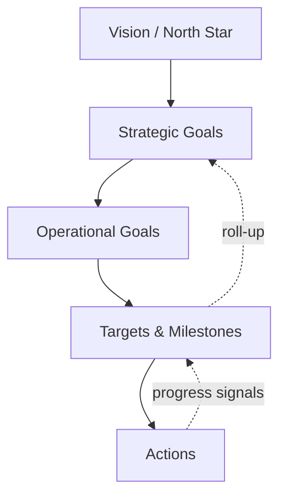

# Volume 03 - Goal Understanding

| Field | Value |
|---|---|
| Document ID | WORLD-VOL03-027 |
| Title | Goal Understanding |
| Version | 1.0 |
| Status | Approved |
| Classification | Internal |
| Founder | Mahesh Choudhary |

## Purpose
Define how the AI Business Partner understands what a business is trying to achieve. Goal Understanding lets the AI interpret, structure, and track objectives so that its reasoning, recommendations, and prioritisation serve the founder's intent rather than isolated requests.

## Scope
This chapter specifies goal understanding functionally: what a goal is, why goals anchor intelligent behaviour, the structure of a goal, and how the AI reasons about goal health. It builds on the business model held by the [Business Context Engine](/docs/blueprint/volume-03-ai-business-partner/section-d-business-understanding/26-business-context-engine.md).

## What a Goal Is
A goal is a desired future state the business intends to reach, expressed clearly enough to guide action and judge progress. From first principles, intelligence without goals is directionless: the same data supports opposite decisions depending on what the business is trying to achieve. Goal Understanding gives the AI the direction against which everything else is evaluated.

## Why It Matters
Founders juggle many objectives that compete for scarce time and capital. An AI that understands goals can align its advice, flag actions that conflict with stated intent, and prioritise what matters most. Without goal understanding, the AI optimises nothing in particular and risks helpful-sounding advice that pulls the business off course.

## Anatomy of a Goal
| Element | Description |
|---|---|
| Statement | The outcome sought, in plain terms |
| Metric | The KPI or measure that defines success |
| Target | The specific value to reach |
| Horizon | The timeframe for achievement |
| Owner | Who is accountable |
| Dependencies | Other goals or conditions it relies on |

Goals connect directly to measurement: a goal is only meaningful when tied to a [KPI](/docs/blueprint/volume-02-business-foundation/section-d-business-intelligence/26-kpis.md) that reveals progress toward its target.

## The Goal Hierarchy
Goals are rarely flat. The AI organises them from enduring intent to concrete near-term targets, so that daily choices remain traceable to strategy.

### Reasoning About Goal Health
The AI does not merely store goals; it assesses them. It checks whether a goal is measurable, whether its target and horizon are realistic given current state, whether goals conflict, and whether progress is on track. When a goal is vague, the AI seeks the missing metric or target rather than proceeding on assumption.

## Enterprise Example
A founder states, "I want to grow faster." The AI recognises this as an unstructured goal and helps convert it into a defined objective: increase monthly recurring revenue from a known baseline to a specific target within three quarters, owned by the founder, dependent on a stable churn rate. It then links the goal to the revenue KPI in the Business Context Engine, notes a conflict with a parallel goal of extending runway through cost cuts, and prioritises accordingly. In later conversations it reports progress against the target and warns when a proposed decision would advance growth at the expense of the runway goal.

## Cross-References
- [Business Context Engine](/docs/blueprint/volume-03-ai-business-partner/section-d-business-understanding/26-business-context-engine.md)
- [KPI Awareness](/docs/blueprint/volume-03-ai-business-partner/section-d-business-understanding/28-kpi-awareness.md)
- [Strategic Thinking](/docs/blueprint/volume-03-ai-business-partner/section-d-business-understanding/33-strategic-thinking.md)
- [Volume 02 - Strategic Planning](/docs/blueprint/volume-02-business-foundation/section-e-decision-science/39-strategic-planning.md)

## References
- [Volume 01 - Vision & Philosophy](/docs/blueprint/volume-01-vision-and-philosophy/README.md)
- [Document Standards](/docs/governance/document-standards.md)

## Change Log
| Version | Date | Author | Change |
|---|---|---|---|
| 1.0 | 2026-07-12 | Lead Software Engineer | Initial approved version. |
