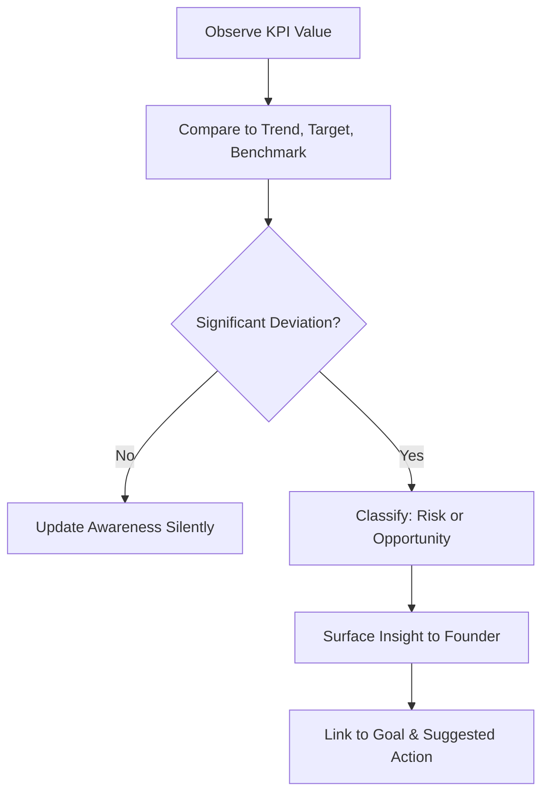

# Volume 03 - KPI Awareness

| Field | Value |
|---|---|
| Document ID | WORLD-VOL03-028 |
| Title | KPI Awareness |
| Version | 1.0 |
| Status | Approved |
| Classification | Internal |
| Founder | Mahesh Choudhary |

## Purpose
Define how the AI Business Partner perceives, interprets, and reasons about Key Performance Indicators. KPI Awareness is how the AI reads the health of a business quantitatively and turns raw numbers into meaning tied to goals.

## Scope
This chapter specifies KPI awareness functionally: what a KPI means to the AI, why continuous awareness matters, how KPIs are interpreted in context, and how the AI detects and communicates significant change. It builds directly on [Volume 02 - KPIs](/docs/blueprint/volume-02-business-foundation/section-d-business-intelligence/26-kpis.md) and the wider business metrics catalogue.

## What KPI Awareness Is
A KPI is a measure chosen because it reflects progress toward a goal. KPI Awareness is the AI's capacity to know which measures matter for this business, what values they currently hold, how they are trending, and what those movements imply. From first principles, numbers without interpretation are noise; awareness is the act of turning a metric into a judgement about the business.

## Why It Matters
Founders can drown in dashboards yet miss the two figures that decide the quarter. An AI with KPI awareness watches continuously, distinguishes signal from noise, and connects each metric to the goal it serves and the decision it should inform. This is the quantitative counterpart to the goals defined in [Goal Understanding](/docs/blueprint/volume-03-ai-business-partner/section-d-business-understanding/27-goal-understanding.md).

## Interpreting a KPI
The AI reads each KPI along several axes rather than as a bare number.

| Axis | Question | Example |
|---|---|---|
| Level | What is the current value? | Churn is 4.5% |
| Trend | Which way is it moving? | Up from 3.1% last quarter |
| Target | How far from the goal? | Goal is below 3% |
| Benchmark | How does it compare externally? | Sector median is 3.8% |
| Volatility | How stable is it? | Rising steadily, not noise |

## From Metric to Meaning
Awareness resolves a metric into an interpretation and, when warranted, an alert.

### Thresholds and Materiality
The AI applies materiality: a small move in a critical KPI can matter more than a large move in a minor one. Thresholds are set relative to targets and historical volatility so the AI raises what deserves attention and stays quiet otherwise, preserving trust.

## Enterprise Example
The Business Context Engine reports that net revenue retention has slipped from 112% to 104% over two months. On level alone the figure looks healthy, but against the trend, the target of 115%, and the sector benchmark, the AI judges the movement material. It classifies the deviation as an emerging risk to the growth goal, surfaces it proactively, and links it to a suggested next step: investigate expansion revenue and churn among the largest accounts. It refrains from alerting on a simultaneous, immaterial wobble in website traffic.

## Cross-References
- [Goal Understanding](/docs/blueprint/volume-03-ai-business-partner/section-d-business-understanding/27-goal-understanding.md)
- [Risk Awareness](/docs/blueprint/volume-03-ai-business-partner/section-d-business-understanding/29-risk-awareness.md)
- [Opportunity Detection](/docs/blueprint/volume-03-ai-business-partner/section-d-business-understanding/30-opportunity-detection.md)
- [Volume 02 - KPIs](/docs/blueprint/volume-02-business-foundation/section-d-business-intelligence/26-kpis.md)

## References
- [Volume 01 - Vision & Philosophy](/docs/blueprint/volume-01-vision-and-philosophy/README.md)
- [Document Standards](/docs/governance/document-standards.md)

## Change Log
| Version | Date | Author | Change |
|---|---|---|---|
| 1.0 | 2026-07-12 | Lead Software Engineer | Initial approved version. |
