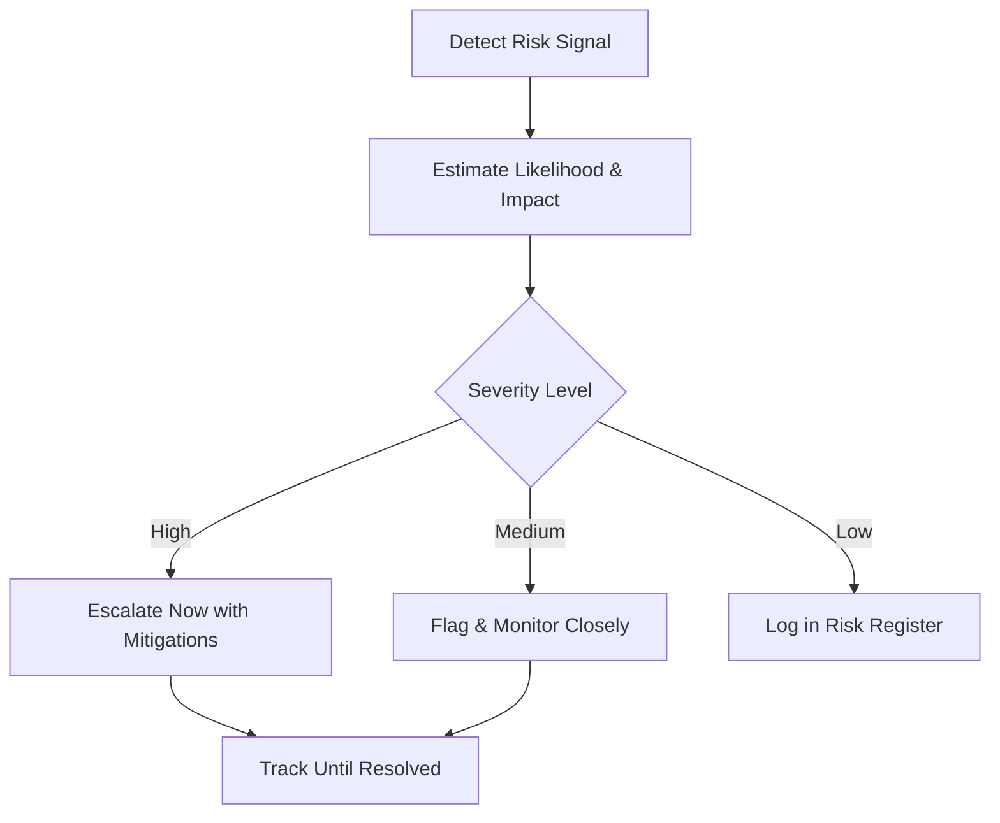

# Volume 03 - Risk Awareness

| Field | Value |
|---|---|
| Document ID | WORLD-VOL03-029 |
| Title | Risk Awareness |
| Version | 1.0 |
| Status | Approved |
| Classification | Internal |
| Founder | Mahesh Choudhary |

## Purpose
Define how the AI Business Partner perceives and reasons about risk: the threats and uncertainties that could prevent the business from reaching its goals. Risk Awareness lets the AI see danger early, weigh it soberly, and raise it without causing alarm fatigue.

## Scope
This chapter specifies risk awareness functionally: what a risk is, why constant awareness matters, how risks are characterised and scored, and how the AI decides what to escalate. It applies the framework established in [Volume 02 - Risk Assessment](/docs/blueprint/volume-02-business-foundation/section-e-decision-science/37-risk-assessment.md).

## What Risk Awareness Is
A risk is a possible future event, with uncertain likelihood, that would harm the business if it occurred. Risk Awareness is the AI's standing sensitivity to such events across the business model held by the [Business Context Engine](/docs/blueprint/volume-03-ai-business-partner/section-d-business-understanding/26-business-context-engine.md). From first principles, a partner must not only report what is happening but anticipate what could go wrong while it is still cheap to act.

## Why It Matters
Most business failures are preventable in hindsight; the signal was present but unheeded. An AI with risk awareness scans continuously, connects weak signals across functions, and gives the founder the lead time that turns a crisis into a manageable decision. It is the defensive counterpart to [Opportunity Detection](/docs/blueprint/volume-03-ai-business-partner/section-d-business-understanding/30-opportunity-detection.md).

## Characterising a Risk
The AI describes each risk consistently so that risks can be compared and prioritised.

| Attribute | Description |
|---|---|
| Description | What could happen |
| Likelihood | How probable it is |
| Impact | Severity if it occurs |
| Velocity | How fast it would unfold |
| Trigger | The signal that it is materialising |
| Exposure | Which goals or functions are affected |

## Scoring and Escalation
Risks are scored on likelihood and impact and routed accordingly, so that severe, probable risks reach the founder while minor ones are logged and watched.

### Judgement Over Alarm
The AI is calibrated to avoid two failures: missing a real threat and crying wolf. It aggregates related signals, distinguishes a genuine trend from noise, and pairs every escalated risk with context and possible mitigations so the founder receives a decision, not merely a warning.

## Enterprise Example
KPI Awareness reports that a single customer now accounts for 38% of revenue while that customer's support tickets have risen and their renewal date approaches. The AI connects these signals into a concentration risk: high impact, rising likelihood, moderate velocity, triggered by the approaching renewal. Because severity is high, it escalates promptly, quantifies the revenue exposure to the profitability goal, and proposes mitigations such as accelerating diversification of the pipeline and a proactive renewal conversation, then tracks the risk until the renewal is secured.

## Cross-References
- [KPI Awareness](/docs/blueprint/volume-03-ai-business-partner/section-d-business-understanding/28-kpi-awareness.md)
- [Opportunity Detection](/docs/blueprint/volume-03-ai-business-partner/section-d-business-understanding/30-opportunity-detection.md)
- [Root Cause Analysis](/docs/blueprint/volume-03-ai-business-partner/section-d-business-understanding/31-root-cause-analysis.md)
- [Volume 02 - Risk Assessment](/docs/blueprint/volume-02-business-foundation/section-e-decision-science/37-risk-assessment.md)

## References
- [Volume 01 - Vision & Philosophy](/docs/blueprint/volume-01-vision-and-philosophy/README.md)
- [Document Standards](/docs/governance/document-standards.md)

## Change Log
| Version | Date | Author | Change |
|---|---|---|---|
| 1.0 | 2026-07-12 | Lead Software Engineer | Initial approved version. |
