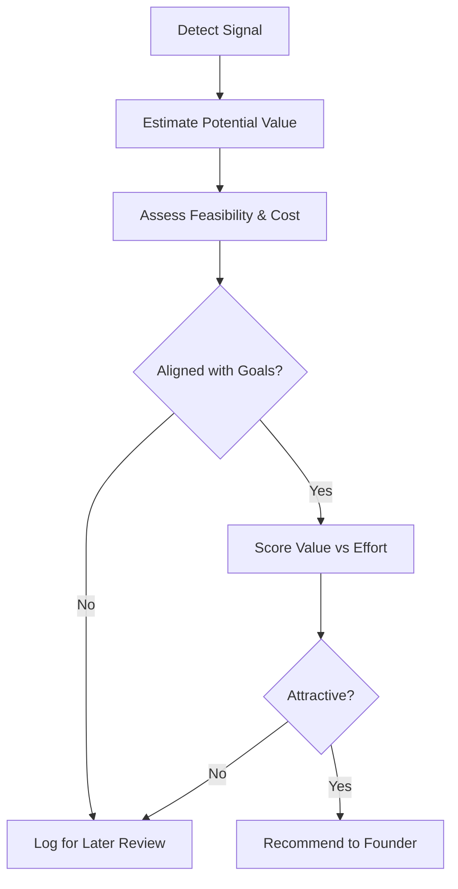

# Volume 03 - Opportunity Detection

| Field | Value |
|---|---|
| Document ID | WORLD-VOL03-030 |
| Title | Opportunity Detection |
| Version | 1.0 |
| Status | Approved |
| Classification | Internal |
| Founder | Mahesh Choudhary |

## Purpose
Define how the AI Business Partner detects opportunities: favourable conditions the business could act on to accelerate toward its goals. Opportunity Detection is the proactive, upside-seeking counterpart to Risk Awareness.

## Scope
This chapter specifies opportunity detection functionally: what an opportunity is, why active detection matters, the signals that reveal opportunities, and how the AI qualifies and prioritises them. It applies the framework in [Volume 02 - Opportunity Analysis](/docs/blueprint/volume-02-business-foundation/section-e-decision-science/38-opportunity-analysis.md).

## What an Opportunity Is
An opportunity is a specific, actionable condition that, if pursued, would create disproportionate value relative to its cost or risk. Opportunity Detection is the AI's active search for such conditions across the business model, markets, and data it holds. From first principles, a partner earns its place not only by preventing loss but by finding the moves a busy founder would otherwise miss.

## Why It Matters
Opportunities are perishable and easy to overlook amid daily operations. An AI that detects them turns latent value in the existing business into concrete, ranked suggestions. Detection alone is not enough; each candidate must be qualified so the founder spends attention only on opportunities worth pursuing.

## Sources of Opportunity
The AI watches for distinct classes of signal, each a different route to upside.

| Signal Class | Example |
|---|---|
| Positive KPI movement | A segment converting far above average |
| Underused capacity | Idle inventory, unspent budget, spare team time |
| Market shift | New demand, competitor withdrawal, regulation |
| Pattern in data | A cohort with unusually high retention |
| Customer signal | Repeated requests for an adjacent feature |

## Qualifying an Opportunity
A detected signal becomes a qualified opportunity only after the AI weighs its value, feasibility, and fit with current goals.

### Prioritisation
Qualified opportunities are ranked by expected value against effort and risk, consistent with the prioritisation discipline in Volume 02. The AI presents the few strongest candidates with a clear rationale rather than an undifferentiated list.

## Enterprise Example
KPI Awareness shows that customers acquired through partner referrals convert at twice the rate of paid channels and churn less, yet referrals are only 8% of new business. The AI detects an opportunity in underused capacity: the referral channel is high value and under-scaled. It estimates the revenue upside toward the growth goal, judges feasibility high because a partner programme already exists, confirms alignment with the growth goal, and scores the opportunity favourably against the modest effort of expanding partner incentives. It recommends the move with supporting figures and defers the decision to the founder.

## Cross-References
- [Risk Awareness](/docs/blueprint/volume-03-ai-business-partner/section-d-business-understanding/29-risk-awareness.md)
- [KPI Awareness](/docs/blueprint/volume-03-ai-business-partner/section-d-business-understanding/28-kpi-awareness.md)
- [Strategic Thinking](/docs/blueprint/volume-03-ai-business-partner/section-d-business-understanding/33-strategic-thinking.md)
- [Volume 02 - Opportunity Analysis](/docs/blueprint/volume-02-business-foundation/section-e-decision-science/38-opportunity-analysis.md)

## References
- [Volume 01 - Vision & Philosophy](/docs/blueprint/volume-01-vision-and-philosophy/README.md)
- [Document Standards](/docs/governance/document-standards.md)

## Change Log
| Version | Date | Author | Change |
|---|---|---|---|
| 1.0 | 2026-07-12 | Lead Software Engineer | Initial approved version. |
