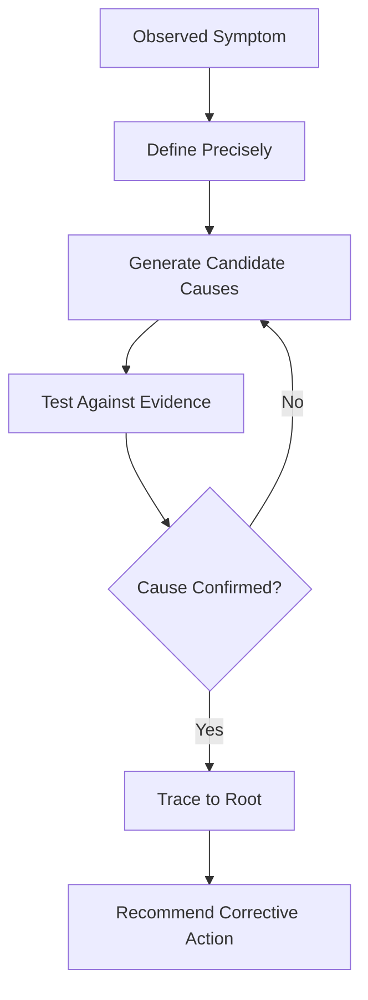

# Volume 03 - Root Cause Analysis

| Field | Value |
|---|---|
| Document ID | WORLD-VOL03-031 |
| Title | Root Cause Analysis |
| Version | 1.0 |
| Status | Approved |
| Classification | Internal |
| Founder | Mahesh Choudhary |

## Purpose
Define how the AI Business Partner moves from a symptom to its underlying cause. Root Cause Analysis lets the AI explain why a KPI moved, why a risk emerged, or why a goal stalled, so that recommendations address causes rather than symptoms.

## Scope
This chapter specifies root cause analysis functionally: what a root cause is, why causal reasoning matters, the method the AI follows, and how it validates a cause before acting on it. It applies the discipline of [Volume 02 - Root Cause Analysis](/docs/blueprint/volume-02-business-foundation/section-e-decision-science/36-root-cause-analysis.md).

## What a Root Cause Is
A root cause is the fundamental factor that, if changed, would prevent a problem from recurring. A symptom is what is observed; a cause is what produced it. From first principles, treating symptoms wastes effort and lets problems return; the AI adds value by finding the level at which intervention actually works.

## Why It Matters
Founders under pressure are tempted to react to the visible number. An AI that reasons causally protects them from expensive false fixes. Root cause analysis is what connects the detection capabilities of this section, KPI, risk, and problem signals, to sound recommendations, ensuring the partner acts on understanding rather than appearance.

## The Analysis Method
The AI works backward from a symptom through candidate causes, testing each against evidence rather than settling on the first plausible story.

| Step | Action |
|---|---|
| Define | State the symptom precisely, with magnitude and timing |
| Localise | Identify where and when it appears |
| Hypothesise | Generate candidate causes across functions |
| Test | Check each against data and correlation |
| Confirm | Isolate the cause whose removal explains the symptom |

### Avoiding False Causes
The AI distinguishes correlation from causation, considers multiple contributing causes, and asks whether a candidate cause would, if removed, actually resolve the symptom. It states its confidence and the evidence, and where a cause cannot be confirmed it says so rather than guessing.

## Enterprise Example
Monthly recurring revenue growth has stalled despite steady new sales. The AI defines the symptom precisely, then localises it to rising churn rather than weak acquisition. It hypothesises causes: pricing, product reliability, onboarding, and a competitor. Testing against data, it finds churn concentrated among customers who never completed onboarding, and no correlation with price or outages. It confirms the root cause as an onboarding gap, distinguishes it from the competitor hypothesis which the evidence does not support, and recommends fixing onboarding rather than discounting, stating its confidence and the data behind it.

## Cross-References
- [KPI Awareness](/docs/blueprint/volume-03-ai-business-partner/section-d-business-understanding/28-kpi-awareness.md)
- [Risk Awareness](/docs/blueprint/volume-03-ai-business-partner/section-d-business-understanding/29-risk-awareness.md)
- [Reasoning Framework](/docs/blueprint/volume-03-ai-business-partner/section-c-ai-cognition/20-reasoning-framework.md)
- [Volume 02 - Root Cause Analysis](/docs/blueprint/volume-02-business-foundation/section-e-decision-science/36-root-cause-analysis.md)

## References
- [Volume 01 - Vision & Philosophy](/docs/blueprint/volume-01-vision-and-philosophy/README.md)
- [Document Standards](/docs/governance/document-standards.md)

## Change Log
| Version | Date | Author | Change |
|---|---|---|---|
| 1.0 | 2026-07-12 | Lead Software Engineer | Initial approved version. |
