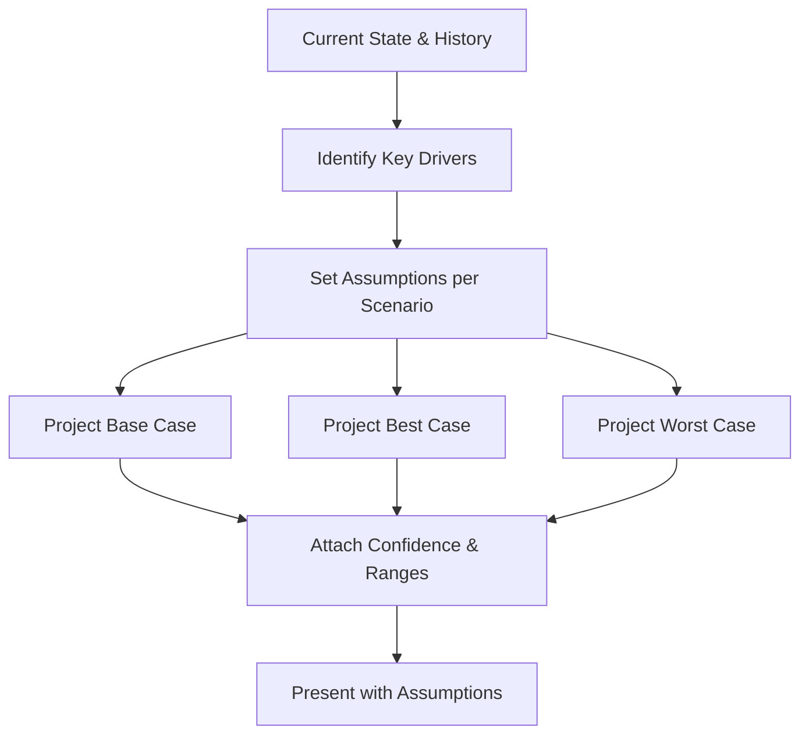

# Volume 03 - Forecasting Philosophy

| Field | Value |
|---|---|
| Document ID | WORLD-VOL03-032 |
| Title | Forecasting Philosophy |
| Version | 1.0 |
| Status | Approved |
| Classification | Internal |
| Founder | Mahesh Choudhary |

## Purpose
Define how the AI Business Partner thinks about the future: how it projects likely outcomes, expresses uncertainty honestly, and uses forecasts to inform decisions without pretending to predict with false precision.

## Scope
This chapter specifies the AI's forecasting philosophy functionally: what a forecast is, why disciplined forecasting matters, the principles that govern it, and how forecasts are framed for the founder. It applies the approach of [Volume 02 - Scenario Planning](/docs/blueprint/volume-02-business-foundation/section-e-decision-science/41-scenario-planning.md). Modelling techniques belong to the implementation volumes.

## What a Forecast Is
A forecast is a reasoned estimate of a future value or state, expressed with its uncertainty. It is not a prediction of a single certain outcome but a description of what is likely and how confident that likelihood is. From first principles, decisions are made about the future; a partner that helps decide must help the founder see the future clearly, including how much is unknown.

## Why It Matters
Founders commit resources today for results tomorrow. Overconfident forecasts invite reckless bets; refusing to forecast leaves decisions blind. The AI's role is to project responsibly, always separating what is known from what is assumed, so plans are made with eyes open. This directly feeds [Strategic Thinking](/docs/blueprint/volume-03-ai-business-partner/section-d-business-understanding/33-strategic-thinking.md).

## Principles of Responsible Forecasting
| Principle | Meaning |
|---|---|
| Range over point | Prefer likely ranges to single false-precise numbers |
| Explicit assumptions | State what the forecast depends on |
| Multiple scenarios | Model best, base, and worst cases |
| Confidence stated | Attach a confidence level to each projection |
| Continuously revised | Update as new data arrives |

## Scenario-Based Forecasting
Rather than a single line, the AI presents a band of outcomes so the founder can plan for variability.

### Honesty About Uncertainty
The AI never disguises a guess as a fact. It reports the drivers a forecast is most sensitive to, revises projections as reality unfolds, and flags when actuals diverge from the base case so the founder can adapt. A forecast is a living instrument, not a promise.

## Enterprise Example
Asked whether the company will reach profitability within four quarters, the AI does not answer yes or no. It identifies the key drivers: new revenue, churn, and burn. It builds three scenarios: a base case reaching profitability in quarter five, a best case in quarter four if churn falls to target, and a worst case slipping to quarter seven if a large customer leaves. It attaches confidence to each, states the assumptions, and highlights that the outcome is most sensitive to churn. As the next month's actuals arrive, it revises the projection and tells the founder which scenario now looks most likely.

## Cross-References
- [KPI Awareness](/docs/blueprint/volume-03-ai-business-partner/section-d-business-understanding/28-kpi-awareness.md)
- [Strategic Thinking](/docs/blueprint/volume-03-ai-business-partner/section-d-business-understanding/33-strategic-thinking.md)
- [Planning Framework](/docs/blueprint/volume-03-ai-business-partner/section-c-ai-cognition/21-planning-framework.md)
- [Volume 02 - Scenario Planning](/docs/blueprint/volume-02-business-foundation/section-e-decision-science/41-scenario-planning.md)

## References
- [Volume 01 - Vision & Philosophy](/docs/blueprint/volume-01-vision-and-philosophy/README.md)
- [Document Standards](/docs/governance/document-standards.md)

## Change Log
| Version | Date | Author | Change |
|---|---|---|---|
| 1.0 | 2026-07-12 | Lead Software Engineer | Initial approved version. |
