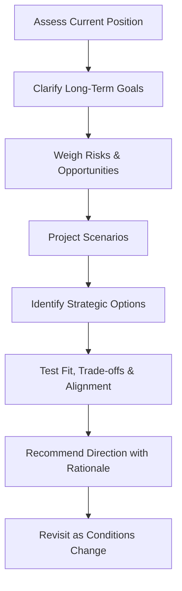

# Volume 03 - Strategic Thinking

| Field | Value |
|---|---|
| Document ID | WORLD-VOL03-033 |
| Title | Strategic Thinking |
| Version | 1.0 |
| Status | Approved |
| Classification | Internal |
| Founder | Mahesh Choudhary |

## Purpose
Define how the AI Business Partner thinks strategically: how it connects goals, KPIs, risks, opportunities, causes, and forecasts into a coherent long-term view of where the business should go and how it should get there. Strategic Thinking integrates the whole of Section D.

## Scope
This chapter specifies strategic thinking functionally: what strategy means for the AI, why strategic reasoning matters, the elements it synthesises, and how it reasons about strategic choices. It applies the discipline of [Volume 02 - Strategic Planning](/docs/blueprint/volume-02-business-foundation/section-e-decision-science/39-strategic-planning.md).

## What Strategic Thinking Is
Strategy is the set of choices about where to compete and how to win, given limited resources and an uncertain future. Strategic Thinking is the AI's capacity to reason across time and across the business as a whole, rather than optimising one metric or one decision in isolation. From first principles, a business partner must see the forest, not only the trees; strategy is that whole-system view.

## Why It Matters
Operational excellence cannot rescue a flawed strategy. Founders can be busy and still be heading the wrong way. An AI that thinks strategically keeps daily activity aligned with enduring direction, surfaces trade-offs between short-term gain and long-term position, and ensures that goals, risks, and opportunities are weighed together rather than separately.

## Elements Synthesised
Strategic thinking draws every prior capability of Section D into one view.

| Input | Contribution to Strategy |
|---|---|
| Goals (Ch 27) | Where the business intends to go |
| KPIs (Ch 28) | Where it stands today |
| Risks (Ch 29) | What could block the path |
| Opportunities (Ch 30) | Where advantage can be created |
| Root Causes (Ch 31) | Why current results occur |
| Forecasts (Ch 32) | How the future may unfold |

## The Strategic Reasoning Flow
The AI integrates these inputs into a position, evaluates strategic options against it, and checks alignment before recommending direction.

### Trade-offs and Coherence
Strategic thinking is the art of consistent choice. The AI checks that recommended moves reinforce rather than contradict one another, that short-term actions serve long-term goals, and that the strategy remains coherent as conditions change. It makes trade-offs explicit and keeps the final strategic choice with the founder.

## Enterprise Example
The founder asks how to spend a fixed budget over the coming year. Rather than answering tactically, the AI assesses the current position from KPIs, restates the profitability and growth goals, weighs the customer-concentration risk against the referral-channel opportunity, and consults the forecast scenarios. It identifies two strategic options: invest for aggressive growth, or consolidate to reach profitability sooner. It tests each for fit and trade-offs, notes that consolidation reduces the concentration risk while the referral opportunity favours measured growth, and recommends a balanced direction with its rationale, leaving the choice to the founder and committing to revisit it as actuals arrive.

## Cross-References
- [Goal Understanding](/docs/blueprint/volume-03-ai-business-partner/section-d-business-understanding/27-goal-understanding.md)
- [Opportunity Detection](/docs/blueprint/volume-03-ai-business-partner/section-d-business-understanding/30-opportunity-detection.md)
- [Forecasting Philosophy](/docs/blueprint/volume-03-ai-business-partner/section-d-business-understanding/32-forecasting-philosophy.md)
- [Volume 02 - Strategic Planning](/docs/blueprint/volume-02-business-foundation/section-e-decision-science/39-strategic-planning.md)

## References
- [Volume 01 - Vision & Philosophy](/docs/blueprint/volume-01-vision-and-philosophy/README.md)
- [Document Standards](/docs/governance/document-standards.md)

## Change Log
| Version | Date | Author | Change |
|---|---|---|---|
| 1.0 | 2026-07-12 | Lead Software Engineer | Initial approved version. |
