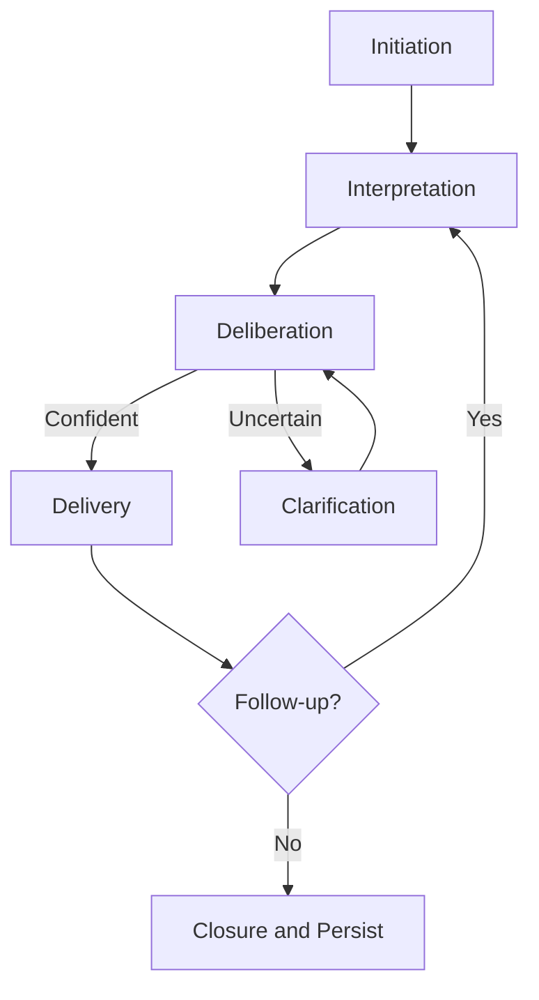

# Volume 03 - Conversation Lifecycle

| Field | Value |
|---|---|
| Document ID | WORLD-VOL03-034 |
| Title | Conversation Lifecycle |
| Version | 1.0 |
| Status | Approved |
| Classification | Internal |
| Founder | Mahesh Choudhary |

## Purpose

This chapter defines the conversation lifecycle of the WORLD AI Business Partner: the complete arc through which a single interaction between a business user and the intelligence layer is opened, understood, worked, and closed. It establishes the canonical stages every conversation passes through so that later chapters on question analysis, reasoning, clarification, and response structure can attach precisely to a shared model.

## Scope

This specification covers the functional behaviour of a conversation from initiation to closure and its continuity across turns. It does not cover transport, session storage, authentication, or model orchestration mechanics, which belong to the platform architecture volumes. The concern here is *how the AI conducts itself* across the life of a conversation, not how the software is built.

## Definition

A **conversation** is a bounded, stateful exchange in which the AI Business Partner pursues a business intent on behalf of a user. It is bounded because it has a clear beginning and end; stateful because each turn is interpreted against accumulated context; and intent-driven because its purpose is to advance a business outcome, not merely to answer text.

This distinguishes WORLD from a generic chatbot. A chatbot processes messages. The AI Business Partner sustains a working relationship in which memory, business context, and prior decisions persist across the lifecycle.

## Why It Matters

Business intelligence is rarely a single question. A user asks about last quarter's margin, then narrows to a region, then requests a brief for the board. If the AI treats each message independently, it forces the user to re-establish context repeatedly and loses the thread of intent. A disciplined lifecycle guarantees continuity, accountability, and predictable behaviour at every stage.

## Lifecycle Stages

Every conversation traverses five stages. Stages may loop, but the sequence is canonical.

| Stage | Trigger | AI Responsibility | Exit Condition |
|---|---|---|---|
| Initiation | User opens conversation or a system event | Load business context and memory; establish intent frame | Intent frame ready |
| Interpretation | Incoming user turn | Analyse the question and required knowledge | Question classified |
| Deliberation | Classified question | Reason, retrieve, and clarify as needed | Answerable state reached |
| Delivery | Answerable state | Structure and return the response | Response acknowledged |
| Continuation / Closure | Follow-up or inactivity | Persist context, or close and summarise | New turn or conversation closed |

### Initiation

On initiation the AI establishes an *intent frame*: the working understanding of who the user is, what business domain is in play, and what outcome is being pursued. Relevant memory and organisational context (Volume 02) are attached here so that the first turn is already grounded.

### Interpretation and Deliberation

The incoming turn is passed to question analysis (Chapter 35), which classifies intent and required knowledge. Deliberation then applies multi-step reasoning (Chapter 36) and invokes clarification (Chapter 37) when confidence is insufficient. These two stages loop until the AI reaches an answerable state.

### Delivery and Continuation

The response is structured (Chapter 38) and delivered. The conversation then either continues, with the new turn re-entering interpretation against enriched context, or closes. On closure the AI persists durable context and, where appropriate, offers a summary of what was decided or produced.

## Lifecycle Flow

## Rules

1. Every conversation must carry an explicit intent frame from initiation onward.
2. Context accumulated in earlier turns must remain available to later turns until closure.
3. The AI must never skip interpretation; even a follow-up is re-analysed against updated state.
4. Closure must persist durable outcomes so a future conversation can build on them.

## Enterprise Example

A Chief Financial Officer opens a conversation. **Initiation** attaches the finance domain and prior board-reporting memory. Turn one, "How did EMEA margin move last quarter?", is **interpreted** as an analytical question. **Deliberation** retrieves figures and detects an ambiguous period boundary, triggering one clarification. On answer, **delivery** returns a structured margin summary. The CFO follows up, "Draft a board brief on this," which re-enters interpretation and routes to decision brief generation (Chapter 41). When the CFO leaves, **closure** persists the brief and the confirmed reporting period for reuse.

## Cross-References

- [Question Analysis](/docs/blueprint/volume-03-ai-business-partner/section-e-interaction-model/35-question-analysis.md)
- [Multi-Step Reasoning](/docs/blueprint/volume-03-ai-business-partner/section-e-interaction-model/36-multi-step-reasoning.md)
- [Response Structure](/docs/blueprint/volume-03-ai-business-partner/section-e-interaction-model/38-response-structure.md)

## References

- [Volume 01 - Vision and Philosophy](/docs/blueprint/volume-01-vision-and-philosophy/README.md)
- [Document Standards](/docs/governance/document-standards.md)

## Change Log

| Version | Date | Author | Notes |
|---|---|---|---|
| 1.0 | 2026-07-12 | Lead Software Engineer | Initial approved version. |
