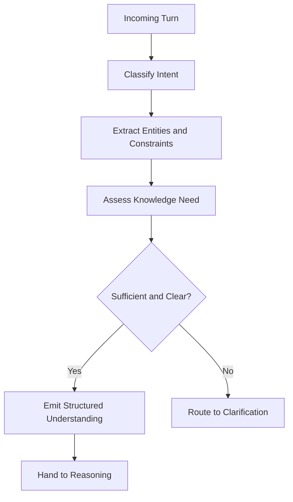

# Volume 03 - Question Analysis

| Field | Value |
|---|---|
| Document ID | WORLD-VOL03-035 |
| Title | Question Analysis |
| Version | 1.0 |
| Status | Approved |
| Classification | Internal |
| Founder | Mahesh Choudhary |

## Purpose

This chapter specifies how the WORLD AI Business Partner analyses an incoming user question before attempting to answer it. Question analysis is the interpretation stage of the conversation lifecycle: it converts natural-language input into a structured understanding of intent, scope, and required knowledge that downstream reasoning can act on reliably.

## Scope

This specification covers classification of questions, extraction of entities and constraints, and the assessment of confidence and knowledge sufficiency. It does not cover the reasoning that produces an answer (Chapter 36) or the mechanics of clarification (Chapter 37), though it defines the signals those chapters consume.

## Definition

**Question analysis** is the disciplined decomposition of a user turn into its intent, its subject entities, its constraints, and the knowledge required to satisfy it. It is the difference between reacting to words and understanding a request.

## Why It Matters

An AI Business Partner that misreads intent produces confident but wrong work. A user asking "Why did churn rise?" wants a causal explanation, not a churn number. Precise analysis ensures the AI answers the question actually asked, retrieves the right knowledge, and knows when it must ask before it acts.

## Analysis Dimensions

Every question is analysed along four dimensions.

| Dimension | Question It Answers | Example Output |
|---|---|---|
| Intent | What kind of task is this? | Analytical, factual, generative, advisory |
| Entities | What business objects are referenced? | Region "EMEA", metric "churn", period "Q2" |
| Constraints | What bounds the answer? | Timeframe, segment, format, audience |
| Knowledge need | What must be known to answer? | Internal data, policy, external context |

### Intent Classification

Intent determines the answer shape. WORLD recognises four primary intents:

- **Factual** - retrieve a known value or definition.
- **Analytical** - explain, compare, or diagnose a pattern.
- **Generative** - produce an artefact such as a report or brief.
- **Advisory** - recommend a course of action.

### Entity and Constraint Extraction

The AI extracts business entities and the constraints that bound them, resolving references against the intent frame and memory. "That region" from a prior turn resolves to the entity established earlier in the conversation.

### Knowledge Sufficiency and Confidence

The AI assesses whether it holds enough grounded knowledge to answer. It produces a confidence signal that drives the next step: proceed to reasoning, or route to clarification.

## Analysis Flow

## Rules

1. Every question must be classified by intent before any answer is attempted.
2. Ambiguous references must be resolved against the intent frame and memory, not guessed silently.
3. When knowledge is insufficient or intent is unclear, the AI must route to clarification rather than fabricate.
4. The structured understanding must be explicit enough for reasoning to consume without re-parsing raw text.

## Enterprise Example

A sales director asks, "Compare EMEA and APAC performance this half versus last, and flag anything worrying." Analysis yields **intent** = analytical plus advisory; **entities** = regions EMEA and APAC, metric "performance"; **constraints** = current half versus prior half. The word "performance" is under-specified, so knowledge need is flagged ambiguous and one clarification is routed to confirm whether performance means revenue, margin, or bookings. Once confirmed, a complete structured understanding is emitted to reasoning.

## Cross-References

- [Conversation Lifecycle](/docs/blueprint/volume-03-ai-business-partner/section-e-interaction-model/34-conversation-lifecycle.md)
- [Multi-Step Reasoning](/docs/blueprint/volume-03-ai-business-partner/section-e-interaction-model/36-multi-step-reasoning.md)
- [Clarification Strategy](/docs/blueprint/volume-03-ai-business-partner/section-e-interaction-model/37-clarification-strategy.md)

## References

- [Volume 01 - Vision and Philosophy](/docs/blueprint/volume-01-vision-and-philosophy/README.md)
- [Document Standards](/docs/governance/document-standards.md)

## Change Log

| Version | Date | Author | Notes |
|---|---|---|---|
| 1.0 | 2026-07-12 | Lead Software Engineer | Initial approved version. |
