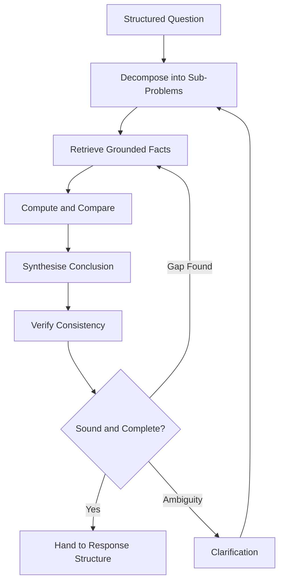

# Volume 03 - Multi-Step Reasoning

| Field | Value |
|---|---|
| Document ID | WORLD-VOL03-036 |
| Title | Multi-Step Reasoning |
| Version | 1.0 |
| Status | Approved |
| Classification | Internal |
| Founder | Mahesh Choudhary |

## Purpose

This chapter specifies how the WORLD AI Business Partner reasons through problems that cannot be answered in a single step. It defines the deliberation stage of the conversation lifecycle: the disciplined progression from a structured question to a grounded, defensible answer.

## Scope

This specification covers the structure of multi-step reasoning, the composition of reasoning steps, the handling of intermediate results, and the conditions under which reasoning pauses for clarification or concludes. It does not cover model-level inference internals; the concern is the functional discipline of business reasoning.

## Definition

**Multi-step reasoning** is the decomposition of a business question into an ordered sequence of sub-problems, each of which is solved and whose result feeds the next, until the original question is answered. It is how the AI moves from "what is asked" to "what is true and why".

## Why It Matters

Most consequential business questions are compound. "Should we open a second warehouse?" requires demand analysis, cost modelling, capacity assessment, and risk weighing. A single-shot answer to such a question is a guess. Explicit multi-step reasoning makes the AI's conclusions traceable, auditable, and trustworthy, which is a founding requirement of an AI Business Partner rather than an assistant.

## Reasoning Steps

A reasoning plan is built from typed steps. Each step has an input, an operation, and an output that becomes available to later steps.

| Step Type | Purpose | Example |
|---|---|---|
| Decompose | Break the question into sub-problems | Split ROI question into cost and benefit |
| Retrieve | Gather grounded facts | Pull warehouse lease costs |
| Compute | Derive new values | Calculate projected fulfilment savings |
| Compare | Weigh options against criteria | Rank two locations |
| Synthesise | Combine results into a conclusion | Form the recommendation |
| Verify | Check consistency and assumptions | Confirm figures reconcile |

## Reasoning Flow

## Rules

1. Compound questions must be decomposed explicitly; the AI must not answer them in a single unexamined step.
2. Every conclusion must trace to grounded facts retrieved during reasoning, not to unsupported assertion.
3. Assumptions introduced during reasoning must be recorded and surfaced in the final response.
4. A verification step is mandatory before any advisory or generative conclusion is delivered.
5. When reasoning exposes a material ambiguity, it must pause and route to clarification rather than proceed on a guess.

## Handling Intermediate Results and Uncertainty

Intermediate results are retained for the life of the deliberation so later steps and the final response can cite them. Where a value is uncertain, the AI carries the uncertainty forward rather than discarding it, and reflects it in the confidence of the conclusion. This prevents the common failure mode of a precise-sounding answer built on a shaky intermediate.

## Enterprise Example

An operations lead asks whether to add a second distribution warehouse. The AI **decomposes** the question into demand growth, current capacity, incremental cost, and service-level impact. It **retrieves** shipment volumes and lease costs, **computes** projected overflow and fulfilment savings, **compares** two candidate sites, and **synthesises** a recommendation to proceed with the northern site. The **verify** step reconciles the savings figure against the cost model, notes an assumption about sustained demand growth, and surfaces it. The conclusion, with its assumption and confidence, is handed to response structure.

## Cross-References

- [Question Analysis](/docs/blueprint/volume-03-ai-business-partner/section-e-interaction-model/35-question-analysis.md)
- [Clarification Strategy](/docs/blueprint/volume-03-ai-business-partner/section-e-interaction-model/37-clarification-strategy.md)
- [Decision Brief Generation](/docs/blueprint/volume-03-ai-business-partner/section-e-interaction-model/41-decision-brief-generation.md)

## References

- [Volume 01 - Vision and Philosophy](/docs/blueprint/volume-01-vision-and-philosophy/README.md)
- [Document Standards](/docs/governance/document-standards.md)

## Change Log

| Version | Date | Author | Notes |
|---|---|---|---|
| 1.0 | 2026-07-12 | Lead Software Engineer | Initial approved version. |
