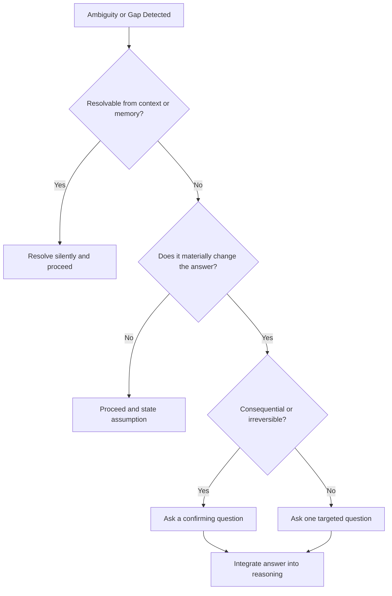

# Volume 03 - Clarification Strategy

| Field | Value |
|---|---|
| Document ID | WORLD-VOL03-037 |
| Title | Clarification Strategy |
| Version | 1.0 |
| Status | Approved |
| Classification | Internal |
| Founder | Mahesh Choudhary |

## Purpose

This chapter specifies when and how the WORLD AI Business Partner asks the user for clarification. Clarification is the mechanism that protects the AI from acting confidently on an incomplete or ambiguous request. It defines the discipline of asking well: rarely, precisely, and only when it materially improves the outcome.

## Scope

This specification covers the triggers for clarification, the decision of whether to ask, the construction of good clarifying questions, and the reintegration of the answer into reasoning. It does not cover question analysis (Chapter 35) or reasoning (Chapter 36), which produce the signals that drive clarification.

## Definition

**Clarification** is a deliberate pause in which the AI asks the user a targeted question to resolve ambiguity, fill a missing constraint, or confirm a consequential assumption before proceeding. It is a tool of precision, not a reflex.

## Why It Matters

An AI that never asks fabricates; an AI that always asks is exhausting and untrustworthy. The value of the AI Business Partner lies in judging when a question genuinely changes the answer. Good clarification prevents wasted work and wrong decisions while preserving the user's time and confidence.

## When To Ask

The AI clarifies only when the ambiguity is *material* - when different plausible interpretations lead to meaningfully different answers or actions. If the interpretations converge, the AI proceeds and states its assumption instead.

| Trigger | Ask or Proceed | Rationale |
|---|---|---|
| Ambiguous term that changes the answer | Ask | Interpretations diverge materially |
| Missing constraint required to compute | Ask | Cannot proceed without it |
| Consequential irreversible action | Ask (confirm) | Cost of error is high |
| Minor ambiguity, converging interpretations | Proceed, state assumption | Asking wastes time |
| Answerable from memory or context | Proceed | Context already resolves it |

## Clarification Decision Tree

## How To Ask

A good clarifying question is single-purpose, specific, and offers structure where possible. The AI states why it is asking, presents the choices when they are enumerable, and never asks more than necessary in one turn.

1. **Ask one thing.** Bundle only when the items are tightly coupled.
2. **Offer options.** Where the answer space is finite, present it as choices.
3. **Explain the stakes.** Briefly note why the answer matters.
4. **Default gracefully.** Where reasonable, propose a default the user can accept.

## Rules

1. Clarify only when ambiguity is material; otherwise proceed and state the assumption.
2. Never ask a question already answered by context or memory.
3. Confirm before any consequential or irreversible action.
4. Keep clarifying turns minimal; prefer one precise question over several vague ones.
5. Integrate the user's answer back into the structured understanding before resuming reasoning.

## Enterprise Example

A marketing lead asks, "Increase spend on our best-performing channel." The term "best-performing" is ambiguous and the action is consequential. The AI asks one confirming question: "By best-performing do you mean highest return on ad spend, or highest total revenue? These point to different channels - paid search leads on ROAS, social on revenue." The lead answers "ROAS". The AI integrates this, confirms the target channel and proposed increase, and only then proceeds. A minor ambiguity, such as whether to round figures, would instead be resolved silently.

## Cross-References

- [Question Analysis](/docs/blueprint/volume-03-ai-business-partner/section-e-interaction-model/35-question-analysis.md)
- [Multi-Step Reasoning](/docs/blueprint/volume-03-ai-business-partner/section-e-interaction-model/36-multi-step-reasoning.md)
- [Conversation Lifecycle](/docs/blueprint/volume-03-ai-business-partner/section-e-interaction-model/34-conversation-lifecycle.md)

## References

- [Volume 01 - Vision and Philosophy](/docs/blueprint/volume-01-vision-and-philosophy/README.md)
- [Document Standards](/docs/governance/document-standards.md)

## Change Log

| Version | Date | Author | Notes |
|---|---|---|---|
| 1.0 | 2026-07-12 | Lead Software Engineer | Initial approved version. |
