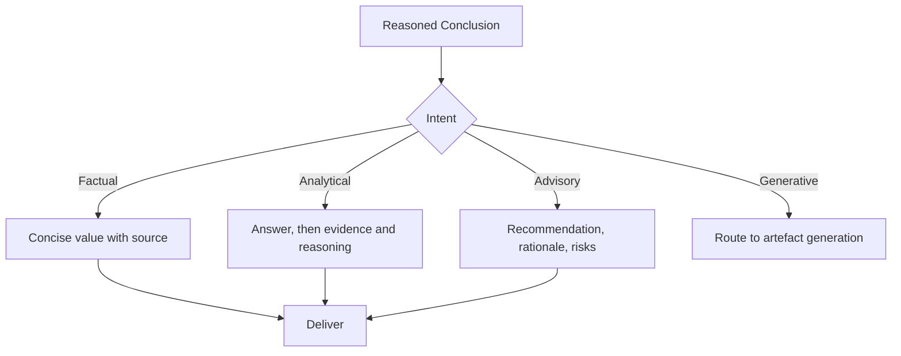

# Volume 03 - Response Structure

| Field | Value |
|---|---|
| Document ID | WORLD-VOL03-038 |
| Title | Response Structure |
| Version | 1.0 |
| Status | Approved |
| Classification | Internal |
| Founder | Mahesh Choudhary |

## Purpose

This chapter specifies how the WORLD AI Business Partner structures the responses it delivers to users. It defines the delivery stage of the conversation lifecycle: the transformation of a reasoned conclusion into a clear, appropriately shaped, and trustworthy answer.

## Scope

This specification covers the anatomy of a response, the selection of response shape by intent, the ordering of content, and the surfacing of assumptions and confidence. It does not cover long-form artefacts such as reports (Chapter 39) or decision briefs (Chapter 41), which have their own structures, though it defines the principles they inherit.

## Definition

**Response structure** is the deliberate arrangement of an answer so that its most important content is immediately accessible, its supporting detail is available but not intrusive, and its assumptions and confidence are transparent.

## Why It Matters

Business users read for decisions, not for prose. A correct answer buried in undifferentiated text is a failed answer. Consistent structure lets users trust that the headline comes first, that evidence is available, and that the AI is honest about what it does not know. Structure is how correctness becomes usable.

## The Response Anatomy

Every substantive response is built from a common anatomy, though not every part appears in every answer.

| Component | Role | Always Present |
|---|---|---|
| Direct answer | The headline conclusion, stated first | Yes |
| Supporting evidence | Facts and figures that ground the answer | For analytical/advisory |
| Reasoning summary | How the conclusion was reached | For compound questions |
| Assumptions | Any assumptions made | When assumptions exist |
| Confidence | How certain the AI is | When materially below full |
| Next actions | Suggested follow-ups | When useful |

## Response Shape by Intent

The shape follows the intent identified in question analysis.

## Rules

1. State the direct answer first; never make the user read to find the conclusion.
2. Match response length and depth to the question; do not pad a factual answer.
3. Surface assumptions and material uncertainty explicitly.
4. Ground every claim in evidence available to the user.
5. Use structure - headings, tables, lists - only where it aids comprehension, not decoratively.

## Ordering and Progressive Disclosure

Responses follow *progressive disclosure*: the conclusion first, then the evidence a careful reader wants, then the fine detail. This lets a busy executive stop after the headline and an analyst continue to the underpinnings, from the same response.

## Enterprise Example

A regional manager asks why service tickets rose last month. A well-structured response opens with the direct answer: "Tickets rose 18% month over month, driven mainly by the billing system migration on the 9th." It then presents a short evidence table of ticket categories and volumes, summarises the reasoning linking the migration to the billing-related spike, notes the assumption that the migration cohort is representative, and states high confidence. It closes with a suggested next action: reviewing the migration runbook before the next rollout. The manager gets the answer in one line and the justification in one glance.

## Cross-References

- [Multi-Step Reasoning](/docs/blueprint/volume-03-ai-business-partner/section-e-interaction-model/36-multi-step-reasoning.md)
- [Report Generation](/docs/blueprint/volume-03-ai-business-partner/section-e-interaction-model/39-report-generation.md)
- [Decision Brief Generation](/docs/blueprint/volume-03-ai-business-partner/section-e-interaction-model/41-decision-brief-generation.md)

## References

- [Volume 01 - Vision and Philosophy](/docs/blueprint/volume-01-vision-and-philosophy/README.md)
- [Document Standards](/docs/governance/document-standards.md)

## Change Log

| Version | Date | Author | Notes |
|---|---|---|---|
| 1.0 | 2026-07-12 | Lead Software Engineer | Initial approved version. |
