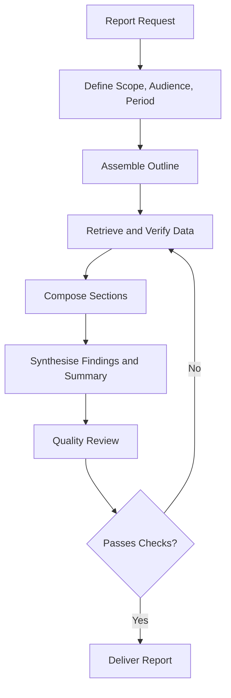

# Volume 03 - Report Generation

| Field | Value |
|---|---|
| Document ID | WORLD-VOL03-039 |
| Title | Report Generation |
| Version | 1.0 |
| Status | Approved |
| Classification | Internal |
| Founder | Mahesh Choudhary |

## Purpose

This chapter specifies how the WORLD AI Business Partner generates reports: structured, multi-section artefacts that communicate analysis over a defined scope to a defined audience. It defines what makes a WORLD report trustworthy and how the AI moves from a generative request to a finished document.

## Scope

This specification covers the definition of a report, the report generation pipeline, section composition, and quality rules. It does not cover single-turn responses (Chapter 38), decision briefs (Chapter 41), or meeting artefacts (Chapter 40), which are distinct artefact types with their own chapters.

## Definition

A **report** is a self-contained, sectioned document that presents analysis of a business subject over a scope and period, grounded in cited data, and organised for its intended reader. Unlike a conversational response, a report is durable, shareable, and expected to stand on its own.

## Why It Matters

Reports are how organisations remember and align. A monthly performance report or an incident analysis becomes an artefact of record. If the AI generates reports that are inconsistent, ungrounded, or poorly organised, it erodes trust in the entire intelligence layer. A disciplined generation pipeline makes reports reliable enough to circulate to leadership.

## Report Generation Pipeline

## Report Anatomy

| Section | Purpose |
|---|---|
| Title and metadata | Subject, period, audience, generation date |
| Executive summary | The findings in brief, readable alone |
| Context | Why the report exists and its scope |
| Findings | The analysis, organised by theme |
| Data and evidence | Tables and figures supporting findings |
| Risks and caveats | Assumptions, limitations, data gaps |
| Recommendations | Suggested actions, where in scope |
| Appendix | Detailed data and methodology |

## Rules

1. Every report must state its scope, period, and audience before its findings.
2. The executive summary must be complete enough to stand alone.
3. Every finding must cite the data that supports it; no unsourced claims.
4. Assumptions, data gaps, and limitations must appear explicitly, not be omitted.
5. Reports must pass a quality review for consistency and reconciliation before delivery.

## Composition and Audience Fit

The AI composes each section to its audience. An executive report leads with implications and keeps detail in the appendix; an operational report foregrounds the working data. The same underlying analysis can yield differently shaped reports for different readers, but the findings must remain consistent across them.

## Enterprise Example

A request reads: "Generate the Q2 EMEA revenue report for the leadership team." The AI defines scope (EMEA, Q2, leadership audience), assembles an outline, retrieves and reconciles revenue data, and composes the sections. The delivered outline is:

1. **Executive Summary** - EMEA revenue up 12% quarter over quarter, driven by enterprise renewals.
2. **Context** - scope, period, and data sources.
3. **Findings** - growth by segment, product, and country.
4. **Data and Evidence** - revenue tables and trend figures.
5. **Risks and Caveats** - one country's figures pending reconciliation, flagged.
6. **Recommendations** - reinvest in the two fastest-growing segments.
7. **Appendix** - detailed breakdowns and methodology.

The report passes quality review, with the pending reconciliation surfaced as a caveat rather than hidden, and is delivered.

## Cross-References

- [Response Structure](/docs/blueprint/volume-03-ai-business-partner/section-e-interaction-model/38-response-structure.md)
- [Multi-Step Reasoning](/docs/blueprint/volume-03-ai-business-partner/section-e-interaction-model/36-multi-step-reasoning.md)
- [Decision Brief Generation](/docs/blueprint/volume-03-ai-business-partner/section-e-interaction-model/41-decision-brief-generation.md)

## References

- [Volume 01 - Vision and Philosophy](/docs/blueprint/volume-01-vision-and-philosophy/README.md)
- [Document Standards](/docs/governance/document-standards.md)

## Change Log

| Version | Date | Author | Notes |
|---|---|---|---|
| 1.0 | 2026-07-12 | Lead Software Engineer | Initial approved version. |
