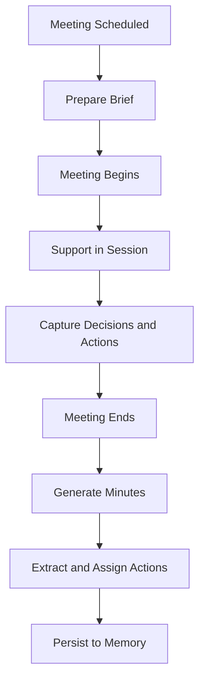

# Volume 03 - Meeting Assistance

| Field | Value |
|---|---|
| Document ID | WORLD-VOL03-040 |
| Title | Meeting Assistance |
| Version | 1.0 |
| Status | Approved |
| Classification | Internal |
| Founder | Mahesh Choudhary |

## Purpose

This chapter specifies how the WORLD AI Business Partner assists with meetings: preparing for them, supporting them, and capturing their outcomes. Meetings are where organisational decisions are made, and this chapter defines how the intelligence layer adds value across that lifecycle without displacing human judgement.

## Scope

This specification covers the three phases of meeting assistance - before, during, and after - and the artefacts the AI produces in each. It does not cover audio capture, transcription mechanics, or calendar integration, which belong to platform volumes. The concern is the AI's functional contribution to a meeting.

## Definition

**Meeting assistance** is the AI Business Partner's participation across a meeting's lifecycle: producing preparatory materials, surfacing relevant context and analysis in the moment, and converting discussion into a durable record of decisions and actions.

## Why It Matters

Meetings are expensive and often poorly served by memory. Preparation is rushed, context is scattered, and outcomes are lost. An AI that arrives prepared, contributes grounded analysis, and captures decisions faithfully raises the quality of every meeting it touches and connects those outcomes back into the organisation's memory (Volume 02).

## The Three Phases

| Phase | AI Contribution | Primary Artefact |
|---|---|---|
| Before | Assemble agenda context, prior actions, relevant data | Meeting brief |
| During | Answer questions, surface facts, track decisions | Live notes and decision log |
| After | Summarise, extract actions, distribute | Minutes and action list |

## Meeting Assistance Flow

### Before the Meeting

The AI prepares a **meeting brief**: the agenda, the status of actions from the previous meeting, the participants, and the analysis relevant to each agenda item. This ensures the meeting starts informed rather than spending its first minutes reconstructing context.

### During the Meeting

When invited, the AI answers factual and analytical questions in the moment, drawing on grounded data, and quietly tracks the decisions reached and the actions assigned. It contributes; it does not chair.

### After the Meeting

The AI generates concise minutes, extracts a clear action list with owners and due dates, and persists decisions to organisational memory so future conversations and meetings can build on them.

## Rules

1. A meeting brief must draw on prior meeting outcomes so context carries forward.
2. In-session contributions must be grounded and cited; the AI must not speculate as if factual.
3. Every captured action must have an owner and, where stated, a due date.
4. Decisions must be recorded verbatim in intent and persisted to memory.
5. The AI supports the meeting; it never assumes the role of decision-maker.

## Enterprise Example

Ahead of a weekly leadership meeting, the AI produces a brief opening with the three open actions from last week, each with status, followed by the current pipeline figures tied to the growth agenda item. During the meeting a participant asks for the latest churn figure; the AI supplies it with its source. As the meeting closes, it produces minutes and an action list: "Approve EMEA hiring plan - owner: VP People - due: 19 July" and "Reconcile the pending country revenue - owner: Finance - due: 15 July." These decisions and actions are persisted so next week's brief opens with their status.

## Cross-References

- [Report Generation](/docs/blueprint/volume-03-ai-business-partner/section-e-interaction-model/39-report-generation.md)
- [Decision Brief Generation](/docs/blueprint/volume-03-ai-business-partner/section-e-interaction-model/41-decision-brief-generation.md)
- [Conversation Lifecycle](/docs/blueprint/volume-03-ai-business-partner/section-e-interaction-model/34-conversation-lifecycle.md)

## References

- [Volume 01 - Vision and Philosophy](/docs/blueprint/volume-01-vision-and-philosophy/README.md)
- [Document Standards](/docs/governance/document-standards.md)

## Change Log

| Version | Date | Author | Notes |
|---|---|---|---|
| 1.0 | 2026-07-12 | Lead Software Engineer | Initial approved version. |
