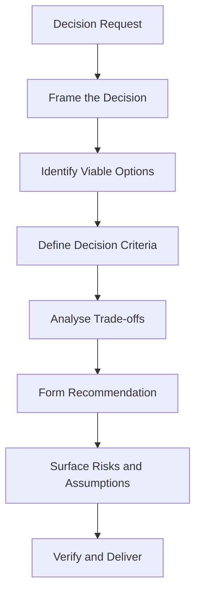

# Volume 03 - Decision Brief Generation

| Field | Value |
|---|---|
| Document ID | WORLD-VOL03-041 |
| Title | Decision Brief Generation |
| Version | 1.0 |
| Status | Approved |
| Classification | Internal |
| Founder | Mahesh Choudhary |

## Purpose

This chapter specifies how the WORLD AI Business Partner generates decision briefs: focused artefacts designed to help a specific decision-maker reach a specific decision. The decision brief is the highest-value artefact the intelligence layer produces, because it converts analysis directly into a defensible choice.

## Scope

This specification covers the definition of a decision brief, its distinct anatomy, the generation flow, and the rules that keep it decision-oriented. It does not cover general reports (Chapter 39), which inform, whereas a decision brief exists to drive a single decision to resolution.

## Definition

A **decision brief** is a concise, structured artefact that frames a specific decision, presents the viable options with their trade-offs, and offers a grounded recommendation with its rationale, risks, and assumptions. It is built to be acted upon, not merely read.

## Why It Matters

Executives are asked to decide, often quickly, on incomplete information. A report tells them what is happening; a decision brief tells them what to do about it and why. By packaging analysis into a clear recommendation with visible trade-offs, the AI Business Partner accelerates good decisions and makes them auditable after the fact - a direct expression of WORLD's founding purpose.

## Decision Brief Anatomy

| Section | Purpose |
|---|---|
| Decision statement | The exact decision to be made, and by whom |
| Context | Why this decision, why now |
| Options | The viable choices, each characterised |
| Trade-off analysis | Options compared against decision criteria |
| Recommendation | The AI's recommended option |
| Rationale | Why the recommendation follows from the analysis |
| Risks and assumptions | What could go wrong, what is assumed |
| Next steps | What happens once decided |

## Generation Flow

## Rules

1. A decision brief must open with an explicit decision statement, not a summary of facts.
2. At least two viable options must be presented; a brief with one option is not a decision.
3. Options must be compared against stated decision criteria, not asserted preferences.
4. The recommendation must trace to the trade-off analysis and carry its assumptions and risks.
5. The brief must remain concise; depth belongs in supporting reports, not the brief itself.

## Relationship to Reasoning and Reports

A decision brief is the destination of multi-step reasoning (Chapter 36) and often draws on an underlying report (Chapter 39). Reasoning produces the trade-off analysis; the report holds the supporting detail; the brief distils both into a decision. The three are layered, not redundant.

## Enterprise Example

A CFO asks, "Should we consolidate our two EMEA warehouses into one?" The AI produces a decision brief structured as:

1. **Decision Statement** - Whether to consolidate the Frankfurt and Rotterdam warehouses into a single site, decided by the CFO with COO input.
2. **Context** - Rising fixed costs and falling combined utilisation.
3. **Options** - (A) Consolidate to Frankfurt; (B) Consolidate to Rotterdam; (C) Retain both.
4. **Trade-off Analysis** - a table scoring each option on cost, service level, and risk.
5. **Recommendation** - Option A, consolidate to Frankfurt.
6. **Rationale** - lowest total cost with acceptable service-level impact.
7. **Risks and Assumptions** - assumes sustained demand; risk of transitional service disruption.
8. **Next Steps** - commission a transition plan if approved.

The brief is verified for reconciliation between the recommendation and the trade-off table, then delivered for the decision.

## Cross-References

- [Multi-Step Reasoning](/docs/blueprint/volume-03-ai-business-partner/section-e-interaction-model/36-multi-step-reasoning.md)
- [Report Generation](/docs/blueprint/volume-03-ai-business-partner/section-e-interaction-model/39-report-generation.md)
- [Response Structure](/docs/blueprint/volume-03-ai-business-partner/section-e-interaction-model/38-response-structure.md)

## References

- [Volume 01 - Vision and Philosophy](/docs/blueprint/volume-01-vision-and-philosophy/README.md)
- [Document Standards](/docs/governance/document-standards.md)

## Change Log

| Version | Date | Author | Notes |
|---|---|---|---|
| 1.0 | 2026-07-12 | Lead Software Engineer | Initial approved version. |
