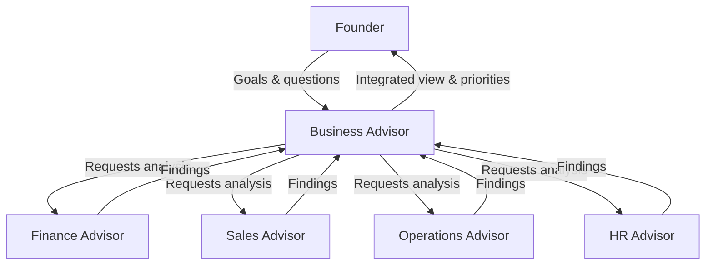

# Volume 03 - Business Advisor

| Field | Value |
|---|---|
| Document ID | WORLD-VOL03-042 |
| Title | Business Advisor |
| Version | 1.0 |
| Status | Approved |
| Classification | Internal |
| Founder | Mahesh Choudhary |

## Purpose
Define the Business Advisor service of the AI Business Partner. The Business Advisor is the generalist advisory role that reasons about the health and direction of the business as a whole. It exists to give the founder a single, coherent view of how the enterprise is performing across functions and where attention is most needed.

## Scope
This chapter specifies the Business Advisor functionally: its role, the questions it answers, the inputs it consumes, the outputs it produces, and how it collaborates with the founder and the specialist advisors. It does not cover deep single-domain analysis, which belongs to the Operations, Finance, Sales, HR, Strategy, and Research advisors. The Business Advisor synthesizes; the specialists specialize.

## Role Definition
The Business Advisor is the founder's whole-business counterpart. Where a specialist advisor sees one function in depth, the Business Advisor sees the business as an integrated system and reasons about the relationships between functions. It is the default advisor a founder turns to for the question "how is my business really doing, and what should I focus on?"

Its distinguishing characteristic is breadth with integration. It does not replace the specialists; it orchestrates their conclusions into one narrative, resolves conflicts between functional priorities, and keeps the founder oriented toward overall business objectives.

## Core Responsibilities
- Maintain a continuous, cross-functional read on business health.
- Translate the founder's goals into a coherent view of progress across functions.
- Detect where a problem in one function is caused by or affecting another.
- Prioritize the small number of issues that most deserve founder attention.
- Commission deeper analysis from specialist advisors when a signal warrants it.

## Questions It Answers
- Is the business healthy overall, and which functions are pulling it up or down?
- Given everything happening, what are the two or three things I should focus on this month?
- How does this operational issue connect to our finances and our growth?
- Are we making progress toward the goals we set, and where are we drifting?
- What does the combined picture from my advisors mean for me as founder?

## Inputs and Outputs
| Direction | Item | Source |
|---|---|---|
| Input | Business goals and objectives | Goal Understanding, founder |
| Input | KPI and metric state | Business Context Engine, Volume 02 intelligence |
| Input | Specialist advisor findings | Finance, Sales, Operations, HR advisors |
| Input | Risks and opportunities | Risk Awareness, Opportunity Detection |
| Output | Business health summary | To founder |
| Output | Prioritized focus list | To founder |
| Output | Cross-functional issue briefs | To founder and specialists |
| Output | Analysis requests | To specialist advisors |

## Collaboration Model

The Business Advisor operates within the human-in-the-loop philosophy. It frames, integrates, and recommends; the founder decides. When a matter is high stakes, it escalates a decision brief rather than acting.

## Enterprise Example
A founder asks the Business Advisor whether the business is on track for the quarter. The advisor reviews goal progress and notices revenue is slightly ahead of plan while cash is tightening. It requests detail from the Finance Advisor, which reports that receivables have slowed, and from the Sales Advisor, which confirms new deals are larger but paying later. The Business Advisor integrates these into a single finding: growth is healthy but the payment mix is straining cash. It presents the founder with a prioritized focus list, leading with a recommendation to tighten collection terms, and offers to commission a deeper cash plan from the Finance Advisor. The founder decides; the advisor records the decision and tracks follow-through.

## Cross-References
- [Business Context Engine](/docs/blueprint/volume-03-ai-business-partner/section-d-business-understanding/26-business-context-engine.md)
- [Strategy Advisor](/docs/blueprint/volume-03-ai-business-partner/section-f-ai-services/47-strategy-advisor.md)
- [Business Operating Model](/docs/blueprint/volume-02-business-foundation/section-a-business-fundamentals/05-business-operating-model.md)
- [KPIs](/docs/blueprint/volume-02-business-foundation/section-d-business-intelligence/26-kpis.md)

## References
- [Volume 01 - Vision & Philosophy](/docs/blueprint/volume-01-vision-and-philosophy/README.md)
- [Document Standards](/docs/governance/document-standards.md)

## Change Log
| Version | Date | Author | Change |
|---|---|---|---|
| 1.0 | 2026-07-12 | Lead Software Engineer | Initial approved version. |
