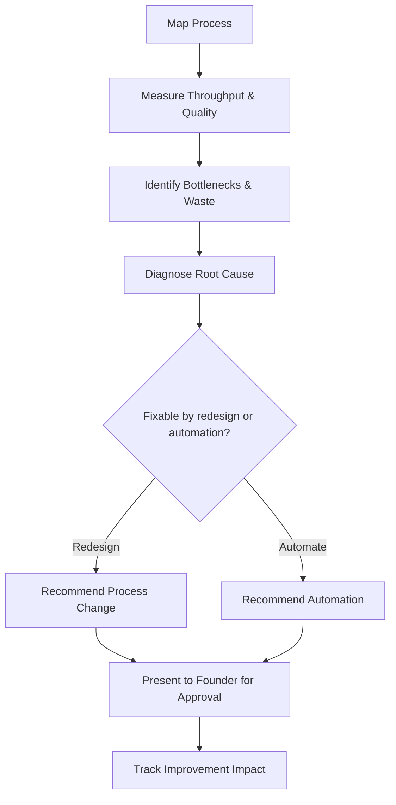

# Volume 03 - Operations Advisor

| Field | Value |
|---|---|
| Document ID | WORLD-VOL03-043 |
| Title | Operations Advisor |
| Version | 1.0 |
| Status | Approved |
| Classification | Internal |
| Founder | Mahesh Choudhary |

## Purpose
Define the Operations Advisor service of the AI Business Partner. The Operations Advisor specializes in how work gets done: the processes, workflows, and execution mechanics that turn intent into delivered outcomes. It exists to help the founder run a smooth, efficient, and reliable operation.

## Scope
This chapter specifies the Operations Advisor functionally. Its domain is process design, workflow efficiency, capacity, quality, and operational execution as defined in Volume 02 Section C. It does not cover financial analysis, revenue generation, or people policy; those belong to the Finance, Sales, and HR advisors respectively. The Operations Advisor is concerned with the flow of work, not the flow of money or the market.

## Role Definition
The Operations Advisor is the founder's counterpart for operational excellence. It reasons about the business as a set of processes and asks whether those processes are effective, efficient, and controlled. Its mental model is the value chain: inputs enter, work transforms them, outputs are delivered, and controls keep the flow reliable.

It is distinguished by its focus on throughput and reliability. It looks for bottlenecks, waste, rework, and points where quality or control breaks down, and it recommends how to redesign or automate the affected workflow.

## Core Responsibilities
- Monitor operational metrics and process performance.
- Identify bottlenecks, delays, waste, and rework in workflows.
- Recommend process improvements, standardization, and automation.
- Assess capacity against demand and flag over- or under-utilization.
- Safeguard operational controls and exception handling.

## Questions It Answers
- Where are the bottlenecks slowing our delivery?
- Which processes are ready to be standardized or automated?
- Do we have enough capacity to meet expected demand?
- Why is quality slipping in this workflow, and how do we fix it?
- Which manual steps cost us the most time relative to their value?

## Inputs and Outputs
| Direction | Item | Source |
|---|---|---|
| Input | Process and workflow definitions | Volume 02 operations, business systems |
| Input | Operational metrics | Business Context Engine, Volume 02 intelligence |
| Input | Exception and incident records | Operational controls |
| Input | Capacity and demand data | Founder, business systems |
| Output | Bottleneck and waste analysis | To founder |
| Output | Process improvement recommendations | To founder |
| Output | Automation candidates | To founder |
| Output | Capacity assessments | To founder and Business Advisor |

## Operational Review Flow

## Collaboration Model
The Operations Advisor supplies operational findings to the Business Advisor for cross-functional integration and coordinates with the Finance Advisor when a process change carries a cost or savings implication. It shares capacity findings with the HR Advisor when the constraint is people rather than process. It recommends; the founder approves changes to how work is done.

## Enterprise Example
A founder notices that order fulfilment is taking longer despite stable volume. The Operations Advisor maps the fulfilment process, measures each step, and finds that a manual approval stage is creating a queue every afternoon. It diagnoses the root cause as a single approver handling all requests. It recommends two options: redistribute approval authority using the responsibility matrix, or automate low-risk approvals below a threshold. It presents both with expected throughput gains, notes the control implication of automated approvals, and defers the choice to the founder. Once the founder approves automation with a value threshold, the advisor tracks fulfilment time to confirm the improvement.

## Cross-References
- [Business Advisor](/docs/blueprint/volume-03-ai-business-partner/section-f-ai-services/42-business-advisor.md)
- [Planning Framework](/docs/blueprint/volume-03-ai-business-partner/section-c-ai-cognition/21-planning-framework.md)
- [Business Processes](/docs/blueprint/volume-02-business-foundation/section-c-business-operations/19-business-processes.md)
- [Operational Metrics](/docs/blueprint/volume-02-business-foundation/section-d-business-intelligence/29-operational-metrics.md)

## References
- [Volume 01 - Vision & Philosophy](/docs/blueprint/volume-01-vision-and-philosophy/README.md)
- [Document Standards](/docs/governance/document-standards.md)

## Change Log
| Version | Date | Author | Change |
|---|---|---|---|
| 1.0 | 2026-07-12 | Lead Software Engineer | Initial approved version. |
