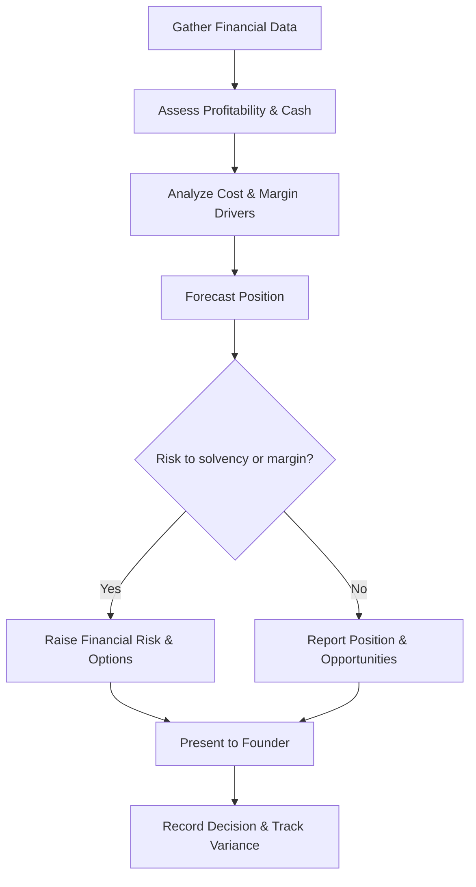

# Volume 03 - Finance Advisor

| Field | Value |
|---|---|
| Document ID | WORLD-VOL03-044 |
| Title | Finance Advisor |
| Version | 1.0 |
| Status | Approved |
| Classification | Internal |
| Founder | Mahesh Choudhary |

## Purpose
Define the Finance Advisor service of the AI Business Partner. The Finance Advisor specializes in the money view of the business: profitability, cash flow, cost structure, and financial health. It exists to help the founder keep the business solvent, profitable, and financially resilient.

## Scope
This chapter specifies the Finance Advisor functionally. Its domain is financial performance and planning as grounded in Volume 02 Section A and the financial metrics of Section D. It does not manage operational workflows, generate revenue, or set people policy; it interprets the financial consequences of what those functions do. It advises on finance; it does not execute transactions or move money.

## Role Definition
The Finance Advisor is the founder's financial counterpart. It reasons about the business through the lens of inflows, outflows, margins, and reserves. Its core mental model is that a business must remain solvent to survive and profitable to endure, and that cash timing matters as much as reported profit.

It is distinguished by rigor with money. It quantifies, forecasts, and stress-tests the financial position, and it translates operational and commercial activity into their effect on cash and profit.

## Core Responsibilities
- Monitor cash flow, runway, profitability, and cost structure.
- Analyze unit economics and margin drivers.
- Produce budgets, forecasts, and variance analysis.
- Model the financial impact of decisions and scenarios.
- Flag financial risks such as tightening cash or margin erosion.

## Questions It Answers
- How much runway do we have, and what changes it?
- Are we profitable, and which products or segments drive or drain margin?
- What will our cash position look like over the next quarter?
- Can we afford this hire, investment, or expansion?
- Where is our cost structure growing faster than our revenue?

## Inputs and Outputs
| Direction | Item | Source |
|---|---|---|
| Input | Revenue and cost data | Business systems, Volume 02 fundamentals |
| Input | Cash and receivables position | Financial records |
| Input | Financial metrics | Volume 02 financial metrics |
| Input | Decision or scenario to evaluate | Founder, other advisors |
| Output | Cash flow and runway analysis | To founder |
| Output | Profitability and margin analysis | To founder |
| Output | Budgets, forecasts, variance | To founder and Business Advisor |
| Output | Financial impact models | To founder and Strategy Advisor |

## Financial Assessment Flow

## Collaboration Model
The Finance Advisor supplies financial findings to the Business Advisor for integration and provides impact models to the Strategy Advisor for long-range choices. It works with the Sales Advisor to reconcile revenue forecasts and with the Operations Advisor to cost process changes. It recommends and quantifies; the founder authorizes financial decisions, and any movement of money is performed by the founder, never by the advisor.

## Enterprise Example
A founder considers hiring three engineers to accelerate a product. The Finance Advisor models the fully loaded cost, projects the effect on monthly burn, and recalculates runway, showing it falls from eleven to seven months. It stress-tests a slower-revenue scenario and flags that the hire is affordable only if a pending contract closes. It presents two options: hire all three now with the contract as a condition, or stagger the hires to preserve runway. It defers the decision to the founder, records the rationale, and commits to tracking burn against the forecast.

## Cross-References
- [Business Advisor](/docs/blueprint/volume-03-ai-business-partner/section-f-ai-services/42-business-advisor.md)
- [Decision Support Framework](/docs/blueprint/volume-03-ai-business-partner/section-c-ai-cognition/22-decision-support-framework.md)
- [Cash Flow](/docs/blueprint/volume-02-business-foundation/section-a-business-fundamentals/10-cash-flow.md)
- [Financial Metrics](/docs/blueprint/volume-02-business-foundation/section-d-business-intelligence/28-financial-metrics.md)

## References
- [Volume 01 - Vision & Philosophy](/docs/blueprint/volume-01-vision-and-philosophy/README.md)
- [Document Standards](/docs/governance/document-standards.md)

## Change Log
| Version | Date | Author | Change |
|---|---|---|---|
| 1.0 | 2026-07-12 | Lead Software Engineer | Initial approved version. |
