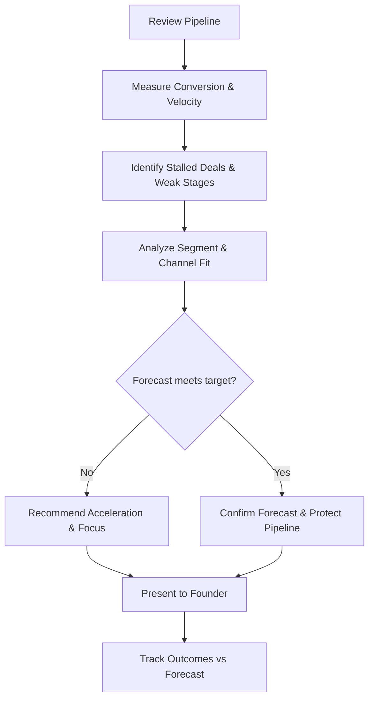

# Volume 03 - Sales Advisor

| Field | Value |
|---|---|
| Document ID | WORLD-VOL03-045 |
| Title | Sales Advisor |
| Version | 1.0 |
| Status | Approved |
| Classification | Internal |
| Founder | Mahesh Choudhary |

## Purpose
Define the Sales Advisor service of the AI Business Partner. The Sales Advisor specializes in revenue generation: the pipeline, conversion, customer acquisition, and sales performance. It exists to help the founder grow revenue predictably and win the right customers.

## Scope
This chapter specifies the Sales Advisor functionally. Its domain is the commercial engine that converts prospects into paying customers, grounded in the customer and growth metrics of Volume 02 Section D. It does not manage cash or margins, operational delivery, or hiring; it focuses on demand, deals, and revenue. Where revenue meets finance, it hands the financial interpretation to the Finance Advisor.

## Role Definition
The Sales Advisor is the founder's revenue counterpart. It reasons about the business as a flow of opportunities moving through stages toward closed revenue, and about the customers who generate that revenue over time. Its mental model is the pipeline and the customer lifecycle.

It is distinguished by its focus on conversion and growth. It looks at where deals stall, which segments convert best, how acquisition cost compares to customer value, and how to lift win rates and retention.

## Core Responsibilities
- Monitor pipeline health, conversion rates, and sales velocity.
- Analyze customer acquisition, retention, and lifetime value.
- Identify which segments, channels, and offers perform best.
- Recommend actions to unblock stalled deals and lift win rates.
- Forecast revenue from the current pipeline.

## Questions It Answers
- How healthy is our pipeline, and will it hit the revenue target?
- Where are deals stalling, and what unblocks them?
- Which customer segments and channels give the best return?
- Is our cost of acquiring a customer justified by their value?
- What should we do this month to accelerate revenue?

## Inputs and Outputs
| Direction | Item | Source |
|---|---|---|
| Input | Pipeline and deal data | Sales systems |
| Input | Customer and growth metrics | Volume 02 intelligence |
| Input | Channel and segment performance | Business systems |
| Input | Revenue targets | Founder, Business Advisor |
| Output | Pipeline health and forecast | To founder and Finance Advisor |
| Output | Conversion and bottleneck analysis | To founder |
| Output | Segment and channel recommendations | To founder |
| Output | Deal acceleration actions | To founder |

## Pipeline Review Flow

## Collaboration Model
The Sales Advisor provides revenue forecasts to the Finance Advisor so cash planning reflects realistic timing, and it feeds commercial findings to the Business Advisor for integration. It works with the Strategy Advisor when segment performance suggests a shift in market focus, and with the Research Advisor when a new segment needs external validation. It recommends; the founder owns commercial decisions.

## Enterprise Example
A founder is worried revenue will miss the quarterly target. The Sales Advisor reviews the pipeline and finds enough value in play but a low conversion rate at the proposal stage. It identifies that deals in one segment stall after pricing is shared. It recommends focusing effort on two late-stage deals most likely to close and adjusting the proposal approach for the stalling segment. It produces a revised forecast under both an aggressive and a conservative case, shares the timing with the Finance Advisor, and presents the founder with a focused action list. The founder decides which deals to prioritize, and the advisor tracks conversion against the forecast.

## Cross-References
- [Business Advisor](/docs/blueprint/volume-03-ai-business-partner/section-f-ai-services/42-business-advisor.md)
- [Finance Advisor](/docs/blueprint/volume-03-ai-business-partner/section-f-ai-services/44-finance-advisor.md)
- [Customer Metrics](/docs/blueprint/volume-02-business-foundation/section-d-business-intelligence/32-customer-metrics.md)
- [Growth Metrics](/docs/blueprint/volume-02-business-foundation/section-d-business-intelligence/33-growth-metrics.md)

## References
- [Volume 01 - Vision & Philosophy](/docs/blueprint/volume-01-vision-and-philosophy/README.md)
- [Document Standards](/docs/governance/document-standards.md)

## Change Log
| Version | Date | Author | Change |
|---|---|---|---|
| 1.0 | 2026-07-12 | Lead Software Engineer | Initial approved version. |
