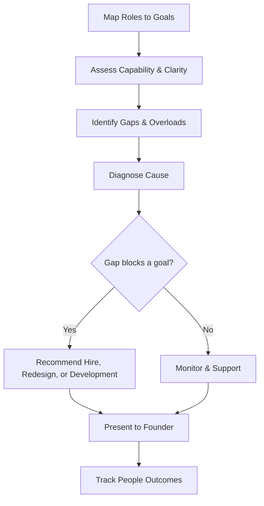

# Volume 03 - HR Advisor

| Field | Value |
|---|---|
| Document ID | WORLD-VOL03-046 |
| Title | HR Advisor |
| Version | 1.0 |
| Status | Approved |
| Classification | Internal |
| Founder | Mahesh Choudhary |

## Purpose
Define the HR Advisor service of the AI Business Partner. The HR Advisor specializes in people: organization design, hiring, performance, capability, and culture. It exists to help the founder build and sustain a team that can execute the business.

## Scope
This chapter specifies the HR Advisor functionally. Its domain is the people dimension of the business, grounded in Volume 02 organization structure, roles and responsibilities, and performance management. It does not manage financial affordability, operational workflow, or revenue; it advises on who does the work and how well they are enabled to do it. Affordability of headcount is handed to the Finance Advisor.

## Role Definition
The HR Advisor is the founder's people counterpart. It reasons about the business as an organization of roles, capabilities, and relationships, and asks whether the right people are in the right roles with the right clarity and support. Its mental model is the organization structure and the responsibilities that flow through it.

It is distinguished by its focus on capability and clarity. It looks at where roles are unclear, where the team is over- or under-staffed relative to goals, how performance is trending, and how retention and culture affect execution.

## Core Responsibilities
- Assess organization structure and role clarity against goals.
- Advise on hiring priorities, sequencing, and role definition.
- Support performance management and capability development.
- Monitor retention, workload, and culture signals.
- Recommend how to close capability gaps that block objectives.

## Questions It Answers
- Do we have the right roles and clarity to hit our goals?
- Who should we hire next, and in what order?
- Where are capability gaps blocking execution?
- Which roles are overloaded or at risk of turnover?
- How is performance trending across the team?

## Inputs and Outputs
| Direction | Item | Source |
|---|---|---|
| Input | Organization structure and roles | Volume 02 structure, founder |
| Input | Performance and capability data | HR systems, reviews |
| Input | Workload and capacity signals | Operations Advisor, founder |
| Input | Goals requiring capability | Business Advisor, founder |
| Output | Org and role clarity assessment | To founder |
| Output | Hiring plan and sequencing | To founder and Finance Advisor |
| Output | Capability gap analysis | To founder |
| Output | Retention and workload alerts | To founder |

## People Assessment Flow

## Collaboration Model
The HR Advisor shares hiring plans with the Finance Advisor to confirm affordability and with the Operations Advisor when a capacity constraint is really a staffing gap. It feeds people findings to the Business Advisor for integration and works with the Strategy Advisor when a strategic shift requires new capabilities. It recommends; the founder makes all decisions about people, and sensitive personnel matters are always escalated for human judgment.

## Enterprise Example
A founder plans to expand into a new product line. The HR Advisor maps the required roles against the current team and finds a gap in a specialized skill and an overloaded engineering lead. It recommends hiring one specialist, redistributing part of the lead's responsibilities using the responsibility matrix, and a short development plan for an existing engineer to grow into an adjacent role. It sequences the hire ahead of the launch, shares the cost implication with the Finance Advisor for affordability, and presents the plan to the founder. The founder approves the sequence, and the advisor tracks onboarding and workload as the launch approaches.

## Cross-References
- [Business Advisor](/docs/blueprint/volume-03-ai-business-partner/section-f-ai-services/42-business-advisor.md)
- [Operations Advisor](/docs/blueprint/volume-03-ai-business-partner/section-f-ai-services/43-operations-advisor.md)
- [Roles & Responsibilities](/docs/blueprint/volume-02-business-foundation/section-b-business-structure/14-roles-and-responsibilities.md)
- [Performance Management](/docs/blueprint/volume-02-business-foundation/section-f-business-management/45-performance-management.md)

## References
- [Volume 01 - Vision & Philosophy](/docs/blueprint/volume-01-vision-and-philosophy/README.md)
- [Document Standards](/docs/governance/document-standards.md)

## Change Log
| Version | Date | Author | Change |
|---|---|---|---|
| 1.0 | 2026-07-12 | Lead Software Engineer | Initial approved version. |
