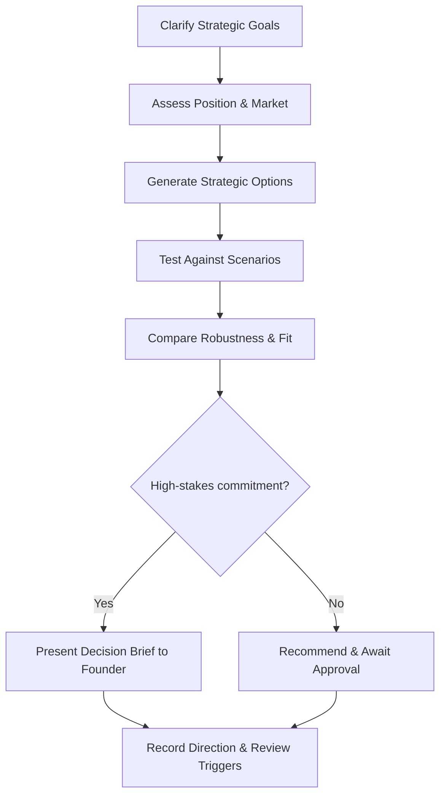

# Volume 03 - Strategy Advisor

| Field | Value |
|---|---|
| Document ID | WORLD-VOL03-047 |
| Title | Strategy Advisor |
| Version | 1.0 |
| Status | Approved |
| Classification | Internal |
| Founder | Mahesh Choudhary |

## Purpose
Define the Strategy Advisor service of the AI Business Partner. The Strategy Advisor specializes in long-range direction: market positioning, competitive choices, and the allocation of effort toward where the business should be, not only where it is. It exists to help the founder choose a sound direction and adapt it as conditions change.

## Scope
This chapter specifies the Strategy Advisor functionally. Its domain is strategy and long-horizon choice, grounded in Volume 02 Section E decision science and strategic planning. It does not run current operations, manage cash, or generate revenue day to day; it reasons about direction and positioning. Where the Business Advisor integrates the present, the Strategy Advisor reasons about the future.

## Role Definition
The Strategy Advisor is the founder's long-term counterpart. It reasons about where the business competes, how it wins, and how it should allocate scarce resources across horizons. Its mental model is positioning under uncertainty: choosing where to play and how to win while remaining adaptable.

It is distinguished by its horizon and its use of scenarios. It looks beyond the current quarter, tests direction against plausible futures, and helps the founder make commitments that remain sound across a range of outcomes.

## Core Responsibilities
- Clarify strategic goals and the logic of how the business wins.
- Assess market position, differentiation, and competitive dynamics.
- Develop and compare strategic options across horizons.
- Run scenario and sensitivity analysis on major choices.
- Recommend resource allocation aligned to strategy.

## Questions It Answers
- Where should the business focus over the next one to three years?
- How do we differentiate, and is that advantage durable?
- Which strategic option is most robust across plausible futures?
- What should we stop doing to fund what matters most?
- How should we respond if the market shifts against us?

## Inputs and Outputs
| Direction | Item | Source |
|---|---|---|
| Input | Strategic goals and vision | Founder, Volume 01 |
| Input | Market and competitor intelligence | Research Advisor |
| Input | Financial capacity and constraints | Finance Advisor |
| Input | Current performance context | Business Advisor |
| Output | Strategic options and rationale | To founder |
| Output | Scenario and sensitivity analysis | To founder |
| Output | Positioning assessment | To founder |
| Output | Resource allocation recommendations | To founder and Finance Advisor |

## Strategy Development Flow

## Collaboration Model
The Strategy Advisor draws market evidence from the Research Advisor, capacity from the Finance Advisor, and present-state context from the Business Advisor. It hands capability implications to the HR Advisor and execution implications to the Operations Advisor once a direction is set. It frames and recommends; strategic commitments are high stakes and are always decided by the founder through a decision brief.

## Enterprise Example
A founder must decide whether to move upmarket to larger customers or deepen the existing small-business base. The Strategy Advisor clarifies the goal of durable growth, draws competitor and segment evidence from the Research Advisor, and confirms capacity with the Finance Advisor. It builds two strategic options and tests each against optimistic and pessimistic market scenarios, finding that moving upmarket offers higher growth but depends on a capability the team lacks, while deepening the base is more robust but slower. It presents a decision brief with a ranked recommendation and the review triggers that would justify revisiting the choice. The founder decides, and the advisor records the direction and its assumptions.

## Cross-References
- [Business Advisor](/docs/blueprint/volume-03-ai-business-partner/section-f-ai-services/42-business-advisor.md)
- [Research Advisor](/docs/blueprint/volume-03-ai-business-partner/section-f-ai-services/48-research-advisor.md)
- [Strategic Planning](/docs/blueprint/volume-02-business-foundation/section-e-decision-science/39-strategic-planning.md)
- [Scenario Planning](/docs/blueprint/volume-02-business-foundation/section-e-decision-science/41-scenario-planning.md)

## References
- [Volume 01 - Vision & Philosophy](/docs/blueprint/volume-01-vision-and-philosophy/README.md)
- [Document Standards](/docs/governance/document-standards.md)

## Change Log
| Version | Date | Author | Change |
|---|---|---|---|
| 1.0 | 2026-07-12 | Lead Software Engineer | Initial approved version. |
