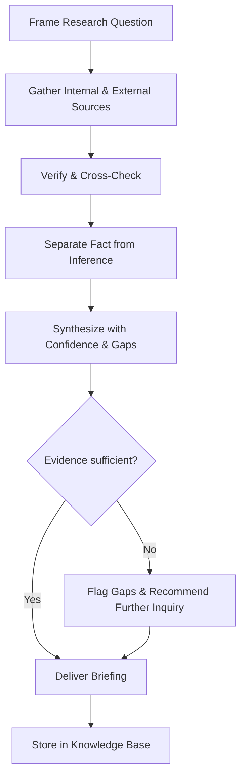

# Volume 03 - Research Advisor

| Field | Value |
|---|---|
| Document ID | WORLD-VOL03-048 |
| Title | Research Advisor |
| Version | 1.0 |
| Status | Approved |
| Classification | Internal |
| Founder | Mahesh Choudhary |

## Purpose
Define the Research Advisor service of the AI Business Partner. The Research Advisor specializes in gathering, verifying, and synthesizing information so that every other advisor and the founder can decide on evidence rather than assumption. It exists to reduce uncertainty by turning scattered information into trustworthy knowledge.

## Scope
This chapter specifies the Research Advisor functionally. Its domain is investigation and evidence synthesis, grounded in Volume 02 business data and knowledge. It does not make domain recommendations itself; it supplies the evidence base on which the domain advisors reason. It answers "what is true and what do we know?" so the other advisors can answer "what should we do?"

## Role Definition
The Research Advisor is the founder's evidence counterpart. It reasons about the reliability and completeness of information and assembles it into a clear, sourced picture. Its mental model is inquiry: form the question, gather sources, verify, and synthesize into knowledge with its confidence and gaps made explicit.

It is distinguished by its discipline about evidence. It separates fact from inference, records sources, states confidence, and surfaces what remains unknown rather than filling gaps with assumption.

## Core Responsibilities
- Conduct market, competitor, customer, and internal research.
- Verify claims and distinguish evidence from assumption.
- Synthesize findings into clear, sourced briefings.
- State confidence levels and highlight information gaps.
- Maintain a reusable knowledge base for other advisors.

## Questions It Answers
- What do we actually know about this market or competitor?
- Is this claim supported by evidence, and how strong is it?
- What are customers really saying, and how representative is it?
- What don't we know yet that we should before deciding?
- What does the combined evidence suggest, with what confidence?

## Inputs and Outputs
| Direction | Item | Source |
|---|---|---|
| Input | Research question | Founder, other advisors |
| Input | Internal data and documents | Volume 02 data and knowledge |
| Input | External sources | Market and public information |
| Input | Prior findings | Knowledge base |
| Output | Verified findings with sources | To requesting advisor or founder |
| Output | Confidence levels and gaps | To requesting advisor or founder |
| Output | Synthesized briefings | To founder and advisors |
| Output | Curated knowledge base entries | To all advisors |

## Research Flow

## Collaboration Model
The Research Advisor is a supporting service to the whole advisor network. It supplies market and competitor evidence to the Strategy Advisor, customer and segment evidence to the Sales Advisor, and benchmarks to the Finance and Operations advisors. It never substitutes its evidence for a domain recommendation; it equips the domain advisors and the founder to reason well, always stating confidence and gaps.

## Enterprise Example
Before a strategic review, the Strategy Advisor asks the Research Advisor to assess a new market segment. The Research Advisor frames the question, gathers external market data and internal sales records, and cross-checks conflicting figures. It separates confirmed facts, such as observed customer demand, from inferences, such as projected segment size, and assigns confidence to each. It reports that demand is real and well supported but that pricing tolerance is uncertain and recommends a small validation test before committing. It delivers a sourced briefing to the Strategy Advisor and the founder and stores the findings in the knowledge base for reuse.

## Cross-References
- [Strategy Advisor](/docs/blueprint/volume-03-ai-business-partner/section-f-ai-services/47-strategy-advisor.md)
- [Knowledge Model](/docs/blueprint/volume-03-ai-business-partner/section-c-ai-cognition/19-knowledge-model.md)
- [Business Knowledge](/docs/blueprint/volume-02-business-foundation/section-g-data-and-knowledge/52-business-knowledge.md)
- [Business Data](/docs/blueprint/volume-02-business-foundation/section-g-data-and-knowledge/49-business-data.md)

## References
- [Volume 01 - Vision & Philosophy](/docs/blueprint/volume-01-vision-and-philosophy/README.md)
- [Document Standards](/docs/governance/document-standards.md)

## Change Log
| Version | Date | Author | Change |
|---|---|---|---|
| 1.0 | 2026-07-12 | Lead Software Engineer | Initial approved version. |
