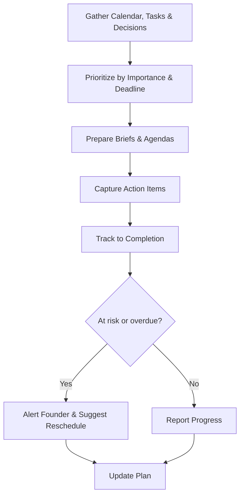

# Volume 03 - Executive Assistant

| Field | Value |
|---|---|
| Document ID | WORLD-VOL03-049 |
| Title | Executive Assistant |
| Version | 1.0 |
| Status | Approved |
| Classification | Internal |
| Founder | Mahesh Choudhary |

## Purpose
Define the Executive Assistant service of the AI Business Partner. The Executive Assistant specializes in coordination and personal productivity: managing the founder's time, tasks, communications, and follow-through. It exists to protect the founder's attention and ensure that decisions and commitments turn into completed actions.

## Scope
This chapter specifies the Executive Assistant functionally. Its domain is operational support for the founder rather than domain advisory. It does not analyze finances, operations, sales, people, or strategy; those belong to the specialist advisors. The Executive Assistant coordinates the founder's day and ensures the outputs of the advisors are scheduled, tracked, and closed out.

## Role Definition
The Executive Assistant is the founder's coordination counterpart. It reasons about time, priorities, and commitments, and keeps the many threads of a founder's work organized. Its mental model is the founder's agenda: the calendar, the task list, the inbox, and the open commitments that must not be dropped.

It is distinguished by its focus on execution logistics rather than analysis. It captures actions, prepares the founder for what is next, and follows up until commitments are complete, freeing the founder to focus on judgment and decisions.

## Core Responsibilities
- Organize the founder's schedule, priorities, and task list.
- Prepare the founder for meetings with context and agendas.
- Capture action items and track them to completion.
- Draft routine communications and summaries for review.
- Coordinate follow-through on advisor recommendations and decisions.

## Questions It Answers
- What are my priorities and commitments today and this week?
- What do I need to know before this meeting?
- What actions came out of that discussion, and who owns them?
- What is overdue or at risk of slipping?
- Can you draft this message or summary for me to approve?

## Inputs and Outputs
| Direction | Item | Source |
|---|---|---|
| Input | Calendar and task data | Founder's systems |
| Input | Meeting context | Business Advisor, specialist advisors |
| Input | Decisions and action items | Founder, advisors |
| Input | Communications to handle | Founder's inbox |
| Output | Prioritized daily and weekly plan | To founder |
| Output | Meeting briefs and agendas | To founder |
| Output | Tracked action items | To founder |
| Output | Draft communications and summaries | To founder for approval |

## Coordination Flow

## Collaboration Model
The Executive Assistant sits alongside the specialist advisors as their logistical counterpart. When an advisor produces a recommendation the founder approves, the Executive Assistant schedules the work, records the action items, and tracks them to completion. It draws meeting context from the Business Advisor and prepares the founder accordingly. It acts only within delegated authority and always presents drafts and plans for founder approval before anything is sent or committed on the founder's behalf.

## Enterprise Example
Following a decision brief from the Finance Advisor about tightening collections, the founder approves the plan. The Executive Assistant captures the action items, schedules a review with the finance function, and drafts a message to the team explaining the new collection terms for the founder's approval. Ahead of the founder's next day, it prepares a prioritized plan, flags that a customer meeting lacks an agenda, and assembles a brief from the relevant advisor context. When one action item risks slipping past its deadline, it alerts the founder and proposes a revised schedule. Every draft and plan is presented for approval before it is acted upon.

## Cross-References
- [Business Advisor](/docs/blueprint/volume-03-ai-business-partner/section-f-ai-services/42-business-advisor.md)
- [Meeting Assistance](/docs/blueprint/volume-03-ai-business-partner/section-e-interaction-model/40-meeting-assistance.md)
- [Execution Management](/docs/blueprint/volume-02-business-foundation/section-f-business-management/44-execution-management.md)
- [Workflow Management](/docs/blueprint/volume-02-business-foundation/section-c-business-operations/21-workflow-management.md)

## References
- [Volume 01 - Vision & Philosophy](/docs/blueprint/volume-01-vision-and-philosophy/README.md)
- [Document Standards](/docs/governance/document-standards.md)

## Change Log
| Version | Date | Author | Change |
|---|---|---|---|
| 1.0 | 2026-07-12 | Lead Software Engineer | Initial approved version. |
