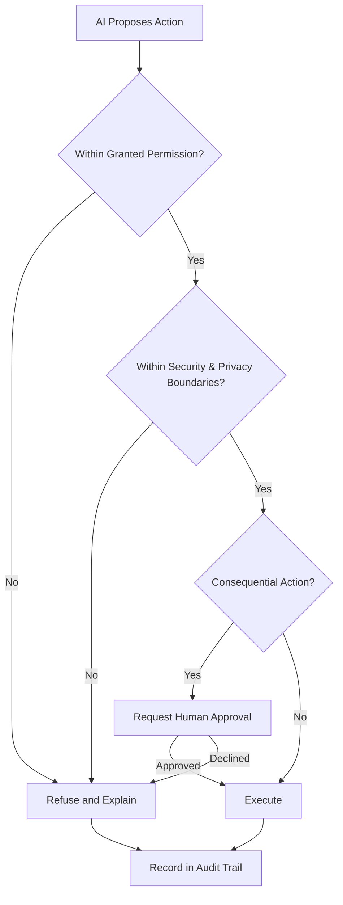

# Volume 03 - AI Governance

| Field | Value |
|---|---|
| Document ID | WORLD-VOL03-050 |
| Title | AI Governance |
| Version | 1.0 |
| Status | Approved |
| Classification | Internal |
| Founder | Mahesh Choudhary |

## Purpose
Establish the governance framework for the AI Business Partner: the set of principles, roles, and controls that determine how the AI is authorized to act, how its behaviour is constrained, and how it is held accountable. Governance is the foundation on which every other safety chapter in Section G rests. It exists to guarantee that the AI always augments the founder and the organization and never overrides them.

## Scope
This chapter specifies AI governance functionally: what governance means, why it is required, the governing principles, the roles that participate, and the control layers that translate principle into enforced behaviour. It does not describe technical enforcement mechanisms, which belong to the implementation volumes. Permissions, security, privacy, auditing, error handling, escalation, and approval are governed here but detailed in their own chapters.

## What Governance Means
Governance is the system of authority and accountability that surrounds the AI Business Partner. It answers three questions at all times: what is the AI allowed to do, under whose authority does it act, and how is that authority verified after the fact. An ungoverned AI is a liability regardless of its capability; a governed AI is a trustworthy partner because its power is bounded, observable, and reversible.

## Why Governance Matters
The AI Business Partner reasons over sensitive business context and can influence consequential decisions. Without governance, three failure modes become possible: the AI acts beyond its mandate, it acts on incorrect authority, or it acts without leaving a trace. Governance closes all three. It reflects the WORLD principle that the founder is always in command: the AI is a partner that advises and executes within limits, never an autonomous authority.

## Governing Principles
- **Augmentation over autonomy.** The AI extends the founder's capacity; it never replaces the founder's judgment on consequential matters.
- **Least privilege.** The AI holds the minimum authority required for the task at hand and nothing more.
- **No security bypass.** The AI never circumvents an established control, even when doing so would be faster or more convenient.
- **Transparency.** Every governed action is explainable and recorded.
- **Reversibility and human primacy.** Where an action carries material consequence, a human retains the final decision.

## Governance Roles
| Role | Responsibility |
|---|---|
| Founder | Ultimate authority; sets mandate, grants and revokes AI authority, approves consequential actions. |
| Delegated Owner | A person the founder authorizes to grant or approve within a defined domain. |
| AI Business Partner | Acts within granted authority; requests approval and escalates when limits are reached. |
| Governance Layer | The control system that enforces permissions, boundaries, and audit across every action. |

## Control Layers
Governance is enforced as a sequence of layers, each of which must pass before the AI acts. Authority is checked first, boundaries second, the action is logged, and consequential actions are gated on human approval.

## Enterprise Example
A founder asks the AI Business Partner to renegotiate payment terms with a major supplier. Governance engages immediately: the permission layer confirms the AI may draft communications but not commit contractual terms; the boundary layer confirms the supplier data is within scope; because a contractual change is consequential, the approval layer routes the proposed terms to the founder. The founder edits and approves the draft, the AI sends it, and the entire sequence, including what was proposed, changed, and approved, is written to the audit trail. The AI never committed the organization on its own authority, yet the founder's intent was executed quickly.

## Cross-References
- [Permission Model](/docs/blueprint/volume-03-ai-business-partner/section-g-safety-and-governance/51-permission-model.md)
- [Human Approval Rules](/docs/blueprint/volume-03-ai-business-partner/section-g-safety-and-governance/57-human-approval-rules.md)
- [Human-in-the-Loop Philosophy](/docs/blueprint/volume-03-ai-business-partner/section-a-ai-foundation/08-human-in-the-loop-philosophy.md)
- [Core Philosophy & Principles](/docs/blueprint/volume-01-vision-and-philosophy/06-core-philosophy-and-principles.md)

## References
- [Volume 01 - Vision & Philosophy](/docs/blueprint/volume-01-vision-and-philosophy/README.md)
- [Document Standards](/docs/governance/document-standards.md)

## Change Log
| Version | Date | Author | Change |
|---|---|---|---|
| 1.0 | 2026-07-12 | Lead Software Engineer | Initial approved version. |
